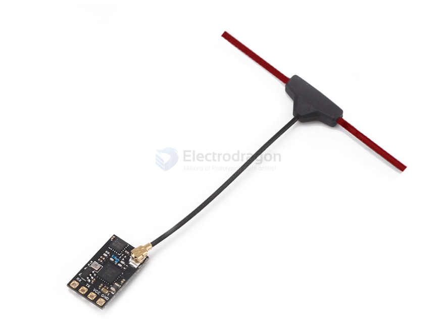
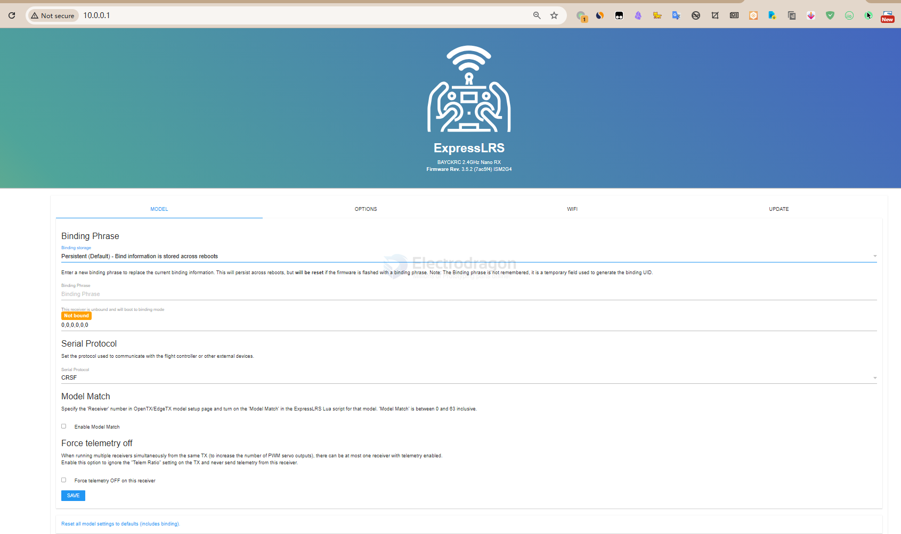
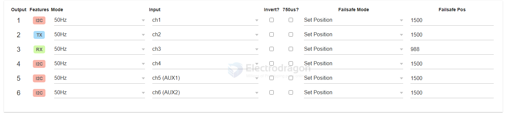
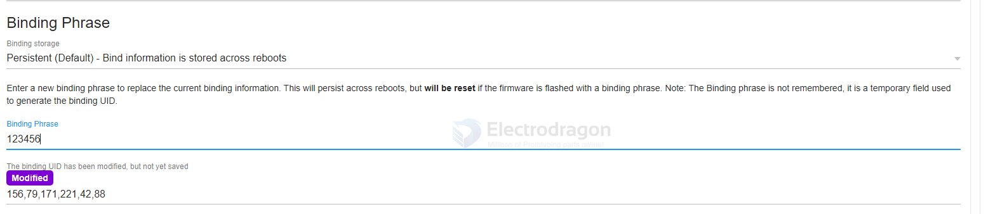
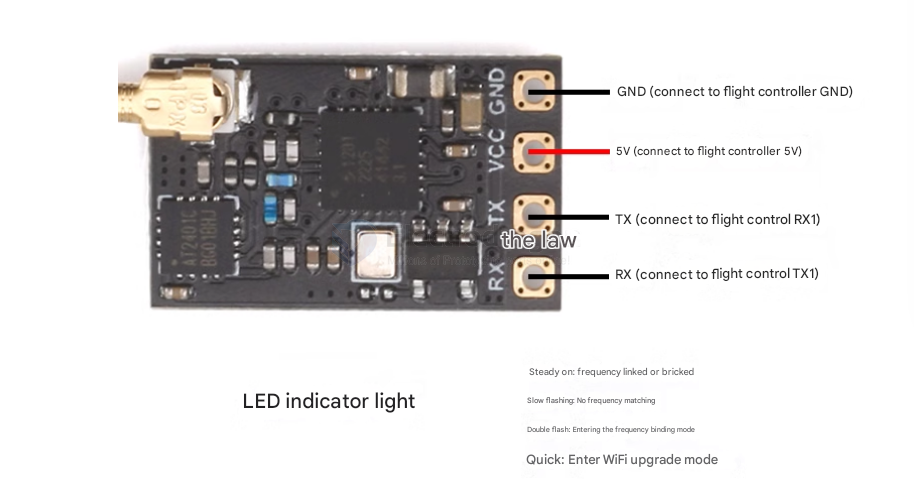
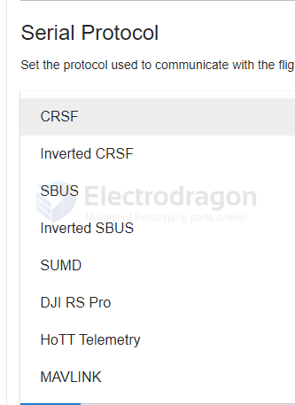

# ELRS-RX-dat

- [[ELRS-dat]] - [[ELRS-TX-dat]] - [[radiomaster-pocket-dat]] - [[radiomaster-dat]]

- [[ELRS-RX-dat]]

- [[motor-driver-dat]]

- [[radiomaster-pocket-dat]] - [[ELRS-TX-dat]]

## Generic ESP8285 6xPWM 2.4Ghz RX

http://10.0.0.1/

Binding Phrase

- Persistent (Default) - Bind information is stored across reboots
- Volatile - Never store bind information across reboots
- Returnable - Unbinding a receiver reverts to flashed binding phrase

protocols 

- CRSF
- Inverted CRSF
- SBUS
- Inverted SBUS
- SUMD
- DJI RS Pro
- HoTT Telemetry
- MAVLINK

## PWM Output

Set PWM output mode and failsafe positions.

- Output: Receiver output pin
- Features: If an output is capable of supporting another function, that is indicated here
- Mode: Output frequency, 10KHz 0-100% duty cycle, binary On/Off, DShot, Serial, or I2C (some options are pin dependant)
    When enabling serial pins, be sure to select the Serial Protocol below and UART baud on the Options tab
- Input: Input channel from the handset
- Invert: Invert input channel position
- 750us: Use half pulse width (494-1006us) with center 750us instead of 988-2012us
- Failsafe
    "Set Position" sets the servo to an absolute "Failsafe Pos"
        - Does not use "Invert" flag
        - Value will be halved if "750us" flag is set
        - Will be converted to binary for "On/Off" mode (>1500us = HIGH)
    "No Pulses" stops sending pulses
        - Unpowers servos
        - May disarm ESCs
    "Last Position" continues sending last received channel position

Model Match

Specify the 'Receiver' number in OpenTX/EdgeTX model setup page and turn on the 'Model Match' in the ExpressLRS Lua script for that model. 'Model Match' is between 0 and 63 inclusive.

- Enable Model Match

Force telemetry off

When running multiple receivers simultaneously from the same TX (to increase the number of PWM servo outputs), there can be at most one receiver with telemetry enabled.

Enable this option to ignore the "Telem Ratio" setting on the TX and never send telemetry from this receiver.

- Force telemetry OFF on this receiver

### mode options 

- 50Hz
- 60Hz
- 100Hz
- 160Hz
- 333Hz
- 400Hz
- 10KHzDuty
- On/off
- I2C SCL
- I2C SDA

This option is specifically designed by ExpressLRS for devices requiring Duty Cycle control, such as DC motor drivers and LED brightness control.

⚙️ **Why choose 10KHzDuty?**
**Mode Switching:** Once you select a duty cycle option, the physical output of the pin switches from "RC Servo Signal (Pulse Width Control)" to "Standard DC PWM Signal (Voltage Duty Cycle Control)", matching your IN1/IN2 driver board perfectly.

**Optimal Frequency:** The 10KHz (10,000Hz) frequency is ideal for micro DC motors. Lower frequencies (like 50Hz or 400Hz) often cause noticeable "squeaking" mechanical noise when the motor rotates or vibrates; a 10KHz drive frequency makes the motor run smoother and quieter.

🛠️ **Recommended Final Configuration:**
Set the Output 1, 2, 3, 4 columns as follows:

1I2C ➔ Select **10KHzDuty** ➔ Set Input to **ch1**

2TX  ➔ Select **10KHzDuty** ➔ Set Input to **ch2**

3RX  ➔ Select **10KHzDuty** ➔ Set Input to **ch3**

4I2C ➔ Select **10KHzDuty** ➔ Set Input to **ch4**

**About Frequency Selection (50Hz ~ 10KHz):**

For DC motor drives, 10KHz is highly recommended. High-frequency PWM ensures smoother operation and eliminates the "squeaking" AC hum often heard from micro motors at low frequencies (as 10KHz is near or beyond the range of human hearing).

### H-bridge control 

**Control Logic (How to set up on the remote controller)**
The control logic for this H-bridge driver board is:

- **IN1 HIGH (Pulse), IN2 LOW:** Motor forward.
- **IN1 LOW, IN2 HIGH:** Motor reverse.
- **IN1 and IN2 both LOW:** Motor stop.

To control via remote sticks, configure the **MIXES** screen on your remote (e.g., EdgeTX / OpenTX) as follows (using Motor A forward/reverse as an example):

**Remote Mixer Settings**
Assuming you want to use the right stick vertical axis (Throttle/Elevator) to control Motor A:

**CH1 Mixer Configuration:**
- **Source:** Input stick (e.g., Ele)
- **Weight:** 50%
- **Offset:** 50%
- **Explanation:** Pushing the stick to the top outputs maximum signal; pulling it to the bottom or middle outputs minimum signal (near 0).

**CH2 Mixer Configuration:**
- **Source:** Input stick (e.g., Ele)
- **Weight:** -50% (Inverted)
- **Offset:** 50%
- **Explanation:** Opposite of CH1. Pulling the stick to the bottom outputs maximum signal; pushing it to the top outputs minimum signal.

Similarly, if you want to control Motor B with another stick, apply the same configuration to CH3 and CH4 using a different **Source**.

### other options 

### Recommended Configurations for Output 1 to 4

| Option Name | Recommended Setting | Core Reason / Explanation |
| :--- | :--- | :--- |
| **Invert?** | **Unchecked** (Default) | If checked, the logic reverses: pushing the stick up would stop the motor, and centering it would make it run at full speed. |
| **750us?** | **Unchecked** (Default) | This is used for specialized high-rate model servos. Since we selected `10KHzDuty` mode, this option is ignored. |
| **Failsafe Mode** | Select **`Set Position`** | **CRITICAL!** Tells the receiver to output a specific, safe signal if the transmitter loses connection (failsafe). |
| **Failsafe Pos** | Enter **`1000`** | **SAFE VALUE!** In ELRS Duty mode, `1000` represents a 0% duty cycle (0V / completely off). |

---

### Why Failsafe Settings Matter for Duty Mode

When an ELRS pin is configured in `10KHzDuty` mode, the values inside **Failsafe Pos** directly translate to voltage duty cycles rather than servo pulse widths:

*   **`1000`** = 0% Duty Cycle = Outputs `0V` (Low Level / Off)
*   **`1500`** = 50% Duty Cycle = Outputs ~1.65V
*   **`2000`** = 100% Duty Cycle = Outputs `3.3V` (High Level / Full On)

> ⚠️ **Safety Warning:**
> If you leave `Failsafe Mode` as `Last Position`, or accidentally set `Failsafe Pos` to `1500` or `2000`, the receiver will keep sending voltage to your `IN1/IN2` motor driver pins if you turn off your transmitter or lose signal. 
> **This will cause your motors to runaway at full speed during a signal loss.**

Setting **Failsafe Mode** to **`Set Position`** and entering **`1000`** across all 4 utilized channels ensures that both motors instantly kill power if anything goes wrong.

### Why Failsafe Pos is 1000 (Not 1500) for Duty Mode

You are completely right about how RC channels normally work! For a standard servo or standard航模 ESC, **1500** is the center position (neutral/stop). 

However, because we changed the mode to **`10KHzDuty`**, the rules completely change. Here is why 1500 will actually cause issues instead of stopping your motors:

#### 1. Servo Signal vs. DC Duty Cycle

* **Standard Mode (Servo/ESC):** The signal represents a *position* or *value* along an axis. `1000` is full low, `1500` is center (neutral), and `2000` is full high. 
* **`Duty` Mode (Your Driver Board):** The signal represents raw *voltage output percentage* on that single pin from 0% to 100%. 
  * `1000` = 0% Duty Cycle (0V / Ground)
  * `1500` = 50% Duty Cycle (1.65V PWM)
  * `2000` = 100% Duty Cycle (3.3V / Full High)

#### 2. How Your `IN1/IN2` Board Interprets the Voltage

Your dual H-bridge motor driver does not understand "center/neutral" positions. It only looks at the raw voltage on its individual input pins:
* **To Stop:** It needs both `IN1 = 0V` and `IN2 = 0V`.
* **To Move:** It needs one pin to have voltage and the other to be at `0V`.

If you set the Failsafe Pos to **1500**, the receiver will output a 50% duty cycle voltage (~1.65V) on both `IN1` and `IN2` simultaneously. 

Depending on your specific driver chip, sending voltage to both pins at the same time will either trigger an aggressive electronic brake (generating massive heat and draining your battery while stuck), or cause the motors to creep and shudder if the two channel outputs are slightly mismatched.

#### 3. How "Center is Stop" is Handled

Because the receiver expects `1000` for 0V and `2000` for 3.3V, the "middle is stop" logic is handled **entirely inside your transmitter's Mixer settings**, not on the receiver. 

When your radio stick is centered, your transmitter mixes that central position so that **both** CH1 and CH2 send a digital value of `1000` (0V) to the receiver, turning the motor off. 

Therefore, for hardware safety during a total signal loss, you want the receiver to output absolutely zero voltage (0V) on all control pins, which means **`1000`** is the correct safe value.

## T-anntena version 

- [[antenna-dat]]

## SMD antenna version 

## info 

Nano2400-RX receiver with power amplifier (PA+LNA).

Therefore, it has 100mW telemetry output and better sensitivity at longer distances.

It uses an IPEX1 antenna connector.

Paired with an external dipole T-antenna (customized by a professional factory, each antenna is tested with professional instruments to ensure quality, lightness, and durability).

The CYCLONE series receivers are based on the open-source architecture and program of ExpressLRS.

We have released 3 types of RX receiver modules. All use the [[ESP8285-dat]] [[MCU-dat]]. You can upgrade the firmware via [[WIFI-DAT]], which is very user-friendly.

## hotspot 

Typically, after powering the receiver and with the remote controller turned off, the **ExpressLRS** hotspot can be found after a default of 60 seconds. Connect to this hotspot using a computer or mobile phone.

The password is "**expresslrs**", and then you can access **10.0.0.1** to upload the receiver firmware.

check the firmware version: 

    Generic ESP8285 6xPWM 2.4Ghz RX
    Firmware Rev. 3.5.3 (40555e) ISM2G4

## hardware default output value 

middle value should be 1500 for CH1, CH2, etc 

## modify the binding phase for binding 

## serial 

Runtime Options

This form overrides the options provided when the firmware was flashed. These changes will persist across reboots, but will be reset when the firmware is reflashed.

WiFi auto on" interval in seconds (leave blank to disable) == 60
UART baud == 420000 = 420K

## Product Features

-   High refresh rate 100mW telemetry output;
-   Supports convenient and fast firmware flashing via WIFI connection;
-   Firmware Version: 3.3.0 [BETAFPVLite2400RX]
-   Equipped with a power amplifier (PA+LNA), providing 100mW telemetry output and better response speed;
-   Theoretically compatible with most ELRS 2.4G transmitter modules on the market (requires firmware version 2.0 or above).

## supported modules 

## FAQ

1.  **Q: Can this receiver be bound to a XXX brand's high-frequency head (transmitter module)?**
    A: The ELRS project is open source. Therefore, as long as the high-frequency head uses the ELRS protocol, regardless of the brand, it can be bound. However, three conditions must be met:
    *   The frequency must be the same, either both 2.4G or both 915MHz.
    *   The firmware version must be consistent. For example, if the high-frequency head is flashed with firmware version 2.5.0, the receiver must also be flashed with firmware version 2.5.0.
    *   Either both have no binding phrase, or both have the same binding phrase set.

2.  **Q: How do I enter binding mode?**
    A: After soldering the receiver, quickly power cycle the aircraft three times. That is: power on then immediately power off, power on then immediately power off, power on and leave it on. The interval between power cycles should be within 1.5 seconds. If done correctly, the receiver's LED will flash rapidly twice in a cycle, indicating it is in binding mode. At this time, press the bind button in the remote controller's script. If binding is successful, the receiver's LED will turn solid.

3.  **Q: I'm using my receiver for the first time, why can't I enter binding mode? The light stays solid. What's wrong?**
    A: We have encountered similar issues in after-sales support. We found that some flight controllers have abnormal TX/RX ports, causing the receiver to enter bootloader/flash mode upon power-up. In this case, simply changing to a different TX/RX port on the flight controller can solve the problem.

4.  **Q: Why is my receiver's light always flashing rapidly?**
    A: If you power on the receiver and it does not enter binding mode, or if it's already bound but the remote controller is not turned on, the receiver will enter WiFi flashing mode after 60 seconds without a signal, and the indicator light will flash rapidly.

5.  **Q: How do I enter WiFi flashing mode to flash firmware to the receiver?**
    A: Same as the answer above. Power on the receiver and leave it. It will automatically enter WiFi flashing mode in about 60 seconds, and the light will flash rapidly.

## Versions 

- Firmware Rev. 3.5.2 (7ac5f4)

## ref 

- [[ELRS-dat]]