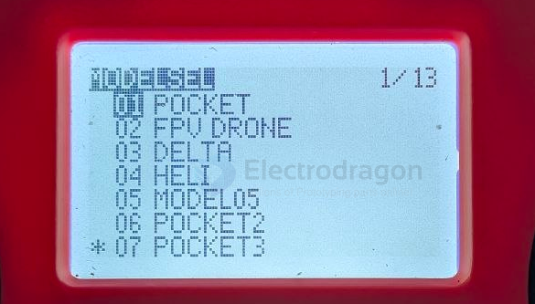
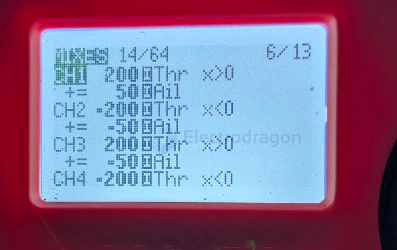
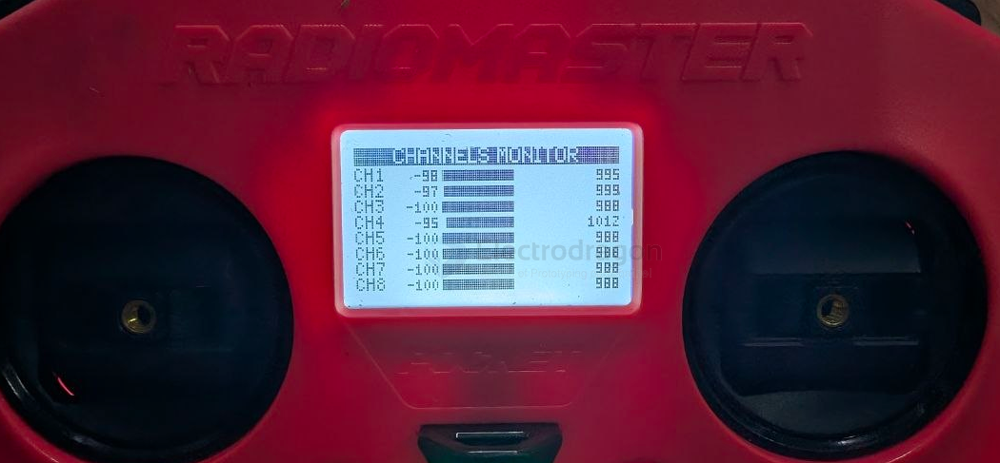
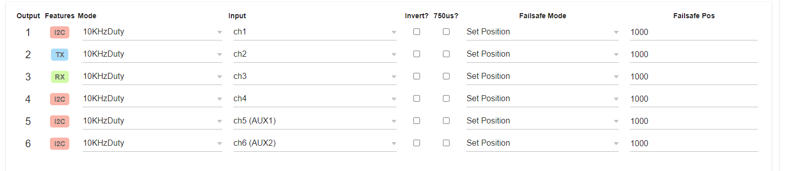

# ELRS-TX-setup-motor-dual-dat

- [[radiomaster-pocket-dat]] - [[ELRS-TX-dat]] - [[ELRS-TX-setup-motor-dual-dat]] - [[motor-driver-design-dat]] - [[mosfet-dat]]


## MIXES setup 

- find refer from - [[radiomaster-pocket-dat]]

## create a new model for this 




## Issue Analysis: Burned Board Diagnosis == mosfet driver board 

- [[motor-driver-dead-time-protection-dat]] - [[motor-driver-dat]] - [[ELRS-TX-setup-motor-dual-dat]] - [[motor-driver-design-dat]] - [[mosfet-dat]]

### Fix 1: Switch from "Add" to "Multiply" (The Safest Software Fix)

The safest way to handle tank steering on IN1/IN2 setups is to use **Multiplex ➔ Multiply (*)** instead of **Add** for your steering lines.

When you use Multiply, steering doesn't try to force the opposite pin high or fight the throttle physics. Instead, it acts like a brake—it smoothly reduces power to one side to make a turn. 

Change your **Line 2** mixing values to this:

```text
CH1 (Left Fwd): Line 2 ➔ Source = Ail, Weight = -100%, Multiplex = Multiply
CH3 (Right Fwd): Line 2 ➔ Source = Ail, Weight = 100%, Multiplex = Multiply
```

(Do the same for the reverse channels CH2 and CH4, matching the steering polarities).

**Why this fixes it:** If you are moving forward, IN1 is active and IN2 is completely dead at $0\text{V}$. When you steer, **Multiply** simply reduces the voltage on IN1 toward $0\text{V}$ to slow that track down. It never commands IN2 to turn on while moving forward, eliminating shoot-through short circuits entirely!


## setup guide 


### Dual Motor Differential Steering (Tank Mix) Setup

This configuration maps your **Throttle stick** (Left Stick Vertical) to control forward/backward speed, and your **Aileron stick** (Right Stick Horizontal) to control left/right differential steering. 

Because we are combining two distinct inputs (Speed + Steering), **each channel will contain TWO lines of code** on your RadioMaster Pocket's **MIXES** page.

---

### 🛠️ Transmitter Mixer Layout (CH1 to CH4)

#### 1. MOTOR A (Left Motor) ── Physical Outputs 1 & 2
The left motor spins faster when you steer right, and slower when you steer left.

*   **CH1 (Left Motor Forward):**
    *   *Line 1:* Source = `Thr`, Weight = `200%`, Offset = `-100%`, Curve = `Func x>0`, Trim = `OFF`
    *   *Line 2:* Source = `Ail`, Weight = `50%`, Multiplex = `Add`, Trim = `OFF`
*   **CH2 (Left Motor Backward):**
    *   *Line 1:* Source = `Thr`, Weight = `-200%`, Offset = `-100%`, Curve = `Func x<0`, Trim = `OFF`
    *   *Line 2:* Source = `Ail`, Weight = `-50%`, Multiplex = `Add`, Trim = `OFF`

#### 2. MOTOR B (Right Motor) ── Physical Outputs 3 & 4
The right motor spins slower when you steer right, and faster when you steer left.

*   **CH3 (Right Motor Forward):**
    *   *Line 1:* Source = `Thr`, Weight = `200%`, Offset = `-100%`, Curve = `Func x>0`, Trim = `OFF`
    *   *Line 2:* Source = `Ail`, Weight = `-50%`, Multiplex = `Add`, Trim = `OFF`
*   **CH4 (Right Motor Backward):**
    *   *Line 1:* Source = `Thr`, Weight = `-200%`, Offset = `-100%`, Curve = `Func x<0`, Trim = `OFF`
    *   *Line 2:* Source = `Ail`, Weight = `50%`, Multiplex = `Add`, Trim = `OFF`



### 💡 How to Add the Second Line on EdgeTX

1. Go to the **MIXES** page on your RadioMaster Pocket.
2. Highlight the target channel (e.g., **CH1**), press and **hold the system roller**, then select **`Insert After`**.
3. A secondary line will appear nested directly underneath that channel. 
4. Edit this new line to set your steering parameters (`Source = Ail`, etc.). Ensure the **Multiplex** option at the bottom remains set to **`Add`**.

---

### 🔍 Multimeter Verification Protocol (Before Connecting Driver Board)

Disconnect your `IN1/IN2` motor driver board and measure the bare receiver signal pins against **GND**:

1. **Sticks Completely Centered:** Outputs 1, 2, 3, and 4 must all read **`0V`** (Dead Stop).
2. **Push Throttle Straight UP:** Output 1 (Left Fwd) and Output 3 (Right Fwd) must smoothly climb to **`3.3V`**. Outputs 2 and 4 must stay at **`0V`**.
3. **Throttle Straight UP + Move Steering RIGHT:** Output 1 stays high near **`3.3V`**, while Output 3 drops significantly toward **`1.6V` or lower**. This drops power to the right motor, causing the vehicle to pivot right.

## final result and initiate screen 




## ELRS-RX setup 




## ref 


