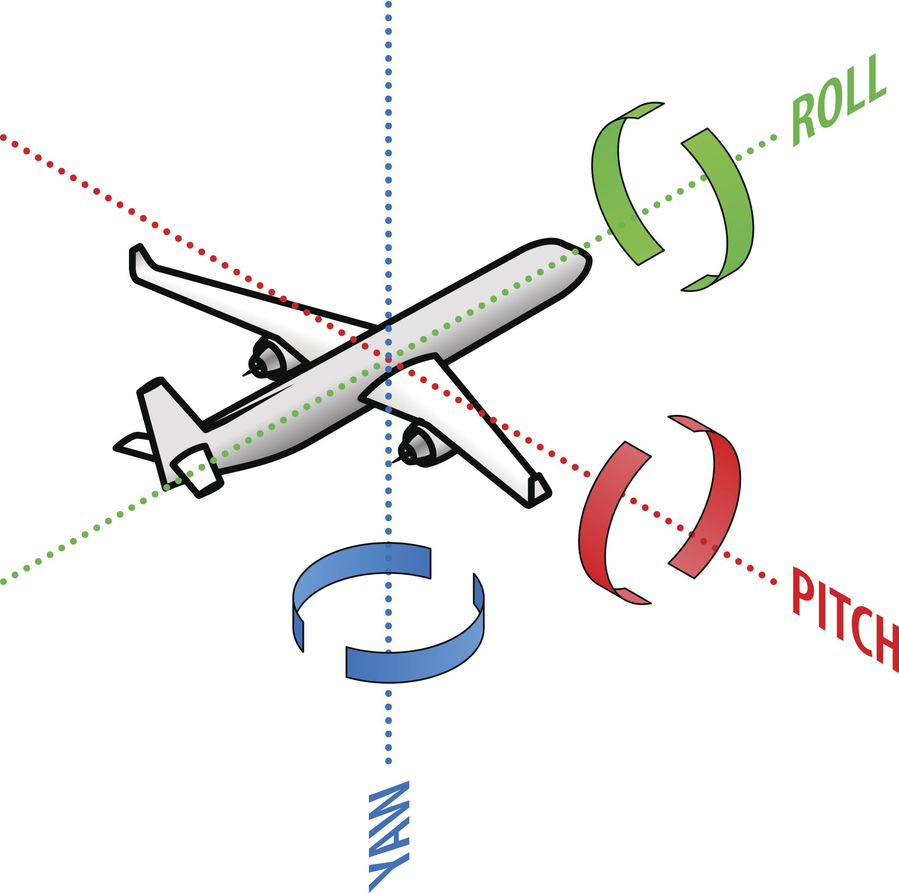

# RC-dat

- [[RC-dat]] - [[unmanned-vehicle-dat]] - [[manned-vehicle-dat]] - [[vehicle-dat]]

- [[rc-projects-list-dat]] - [[rc-dat]]

- [[rc-rover-project-list-dat]]

- [[rc-rover-dat]] 

- [[Gyroscope-Mechanical-dat]] - [[engineering-dat]] - [[rc-bike-dat]] - [[rc-dat]]

- [[FPV-dat]] - [[RC-dat]]

- [[frequency-rc-dat]] - [[RF-dat]] - [[RF-2.4ghz-dat]]

- [[motor-driver-rc-dat]] - [[motor-dat]]

- [[wheel-dat]]

- [[RC-system-dat]] - [[elrs-dat]] - [[CRSF-dat]] - [[edge-tx-dat]] 

- [[radiomaster-pocket-dat]] - [[radiomaster-dat]] 

- [[RC-system-dat]] - [[ardupilot-dat]] - [[betaflight-dat]] - [[heli-configurator-dat]]

- [[RC-protocols-dat]] - [[CRSF-dat]]

- [[RC-TX-dat]] - [[ELRS-dat]]

- [[flight-controller-dat]]

- [[RC-code-dat]]

- [[RC-apps-dat]] - [[rc-controller-dat]]

- [[rc-gimbal-dat]]

- [[rc-kits-dat]]

- [[rc-hack-dat]]

- [[frequency-dat]]

- [[battery-dat]] - [[battery-charger-dat]] 

- [[physics-dat]] - [[gravity-dat]]

## tech 

- [[telemetry-dat]] - [[RC-dat]] - [[radio-dat]]

## control 

- [[ESP-NOW-dat]]

- [[RC-dat]] - [[radiomaster-pocket-dat]] - [[ELRS-TX-dat]]

## The Four Controls Explained

Throttle (Thrust / Power) - common CH3 

Yaw (Vertical Axis) - common CH1

### 1. Roll (Longitudinal Axis) - common CH4
* **What it does:** Tilts the craft side-to-side (banking left or right).
* **The motion:** Imagine a line passing through the nose of the vehicle straight out the back tail. Rotating around this front-to-back axis raises one wing while dipping the other.
* **Result:** Used primarily to initiate turns or bank side-to-side.

### 2. Pitch (Lateral Axis) - common CH2 
* **What it does:** Tilts the craft nose-up or nose-down.
* **The motion:** Imagine a rod running through the vehicle from wingtip to wingtip (left-to-right). Rotating around this axis lifts or lowers the nose.
* **Result:** Used to gain/lose altitude or move forward/backward depending on vehicle type.

### 3. Yaw (Vertical Axis) - common CH1

* **What it does:** Swivels or rotates the nose left or right.
* **The motion:** Imagine a vertical line extending straight up and down through the center of gravity. Rotating around this axis turns the vehicle like a spinning top or a car turning on a flat road.
* **Result:** Changes the heading or direction the front of the vehicle is pointing.

### 4. Throttle (Thrust / Power) - common CH3 
* **What it does:** Controls the engine output or motor speed.
* **The motion:** Pushing throttle forward/up increases power, while pulling back decreases power.
* **Result:** Determines overall thrust—controlling speed in fixed-wing planes or altitude/lift in quadcopters and vertical-takeoff aircraft.

---

## Comparison Summary

| Control | Axis | Direction / Motion | Primary Purpose |
| :--- | :--- | :--- | :--- |
| **Roll** | Front-to-Back | Wing-to-wing tilt | Banking left/right |
| **Pitch** | Left-to-Right | Nose up / Nose down | Climbing or diving |
| **Yaw** | Top-to-Bottom | Nose turns left/right | Changing heading |
| **Throttle** | Linear (Power) | Power increase / decrease | Thrust and altitude/speed |

## ref 

- [[network-dat]]

- [[rover-dat]]

- [[bag-dat]] - [[bag]] - [[container-dat]] - [[case-dat]]

- [[rc]]