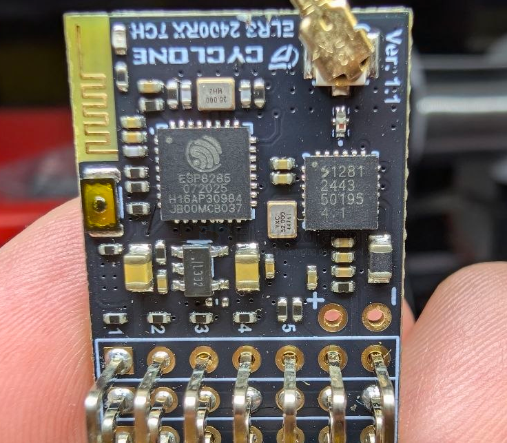
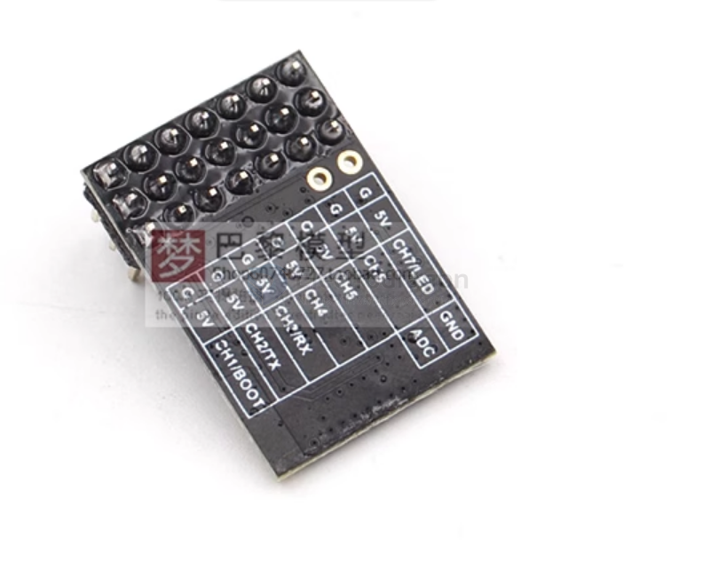
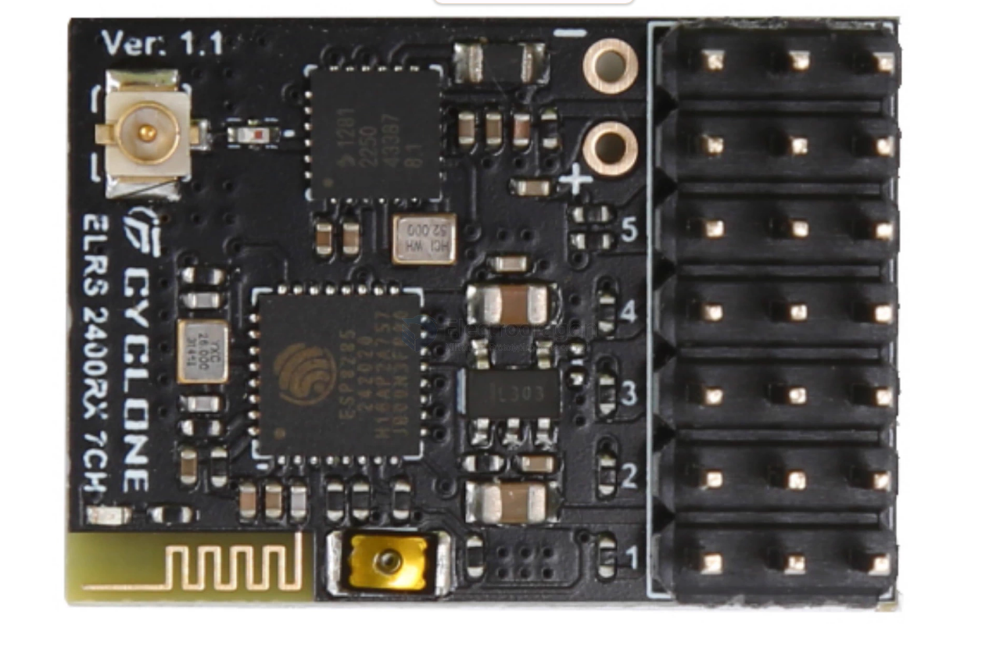
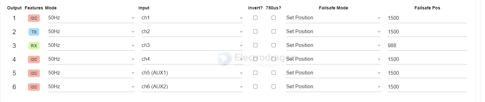
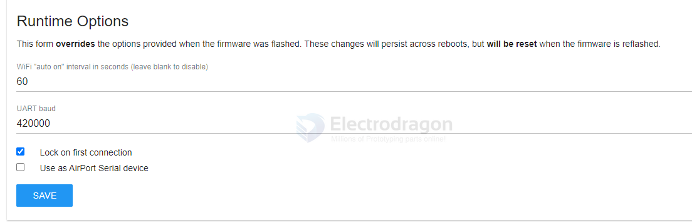
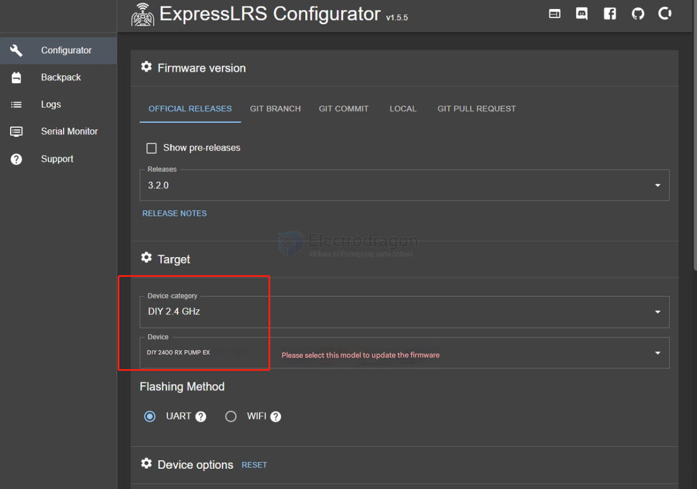
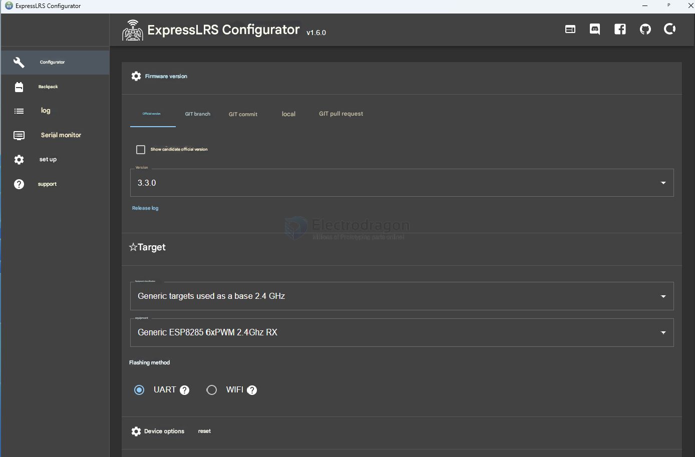
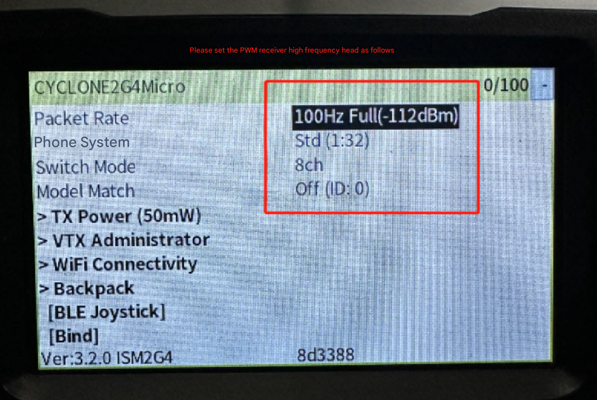

# ELRS-RX-PWM-dat

## tech 

- [[ESP8285-dat]] - [[ESP32-C3-dat]] - [[LR1121-dat]] - [[SX1281-dat]] == [[APP-dat]] - [[ELRS-RX-PWM-dat]]

- [[ABLIC-dat]] ?? XX - [[LDO-dat]]

注意:出厂固件3.6.2，如你高频头固件低于3.0版本，建议更新到3.2.0可以使用7个pwm全比列通道，按照如下方法可以经松划换打开接收机WI-FI网络，

- 回传功率:20dbm/100mW
- 面件版本:ExpressLR5 V3.6.2
- 电路板尺寸:18.5mm*26mm
- 通道数量:6CH
- 工作电压:4-8.4V
- 协议:PWM/CRSF可划换
- 6通道全比列ELR5 2.4G/915双频接收机
- 可切换CRSF总线模式无幕业刷固件

2.未连接高频头通电等待一分钟，接收机自动进入WI-FI 电脑或手机投索WIFI
- WIFI热点名称:ExpressLRS RX
- 连接密码(注意密码全都小写):expresslrs
- 浏览器打开http://10.0.0.1/hardware.html

Firmware Rev. 3.5.3 (40555e)

## LED indicator and mode 

- low blink, wait 1 mintue, super fast blink == configuration mode 

## Electrodragon 7CH PWM ELRS Receiver

Electrodragon ELRS 2.4G Receiver, Seven-Channel PWM Receiver

This receiver features independent PWM channel outputs, suitable for fixed-wing aircraft, cars, boats, and other models. It also supports CRSF output. The two output signals (PWM and CRSF) can be switched without re-flashing the firmware.

### setup V2 

### Follow these steps to switch between PWM (6CH/7CH) and CRSF modes:

**Accessing the Receiver's Wi-Fi Network:**

1.  **If connected to the high-frequency head (transmitter module):** Use the transmitter's LUA script menu to activate the receiver's Wi-Fi.
2.  **If not connected to the high-frequency head:** Power on the receiver and wait for one minute. The receiver will automatically enter Wi-Fi mode.

**Connecting to the Receiver's Wi-Fi:**

*   Search for Wi-Fi networks on your computer or phone.
*   **Wi-Fi Hotspot Name (SSID):** `EXPRESSLRSRX`
*   **Connection Password (all lowercase):** `expresslrs`

**Accessing the Configuration Page:**

*   Open a web browser and go to: `http://10.0.0.1/hardware.html`

**Configuring the Receiver:**

*   This will take you to the ELRS hardware configuration page where you can import hardware configuration files.
*   **Caution:** Do not modify parameters yourself unless you fully understand their meaning.
*   Import the provided configuration file for either `PWM7CH` or `CRSF`.
*   Click the button at the bottom of the page and wait for the receiver to restart automatically.

## configuaration note 

PWM Output

Set PWM output mode and failsafe positions.

- Output: Receiver output pin
- Features: If an output is capable of supporting another function, that is indicated here
- Mode: Output frequency, 10KHz 0-100% duty cycle, binary On/Off, DShot, Serial, or I2C (some options are pin dependant)
    - When enabling serial pins, be sure to select the Serial Protocol below and UART baud on the Options tab
- Input: Input channel from the handset
- Invert: Invert input channel position
- 750us: Use half pulse width (494-1006us) with center 750us instead of 988-2012us

Failsafe

- "Set Position" sets the servo to an absolute "Failsafe Pos"
    Does not use "Invert" flag
    Value will be halved if "750us" flag is set
    Will be converted to binary for "On/Off" mode (>1500us = HIGH)
- "No Pulses" stops sending pulses
    Unpowers servos
    May disarm ESCs
- "Last Position" continues sending last received channel position

default configuration 

runtime option 

## custom PWM setup 

## setup for [[ELRS-HF-RF-module-dat]]

## configuration file 

- [[7CH.json]] - [[CRSF.json]]

the pwm channels 

    "pwm_outputs": [
        0,
        1,
        3,
        9,
        10,
        5,
        16
    ],

## ref 

- [[ELRS-PWM]] - [[ELRS]]

- [[FUS-X111-dat]]