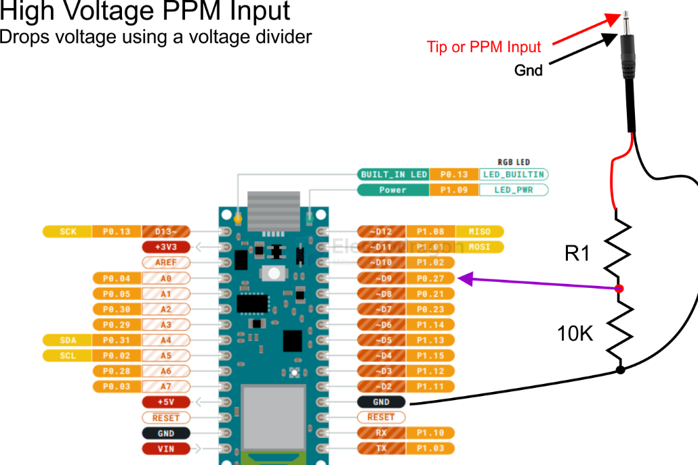
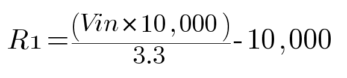

# PPM-dat

- [[servo-dat]]

- [[Wfly-dat]] - [[RC-code-dat]]

- [[PWM-dat]]

## understand PPM 

PPM (Pulse Position Modulation)

What changes:
👉 Pulse position (timing shift)

What stays fixed:

Pulse width

Frequency (usually)

    |  ■■        |  early pulse
    |     ■■     |  mid pulse
    |        ■■  |  late pulse

Used for

- RC receivers (classic PPM signal)
- Some communication systems
- Timing-based encoding

PPM (Pulse Position Modulation) is a type of analog signal used in radio control (RC) systems to transmit multiple channels of control information (like throttle, steering, elevator, etc.) over a single wire.

In simple terms:

- It sends a series of pulses.
- The position (or timing) of each pulse within a repeating frame represents the value for a specific channel.
- A longer "sync" pulse marks the end of one frame and the beginning of the next.

So, instead of needing a separate wire for each control channel, PPM combines them into one sequential signal.

## PPM over voltage protection == PPM OVP 

1️⃣ Resistor Divider + Comparator (Most Common)

    Vout ──R1──┐
            ├── V_sense → Comparator → PWM inhibit
    GND  ──R2──┘

2️⃣ Zener Clamp Based PPM OVP (Simple & Cheap)

    Vout ──R──┬── Zener ── GND
            └──→ PWM control pin

## high voltage control 

For 5V PPM signal, R1 = (5*10,000)/3.3 - 10,000 = 5151ohms Round the value UP to the nearest commonly available resistor, which is 5600ohm or 5.6k

For 7V PPM Signal, R1 = 7*10,000/3.3 - 10,000 = 11,212 ohms ==> Rounded Up ==> 12,000ohm or 12Kohm

## demo video 

[RC #PPM PWM send and receive at Arduino, note the four channels color](https://youtube.com/shorts/BDdSFPlh9KE?si=n1oF2KUIMqEeH1QW)

Internal control by [[SDR1064-dat]]

[Wfly #PPM console control toy rover](https://t.me/electrodragon3/369)

## ref 

- [[RC-protocols-dat]]