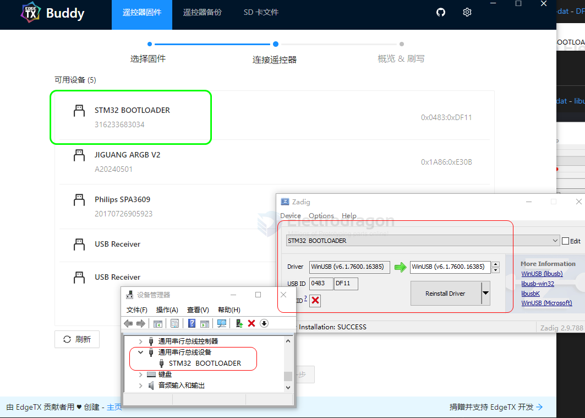

# edgetx-dat

- [[rc-protocols-dat]] - [[edgetx-dat]] - [[ELRS-dat]]

- [[radiomaster-dat]] - [[radiomaster-pocket-dat]] == system - [[edgetx-dat]] 

## scripts 

https://edgetx.org/lua-scripts/

Installation:

Copy ELRS_Finder.lua into /SCRIPTS/TOOLS/ on your SD card.

On your radio: Long-press SYS → Tools tab → run ELRS Finder
For best results:
- Set fixed low TX power (10–25 mW) in ELRS menu
- Sweep the radio slowly to locate signal peaks

## info 

https://github.com/EdgeTX/edgetx

## edge-tx-buddy 

https://buddy.edgetx.org/#/backup

https://github.com/EdgeTX/buddy

## flash 

## ref 