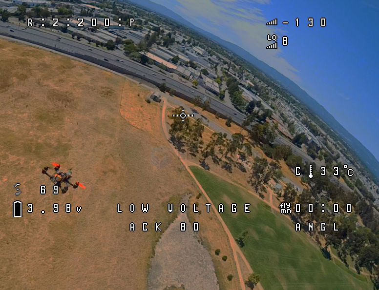

# betaflight-OSD-dat

- [[betaflight-OSD-dat]] - [[betaflight-video-transmitter-dat]] - [[betaflight-dat]]

## screen 

value - 1 

- Adjustment range
- Aircraft name
- AG
- Altitude
- Angle: pitch
- Angle: roll
- Anti gravity
- Artificial horizon
- Artificial horizon sidebars
- Aux value
- Battery average cell voltage
- Battery current draw
- Battery current mAh drawn
- Battery current Wh drawn
- Battery efficiency
- Grap
- Battery usage
- Battery voltage
- Blackbox log status
- Camera frame
- Compass bar
- Core temperature
- Crosshairs
- Debug
- Disarmed
- ESC RPM
- ESC RPM frequency
- ESC temperature
- Flight distance
- Flip after crash arrow
- Fly mode
- G force
- Goggle DVR status
- Goggle fan speed
- Goggle link quality
- Goggle system warnings
- Goggle voltage
- GPS latitude
- GPS longitude
- GPS sats
- GPS speed
- Home direction
- Home distance
- Link quality
- Motor diagnostics
- Numerical heading
- Numerical vario
- PID pitch
- PID roll
- PID yaw
- Pilot name
- Power
- Profile: OSD profile name
- Profile: PID and rate
- Profile: PID profile name
- Profile: rate profile name
- RC Channels
- Ready Mode
- RSNR Value
- RSSI dBm value
- RSSI value
- RTC date and time
- Stick overlay left
- Stick overlay right
- Throttle position
- Timer 1
- Timer 2
- Timer: remaining time estimate
- Total flights
- Tx uplink power
- Up (Pitch 90 deg)/Down (Pitch -90 deg) Reference
- VTX bitrate
- VTX channel
- Band:Channel:Pwr:Pit
- VTX delay
- VTX distance
- VTX DVR status
- VTX temperature
- VTX voltage
- Warnings

## ref 

