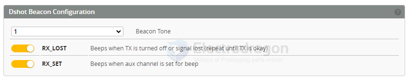

# betaflight-configuration-dat

## options 

### Crash Recovery

if not work, try CLI set **crash_recovery = ON**

→ Connect flight controller → open **Betaflight Configurator** → click **Connect**  

→ Go to **Configuration Tab** → scroll to **Other Features**  

→ Tick **Crash Recovery** → click **Save and Reboot**  

## Configuration

## beeper 

- [[Betaflight-configuration-dat]] - [[BF-beeper-dat]]

In some newer versions of Betaflight Configurator:
1. Go to the **Configuration** tab.
2. Scroll down to the **Other Features** section.
3. Check the box for **BEEPER** (and ensure DShot is selected as your motor protocol in the same tab).
4. Click **Save and Reboot**.

### Dshot Beacon Configuration

Beacon Tone

- RX_LOST - Beeps when TX is turned off or signal lost (repeat until TX is okay)
- RX_SET - Beeps when aux channel is set for beep

### other features 

- air mode - consider turn this off, it may cause the whoop bump (hop round) when touch the ground

- [] INFLIGHT_ACC_CAL
- [] SERVO_TILT
- [x] SOFT SERIAL
- [] SONAR
- [] LED_STRIP
- [] DISPLAY
- [x] OSD
- [] CHANNEL_FORWARDING
- [] TRANSPONDER
- [] AIRMODE
- [?] DYNAMIC_FILTER

### Beeper Configuration

## ref 

- [[betaflight-dat]]