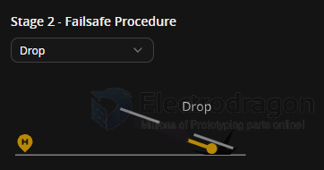

# betaflight-failsafe-dat

- [[betaflight-failsafe-dat]] - [[betaflight-dat]]

Failsafe has two stages. 

Stage 1 is entered when a flightchannel has an invalid pulse length, the receiver reports failsafe mode or there is no signal from the receiver at all, the channel fallback settings are applied to all channels and a shortamount of time is provided to allow for recovery. 

Stage 2 is entered when the error condition takes longer than the configured guard time while the aircraft is armed, all channels will remain at the applied channel fallback setting unlessoverruled by the chosen procedure.

Note: Prior to entering stage 1, channel fallback settings are also applied to individual AUX channels that have invalid pulses.

## Stage 1

- Roll [A] - Auto
- Pitch [E] - Auto
- Yaw [R] - Auto
- Throttle [T] - Auto
- AUX 1ARM - Hold
- AUX 2ANGLEHORIZONACRO TRAINER - Hold
- AUX 3FLIP OVER AFTER CRASH - Hold
- AUX 4BEEPER - Hold

## Stage 2

Stage 2 - Settings

0.4 Period of time in Stage 1 failsafe after signal loss [seconds]
10 Failsafe Throttle Low Delay [seconds]

Stage 2 - Failsafe Procedure

## ref 