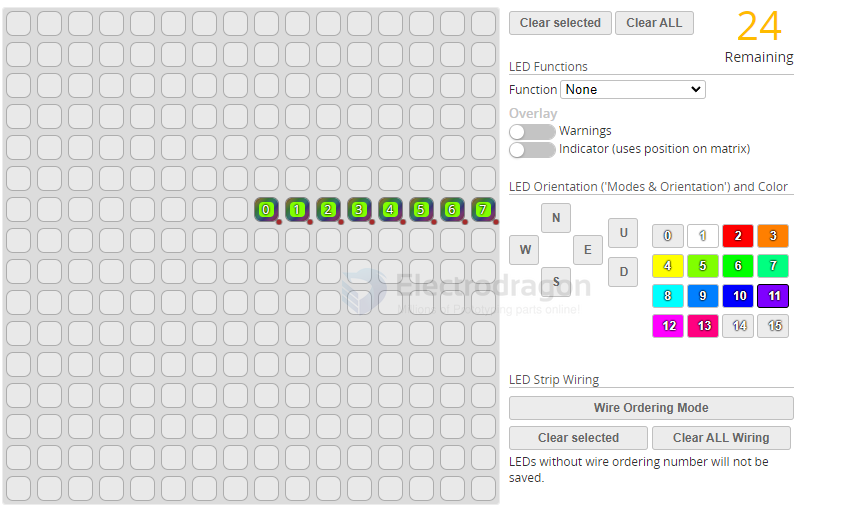

# betaflight-led-strip-dat

- [[betaflight-ports-dat]] - [[betaflight-led-strip-dat]] - [[betaflight-dat]]

The flight controller can control colors and effects of individual LEDs on a strip.

Configure LEDs on the grid, configure wiring order then attach LEDs on your aircraft according to grid positions. LEDs without wire ordering number will not be saved.Double-click on a color to edit the HSV values.

## ref 

