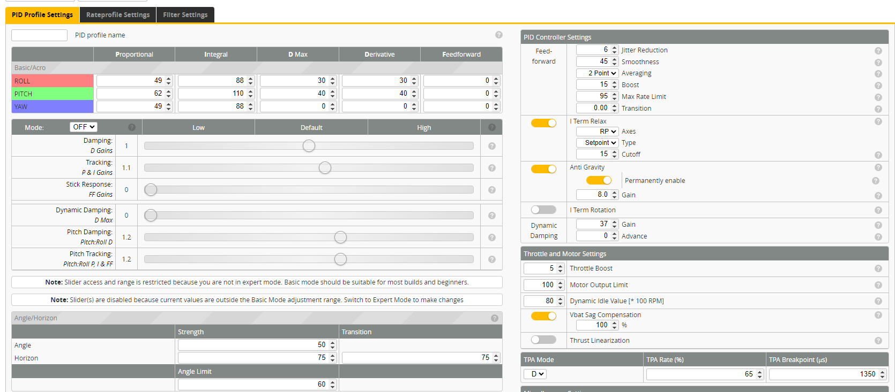

# Chris-Rosser-tune-AOs-Cine20-dat

#### AOs Cine20 tune by Chris Rosser

Filters
- [x] AOs Filters (Recommended)
- [x] **RPM Filter Weights** for **triblade props**
- [] RPM Filter Weights for other props

Motor Settlngs
- [x] DShot Motor Beeping (Recommended)
- [x] 12 pole motors (Most 1404 motors have 12 poles)

Rates
- [x] Cinematic Rates (Recommended)

Typical Board Alignment for 25mm AlO
- [x] Typical Board Alignment for 25mm AlO (Test in setup tab BEFORE take-off!)

EXCLUSIVE): Choose your RC llnk (or apply another preset separately)
- [x] ELRS_250HZ (Recommended)
- [] ELRS_500HZ
- [] DJI Normal
- [] DJI SBUS FAST
- [] Crossfire 50Hz
- [] Crossfire 150Hz

Check all of these (recommended)
- [x] Full battery sag compensation
- [] No stick deadband
- [] Arm at any angle
- [] Props out (check motor direction!)

