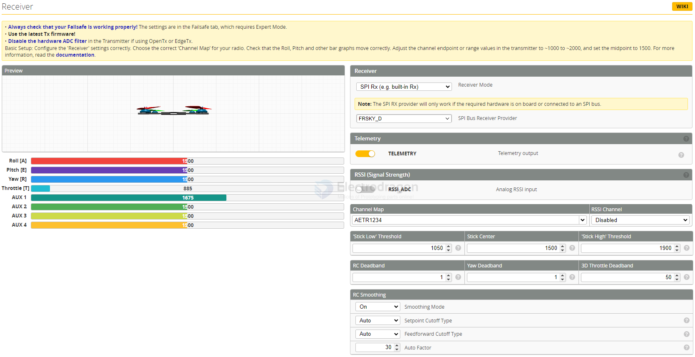

# betaflight-receiver-dat

- [[betaflight-dat]] - [[betaflight-receiver-dat]] - [[betaflight-modes-dat]]

- [[radiomaster-dat]]

- [[ELRS-dat]] - [[FRSKY-dat]]

## Channel map 

AETR1234

### Telemetry

TELEMETRY - Telemetry output

### RSSI 

Analog RSSI input == on or off

RSSI Channel == disabled or AUX1 .. AUX12?

### 1. Analog RSSI Input (ON or OFF)
* **What it does**: Tells the flight controller whether to look for a physical analog DC voltage signal (ranging from 0V to 3.3V) wired into a dedicated analog RSSI pad on the board.
* **When to set to OFF (Recommended for 99% of modern setups)**: If you use modern serial receivers like **ExpressLRS (ELRS)**, Crossfire, or modern FrSky/FlySky protocols connected via a serial port (UART), your signal strength (RSSI) is already transmitted digitally through the serial data stream. You must keep this **OFF**.
* **When to set to ON**: Only if you are using an extremely old-school PWM or PPM receiver that features a physical analog RSSI wire connected to an analog-to-digital converter (ADC) pad on the flight controller.

---

### 2. RSSI Channel (Disabled or AUX1...AUX12)
* **What it does**: Assigns an auxiliary channel coming from your radio transmitter to carry the RSSI (Signal Strength) data value.
* **When to set to DISABLED (Recommended for modern serial links like ELRS)**: If your receiver protocol (like ELRS or CRSF) automatically injects RSSI into the data stream (often displayed as the `LQ` or `RSSI` link stat in your OSD automatically), you do **not** need to map a physical channel. Set this to **Disabled**.
* **When to set to an AUX Channel (e.g., AUX1 to AUX12)**: If your receiver outputs RSSI as a dedicated channel stream (common with some older analog receivers or specific SBUS setups), you would select the specific AUX channel here that corresponds to the RSSI channel output configured in your radio.

`RSSI (Signal Strength)` RSSI_ADC Analog RSSI input

`Channel Map` == AETR1234

### TELEMETRY

1. 关于 TELEMETRY ➔ ✅ 开（ON）
*   作用：让飞机把电池电压（Vbat）、电流、飞控状态回传给你的遥控器。
*   为什么开：
    *   虽然 FrSky SPI 回传功率小（容易报 Telemetry Lost），但近距离内遥控器依然能收到电压报警，提供双重安全冗余。
    *   不开的话，遥控器端将完全收不到飞机的任何传感器数据。

Telemetry (`TELEMETRY` Telemetry output)

* **What it means**: This setting enables the flight controller to **transmit real-time sensor data back to your radio transmitter** over the radio link (using protocols like SmartAudio, F.Port, CRSF, or S.Port).
* **What it does**: When turned **ON**, your radio screen can display live telemetry data sent from the drone, such as battery voltage (`VBAT`), current draw, current GPS coordinates (if equipped), flight mode, and ESC temperatures. 
* **Recommendation**: Keep this **ON** so you can monitor your battery voltage directly on your radio and set up low-voltage audio warnings.

### RSSI ADC 

2. 关于 RSSI_ADC ➔ ❌ 关（OFF，千万别开！）
*   作用：这是给外接老式接收机、且有专门一根“模拟信号线”焊在飞控 RSSI 焊盘时用的（通过测量 0~3.3V 模拟电压来判断信号）。
*   为什么关：
    *   你的接收机是板载 SPI 芯片（CC2500），它跟飞控 MCU 走的是数字内部总线通信。
    *   飞控底层代码直接通过数字寄存器读取真实 RSSI，根本不走外部 ADC 焊盘！
    *   如果开启 RSSI_ADC：飞控会去读悬空的 ADC 引脚电压（采样的全是空中静电和噪声），导致 OSD 上的信号强度彻底错乱（这就是之前出现离奇数值的罪魁祸首之一）！

## 2. RSSI (Signal Strength) (`RSSI_ADC` Analog RSSI input)

* **What it means**: **RSSI** stands for **Received Signal Strength Indicator**, which measures the strength of the radio link signal between your transmitter and the drone's receiver. 

* **What `RSSI_ADC` specifically means**: This is a legacy or specific hardware configuration where the RSSI signal is fed into the flight controller via an **Analog-to-Digital Converter (ADC)** pin using an analog DC voltage wire (ranging from 0V to 3.3V) coming from an older style receiver.

* **Modern Context**: If you are using modern digital or serial receivers like ExpressLRS (ELRS), Crossfire, or modern FrSky/FlySky protocols over a serial port (SBUS/CRSF), **RSSI is transmitted automatically over the digital serial link**, and you do *not* need to enable `RSSI_ADC`. Leaving it checked when using a digital receiver can cause RSSI to read incorrectly or stay stuck at 0/100%.

## setup 

- [[FRSKY-dat]]

## ref 

- [[betaflight-dat]]