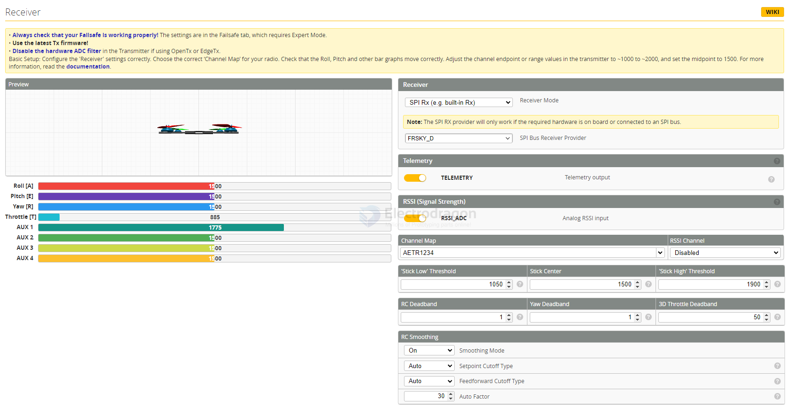

# betaflight-receiver-dat

- [[betaflight-dat]] - [[betaflight-receiver-dat]] - [[betaflight-modes-dat]]

- [[radiomaster-dat]]

## receiver 

`Telemetry` TELEMETRY Telemetry output
`RSSI (Signal Strength)` RSSI_ADC Analog RSSI input

`Channel Map` == AETR1234

## ref 

- [[betaflight-dat]]