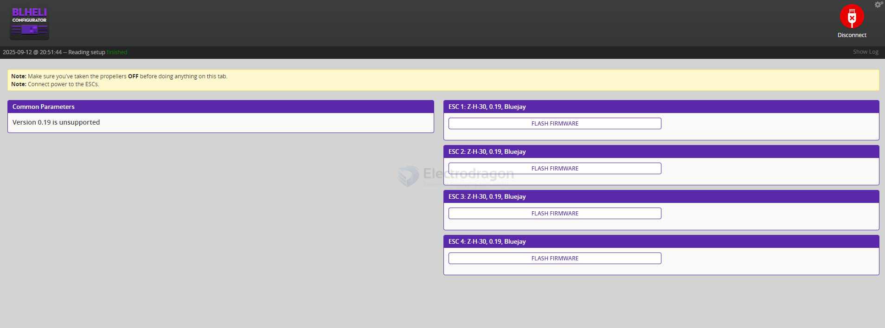
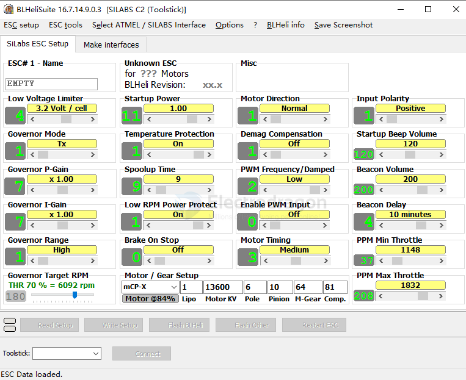

# heli-configurator-dat

## blheli-configurator

last commit is about 5 years ago 

- no more chrome store 

https://github.com/blheli-configurator/blheli-configurator/releases

- set ESC motor directions 

## first launch

## flash 

## BLHeliSuite32 Rev32.10.0.0

Found no valid ESC configuration:
- ESC# 1: BLHeli/_S 8bit!
- ESC# 2: BLHeli/_S 8bit!
- ESC# 3 : BLHeli/_S 8bit!
- ESC# 4: BLHeli/_S 8bit!

One or more BLHeli/BLHeli_S 8Bit ESC found.

BLHeliSuite32 is only intended to be used with BLHeli_32 type ESCs!

https://www.mediafire.com/folder/dx6kfaasyo24l/BLHeliSuite

## BLHeliSuite

