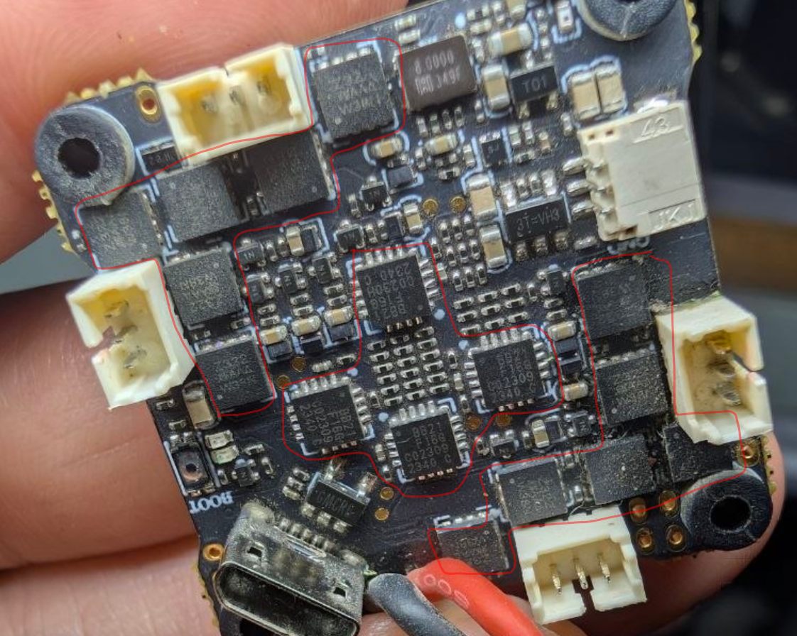

# FC-AIO-dat

- [[flight-controller-dat]] - [[FC-AIO-dat]] - [[FC-stack-dat]]

- [[flight-controller-dat]] + [[ESC-dat]] + [[VTX-dat]]

## AIO 

- [[X12-dat]]

## ESC 

- [[FC-AIO-dat]] - [[ESC-dat]] - [[X12-dat]] - [[test-point-dat]] == pin 4 (VCC) and 5 

## ref 

