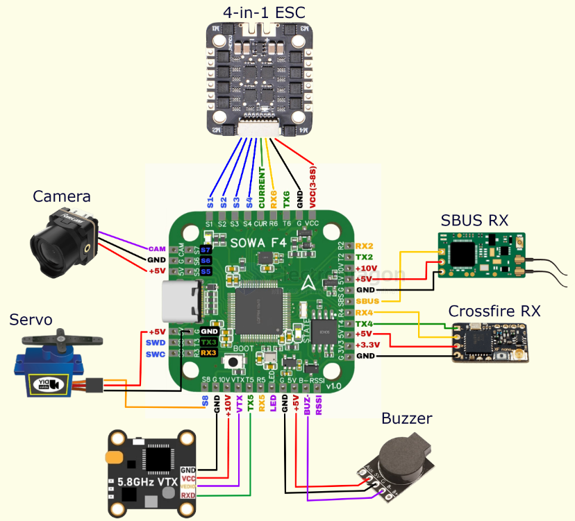
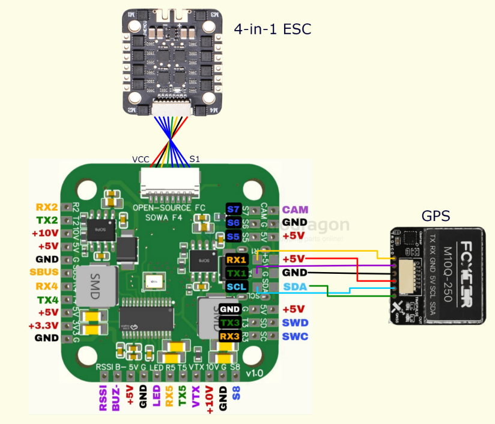
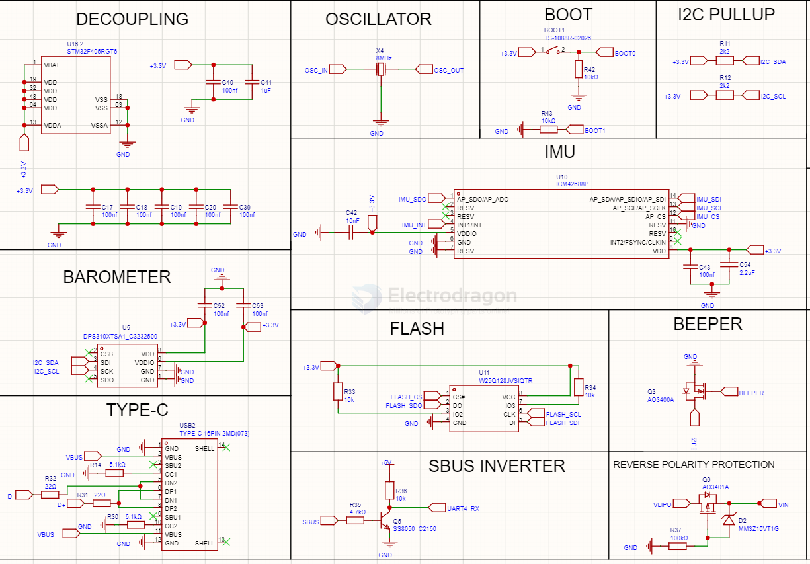
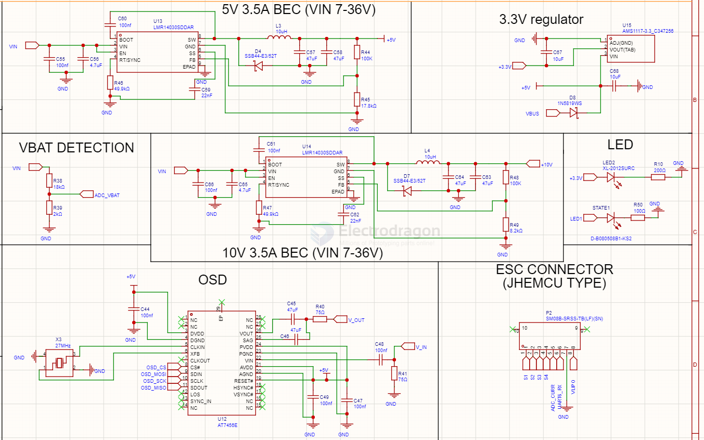
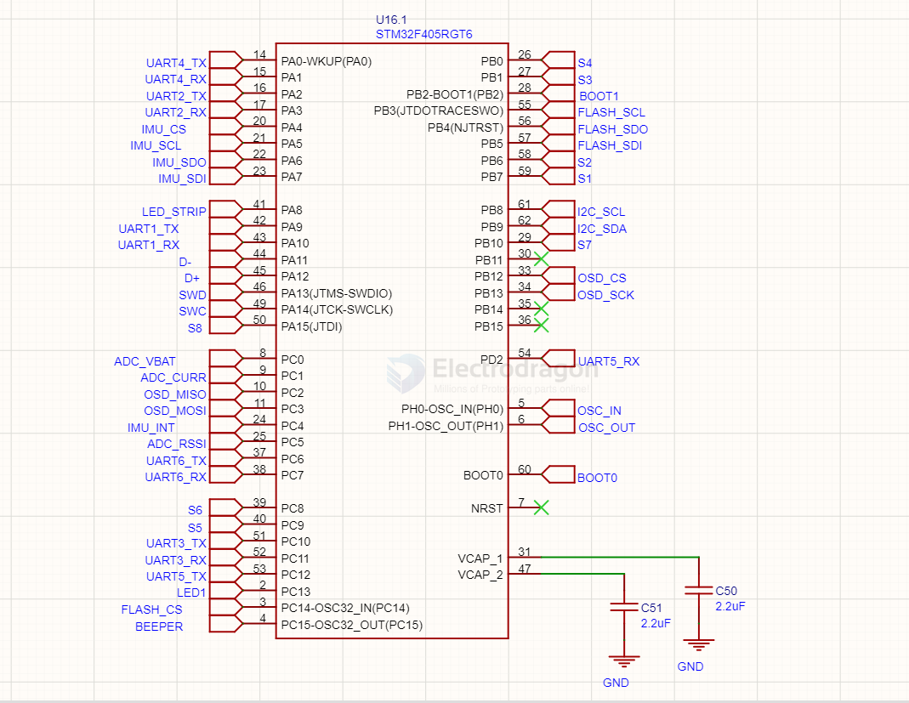
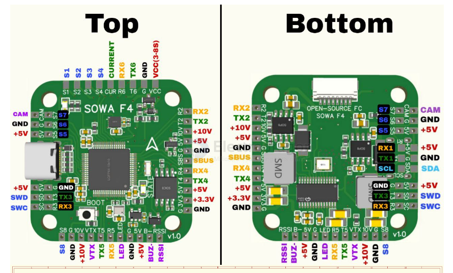

# FC-stack-dat

- [[flight-controller-dat]] - [[FC-AIO-dat]] - [[FC-stack-dat]]

- [[flight-controller-dat]] + [[ESC-dat]] + [[VTX-dat]]

- [[SBUS-dat]]

## schema 

## SCH 1 

- [[STM32-F4-dat]] - [[FC-stack-dat]] - [[STM32-dat]]

## board 

SOWA F4 - https://oshwlab.com/poplavskyib/SOWA_F4

## ref 

