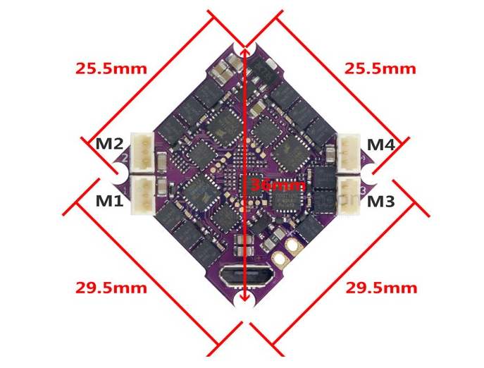

# flight-controller-dat

- [[flight-controller-dat]] - [[RC-system-dat]]

- [[flight-controller-dat]] + [[ESC-dat]] - [[FPV-ESC-dat]]

- [[FC-stack-dat]] - [[FC-AIO-dat]] 

## F4 

- [[STM32-dat]]

## other 

- [[Pixhawk-dat]]

- [[ardupilot-mega-dat]] - [[APM-dat]] - [[ardupilot-dat]]

## old 

- [[KK-Pro-dat]]

- Naza Assistant // Naza-M V2

### F1 

- [[STM32F1-dat]]

- [[DJI-dat]] - [[Naze32-dat]]

- [[CC3D-dat]]

- [[betaflight-blackbox-dat]] - [[betaflight-dat]]

刷 Betaflight 3.2.5

- ✅ 能飞（基本姿态/手动模式）
- ❌ 无 OSD 菜单、无 RPM 滤波、Airmode 是老版本
- ❌ 不能用新版 Configurator（要 3.2.x 老版）

🔧 可用固件 - [[betaflight-dat]]
- • Betaflight 3.2.5（⭐️ 最后支持的版本，2017）
- • Cleanflight 2.5.x（也已停更）
- • iNav 1.x（要 GPS 返航才需要）
- • OpenPilot（2013 原厂）

## main reference and build

- [[FC-AIO-dat]] - [[X12-dat]]

- [[flight-controller-dat]] - [[FC-AIO-dat]] - [[FC-stack-dat]]

## board 

- [[FC-AIO-dat]] - [[X12-dat]]

- [[FUS-X111-dat]]

- [[flight-controller-dat]] - [[JHEMCU-dat]]

## tech 

- [[FPV-dat]]

- [[FPV-wiring-dat]] - [[FPV-build-dat]] - [[flight-controller-dat]]

- [[flight-controller-dat]] - [[FC-AIO-dat]] - [[FC-stack-dat]]

- [[crazybee-dat]] - [[crazybee-f4-lite-dat]] - [[FC-AIO-dat]] - [[flight-controller-dat]]

- **Flight Controller**: The brain of the drone, responsible for stabilizing and controlling the flight. It processes data from sensors and executes commands from the pilot or autopilot system.

- F405 - 
- F411 - 说明: 入门芯片，性能一般（无 DSP 加速），跑 Betaflight 4.5 有点吃力
- F722 

## sensor 

- [[invensense-dat]] - [[6-axis-dat]] - [[ICM42688-dat]]

## dimension 

## ALL-in-One Option 

- [[ELRS-dat]] - [[radio-dat]]
- [[Flight-controller-dat]] 
- [[ESC-dat]] - [[motor-FPV-dat]]
- [[VTX-dat]] - [[sensor-Camera-dat]]

- [[X12-dat]] - [[CRAZYBEEF4SX1280-dat]]

- [[pixelhawk-6c-dat]]

## accessories 

- [[PCB-accessories-dat]] - [[PCB-dat]]

## build 

## ref 

- [[motor-dat]] - [[VTX-dat]]

- [[FPV-dat]]

- [[RC]]