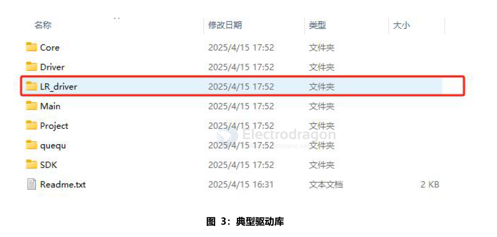

# Lora-SDK-dat

- [[Lora-HDK-dat]] - [[12P-BTB-dat]]

- [[SPI-dat]] - [[SPI-CMD-dat]]

## network ID and address 

For LoRa coding, the network ID and address (often called device address or node address) are typically set in the software/firmware of the device, not in the data payload or by hardware switches.

**LoRaWAN**: The device address (DevAddr), network session keys, and other identifiers are set in the device firmware and used by the LoRaWAN protocol stack. These are not sent in the application data payload; instead, they are part of the protocol headers.

**Raw LoRa (non-LoRaWAN)**: If you are implementing your own protocol, you can choose to include a node address or network ID in the data payload, or you can set it in the firmware and use it as part of your packet structure.

## stm32 code

Path: The files in LR_driversrc are the LoRa drivers. These drivers are downloaded from Semtech and only modified to adapt to the STM32F103 HAL library; no other changes have been made.

The sx126xhal.c file is used for direct data interaction and control with the LoRa module. In theory, to port to a new IC, you only need to modify this part.

Path: The UserConfig.c file in LR_driver is a common file generated when adapting the IC driver. It includes some configurations such as SPI, dio1 pins, etc. Modify it as needed during porting.

- Core: Core files extracted from the SDK for easier modification
- Driver: User-written peripheral driver files
- LR_driver: LoRa (LLCC68, SX1262 shared) RF driver files, currently downloaded from Semtech's official website
- Main: Main function file and configuration files
- Project: Project files, including target binary files
- queue: This file is a queue SPI interface. Add the path and include it to use. The demo is used for UART data processing
- SDK: CMSIS and HAL libraries, only the used libraries are included. Add other peripheral libraries as needed
- Readme.txt: Project description file

## arduino library 

LoRaduplex output 

    error: message length does not match length
    Sending HeLoRa World!
    Sending HeLoRa World!
    Sending HeLoRa World!
    error: message length does not match length
    Sending HeLoRa World!
    Sending HeLoRa World!

### sandeepmistry/arduino-LoRa

reference setup 

    const long frequency = 915E6;  // LoRa Frequency

    const int csPin = 10;          // LoRa radio chip select
    const int resetPin = 9;        // LoRa radio reset
    const int irqPin = 2;          // change for your board; must be a hardware interrupt pin

    void setup() {
    Serial.begin(9600);                   // initialize serial
    while (!Serial);

    LoRa.setPins(csPin, resetPin, irqPin);

frequency in Hz (`433E6`, `868E6`, `915E6`)

- https://github.com/sandeepmistry/arduino-LoRa

    #else
    #define LORA_DEFAULT_SPI           SPI
    #define LORA_DEFAULT_SPI_FREQUENCY 8E6 
    #define LORA_DEFAULT_SS_PIN        10
    #define LORA_DEFAULT_RESET_PIN     9
    #define LORA_DEFAULT_DIO0_PIN      2
    #endif

demo-code loraSender

### RadioLib/radiohead

- [[radiohead-dat]]

- https://jgromes.github.io/RadioLib/

    // ESP8266  -- [[12P-BTB-dat]]
    SX1262 lora = new Module(15, 0, 16);

- https://github.com/beegee-tokyo/SX126x-Arduino

    #ifdef ESP8266
    // ESP32 - SX126x pin configuration
    int PIN_LORA_RESET = 0;	  // LORA RESET
    int PIN_LORA_DIO_1 = 15;  // LORA DIO_1
    int PIN_LORA_BUSY = 16;	  // LORA SPI BUSY
    int PIN_LORA_NSS = 2;	  // LORA SPI CS
    int PIN_LORA_SCLK = SCK;  // LORA SPI CLK
    int PIN_LORA_MISO = MISO; // LORA SPI MISO
    int PIN_LORA_MOSI = MOSI; // LORA SPI MOSI
    int RADIO_TXEN = -1;	  // LORA ANTENNA TX ENABLE
    int RADIO_RXEN = -1;	  // LORA ANTENNA RX ENABLE
    #endif

custom setup 

    #ifdef ESP8266
    // ESP8266 - SX126x pin configuration
    int PIN_LORA_RESET = -1;	  // LORA RESET (GPIO 4 / D2)
    int PIN_LORA_DIO_1 = 0;   // LORA DIO_1 (GPIO 2 / D4)
    int PIN_LORA_BUSY = 16;	  // LORA SPI BUSY (GPIO 5 / D1)
    int PIN_LORA_NSS = 15;	  // LORA SPI CS (GPIO 15 / D8)
    int PIN_LORA_SCLK = 14;   // LORA SPI CLK (GPIO 14 / D5)
    int PIN_LORA_MISO = 12;   // LORA SPI MISO (GPIO 12 / D6)
    int PIN_LORA_MOSI = 13;   // LORA SPI MOSI (GPIO 13 / D7)
    int RADIO_TXEN = 5;	  // LORA ANTENNA TX ENABLE (not used)
    int RADIO_RXEN = 4;	  // LORA ANTENNA RX ENABLE (not used)
    #endif

    // Define LoRa parameters
    #define RF_FREQUENCY 916100000	// Hz
    #define TX_OUTPUT_POWER 22		// dBm
    #define LORA_BANDWIDTH 0		// [0: 125 kHz, 1: 250 kHz, 2: 500 kHz, 3: Reserved]
    #define LORA_SPREADING_FACTOR 7 // [SF7..SF12]
    #define LORA_CODINGRATE 1		// [1: 4/5, 2: 4/6,  3: 4/7,  4: 4/8]
    #define LORA_PREAMBLE_LENGTH 8	// Same for Tx and Rx
    #define LORA_SYMBOL_TIMEOUT 0	// Symbols
    #define LORA_FIX_LENGTH_PAYLOAD_ON false
    #define LORA_IQ_INVERSION_ON false
    #define RX_TIMEOUT_VALUE 3000
    #define TX_TIMEOUT_VALUE 5000

    SDK:2.2.2-dev(38a443e)/Core:3.1.2=30102000/lwIP:STABLE-2_1_3_RELEASE/glue:1.2-65-g06164fb/BearSSL:b024386
    =====================================
    SX126x PingPong test
    =====================================
    BoardId: 00-0A-04-4D-00-0A-04-4D
    Starting lora_hardware_init
    LoRa init success

- [[FreeRTOS-dat]]

- [Single Channel LoRaWAN Gateway == SX1262-SC-GW](https://github.com/beegee-tokyo/SX1262-SC-GW)

## code repro

- info for EE22, EE32, EE2 == https://github.com/Edragon/lora
- lora2 designs == https://github.com/Edragon/Lora2
- https://github.com/Edragon/alios-asr-lora
- E:\Git-category\git-lora

## Config 

### STM32 code 

    sx126x_mod_params_lora_t params;
    params.bw = SX126X_LORA_BW_125;      // Set bandwidth to 125 kHz
    params.sf = SX126X_LORA_SF9;         // Set spreading factor to 9
    params.cr = SX126X_LORA_CR_4_6;      // Set coding rate to 4/6
    params.ldro = 0x00;                  // Low Data Rate Optimization disabled
    sx126x_set_lora_mod_params(NULL, &params); // Apply these parameters to the radio

### arduino sandeepmistry/arduino-LoRa Config 

    LoRa.setPins(csPin, resetPin, irqPin); // set CS, reset, IRQ pin

    if (!LoRa.begin(915E6)) {             // initialize ratio at 915 MHz
    Serial.println("LoRa init failed. Check your connections.");
    while (true);                       // if failed, do nothing
    }

    LoRa.setSignalBandwidth(125E3);
    LoRa.setSpreadingFactor(9);           // ranges from 6-12,default 7 see API docs
    LoRa.setCodingRate4(4/6);
  

## lora encrpytion 

- [[encryption-dat]]

To encrypt data for LoRa by coding, you typically use a symmetric encryption algorithm like AES before sending the data. Here’s a general approach:

1. Choose an Encryption Library
   
Most platforms (Arduino, STM32, Raspberry Pi, etc.) have AES libraries available. For example, on Arduino you can use [AESLib](https://github.com/DavyLandman/AESLib).

2. Encrypt Data Before Sending
   
Encrypt your payload before passing it to the LoRa send function.

Example (Arduino, using AESLib):

    #include <AESLib.h>

    AESLib aesLib;

    byte aes_key[] = { 0x00, 0x01, 0x02, 0x03, 0x04, 0x05, 0x06, 0x07,
                    0x08, 0x09, 0x0A, 0x0B, 0x0C, 0x0D, 0x0E, 0x0F }; // 16 bytes key

    char plainText[] = "Hello, LoRa!";
    byte encrypted[32];

    int dataLen = strlen(plainText);
    int encLen = aesLib.encrypt((byte*)plainText, dataLen, encrypted, aes_key, 128);

    LoRa.beginPacket();
    LoRa.write(encrypted, encLen);
    LoRa.endPacket();

3. Decrypt on Receiver Side

On the receiver, use the same key to decrypt the received data.

Example (Arduino, using AESLib):

    byte decrypted[32];
    int decLen = aesLib.decrypt(receivedData, receivedLen, decrypted, aes_key, 128);
    // Now 'decrypted' contains your original message

### Notes

- Key Management: Both sender and receiver must use the same key.
- LoRaWAN: If you use LoRaWAN, encryption is handled by the protocol stack automatically.
- Raw LoRa: You must implement encryption/decryption yourself as shown above.

## ref

- [[arduino-ide-dat]]

- [[lora-dat]] - [[lora-HDK-dat]] - [[lora-SDK-dat]]

- [[RAKwireless-dat]]