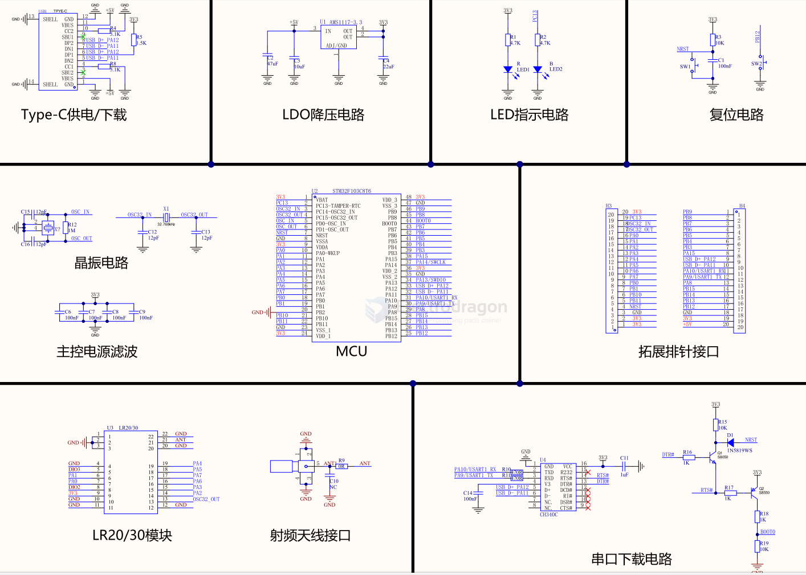
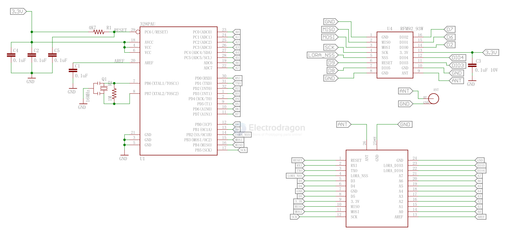
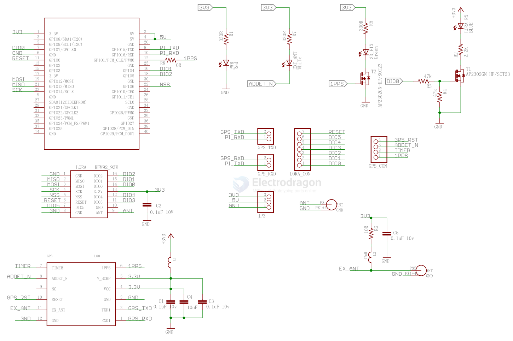

# lora-hdk-dat

- [[LORA-HDK-dat]] - [[SX1262-MD1-dat]] - [[SX1262-HDK-dat]] - [[SX1262-dat]]

- [[lora-SDK-dat]]

- [[LNA-dat]] - [[rf-switch-dat]]

## Dev board SCH 

## 2025 [[SX1262-dat]] with [[STM32-dat]] - [[STM32-HDK-dat]]

- [[STM32-HDK-dat]]

- [[auto-serial-dat]]

## 2022 RFM92 with [[atmega328-dat]]

## RFM92 with [[RPI-dat]]

## wiring to RPI

- [[MPC1056-dat]]

table 

    Raspberry Pi 3 (BCM)     SX1278
    --------------------------------
    3.3V                  → VCC
    GND                   → GND
    GPIO10 (MOSI)         → MOSI
    GPIO9  (MISO)         → MISO
    GPIO11 (SCLK)         → SCK
    GPIO7  (CS / NSS)     → NSS
    GPIO17 (RESET)        → RESET
    GPIO4  (DIO0 / INT)   → DIO0

## wiring to ESP32

| Lora Module | ESP32   |
| ----------- | ------- |
| ANA         | Antenna |
| GND         | GND     |
| DIO3        | -       |
| DIO4        | -       |
| 3.3V        | 3.3V    |
| DIO0        | IO 2    |
| DIO1        | -       |
| DIO2        | -       |
| GND         | -       |
| DIO5        | -       |
| RESET       | IO 14   |
| NSS         | IO 5    |
| SCK         | IO 18   |
| MOSI        | IO 23   |
| MISO        | IO 19   |
| GND         | -       |

- based on [[ESP32-SPI-dat]]

## 

## ref 

- [[lora-dat]]