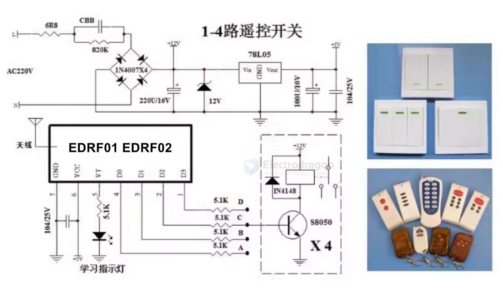
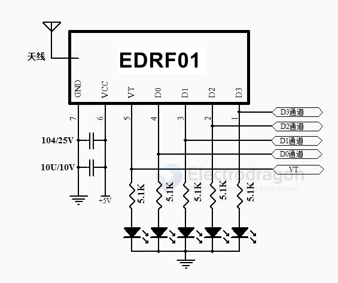
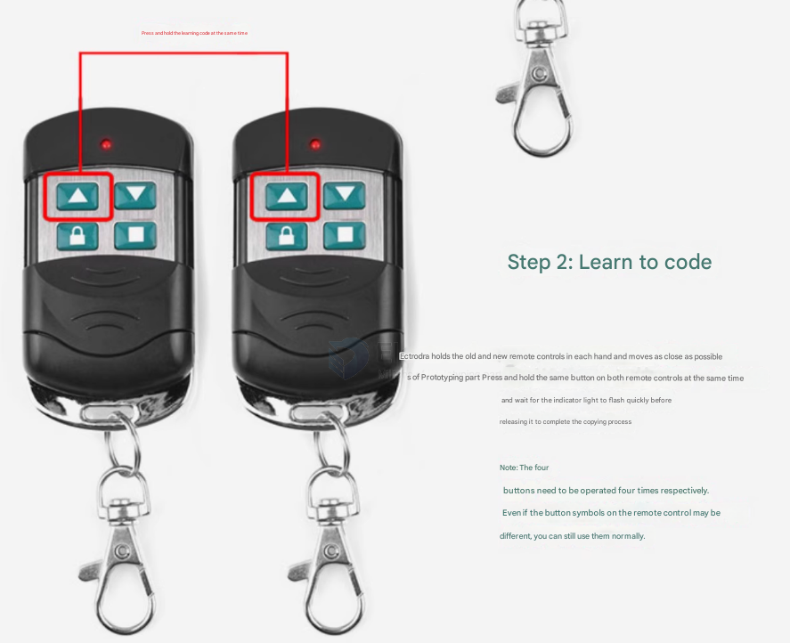

# RF-LINK-dat 

- [more info please find at legacy wiki page](https://w.electrodragon.com/w/Category:RF-Link)

[legacy wiki page 2](https://www.electrodragon.com/w/Category:Wireless)

- [[RF-Modulation-dat]]

- learning code RF link, rolling code RF link, fixed code RF link, etc.

## products

- [[NWL1016-dat]] - [[NWL1017-dat]]

https://www.electrodragon.com/product/433m-rf-wireless-module-a-pair-of-receiver-and-transmitter/

Clasic RF LINK 

- [[NWL1021-dat]] - [[NWL1022-dat]]

- [[NWL1026-dat]] - [[NWL1027-dat]]

- [[NWL1060-dat]]

## Transmitter == Sender 

- [[NWL1007-dat]] - [[NWL1008-dat]]

## Receiver == EDRF1 and EDRF2 Decoder

- [[NWL1089-dat]] == EDRF1 (retired)

- [[NWL1068-dat]] / [[NWL1070-dat]] == EDRF2

### snap button 

- [[NRF1003-dat]] == https://www.electrodragon.com/product/press-button-round-rf-ask-transmitter-433mhz-w-adhesive/

## APP 

### RF-LINK relay 

[[SCU1001-dat]] == https://www.electrodragon.com/product/wireless-relay-kit-learning-code/

## tech 

Manchester encoding

- [[PT2262-dat]] - [[PT2272-dat]] - [[EV1527-dat]]

learning code 
 
fixed (welding code) code

- [[rolling-code-dat]] - [[rolling-code-encoder-dat]] - [[rolling-code-decoder-dat]]

## working mode 

### Jog (M4) Single Working Mode Description:

When the transmitter button is pressed, the corresponding channel outputs a high level. When the button is released, it returns to a low level, with a VT (valid transmission) pulse output.  
Example: If button A has been learned by channel D0, pressing button A will make channel D0 output a high level; releasing the button will return it to a low level. Other channels are not affected.

### Interlock (H4)

When a valid signal is received, the corresponding output channel toggles its state:
If it was previously high, it becomes low; if it was low, it becomes high.

### Self-lock (T4)

When a valid signal is received, the corresponding output channel turns on, and all other channels turn off. Signal indication:
When a valid signal is present, VT outputs a high level; when the valid signal disappears, VT outputs a low level.

## Common Pairing 1 

### Pairing Method 1  (board with learning button)

Press the button on the receiver board and release it when the indicator light turns on; this means it has entered learning mode. 

Then, press any button on the remote control to transmit. If the indicator light on the receiver board flashes, pairing is successful, and the output pins are matched accordingly. Exit learning mode.

Note:

You only need to pair one button; the other buttons will also be paired and matched to their corresponding output pins. There is no need to pair each button individually.

清码方法:

持续按住学习键,指示灯会常亮，按住不放大约8秒后指示灯熄灭，表示代码已全部清除成功。

### Pairing Method 2 (board without learning button)

1. Remote control button learning identification and control channel setting:

- Within 6 seconds of module power-on, long press the button you want to learn for more than 2 seconds, until the learning indicator light flashes twice quickly - this indicates successful button learning. Then within 6 seconds after this button learning success,
- Press this button different numbers of times to set control for different channels:
  - If this button is pressed once (learning indicator flashes once), this button controls D0 channel;
  - If pressed twice (learning indicator flashes twice), this button controls D1 channel;
  - If pressed 3 times (learning indicator flashes 3 times), this button controls D2 channel;
  - If pressed 4 times or more than 4 times (learning indicator flashes 4 times), this button controls D3 channel;
- According to your needs, after pressing the corresponding number of times, long press this button again (about 0.5 seconds, as confirmation signal) until the indicator light flashes twice - this indicates successful setting;
- At this point you can immediately proceed to learn and set the next button's identification and control channel; if no operation is performed, it will automatically exit learning mode after 6 seconds;

Example: To set remote control button A to control D3 channel, the learning setup process is as follows:
- Within 6 seconds of chip power-on, long press button A until the learning indicator flashes twice - button learning is successful,
- Immediately within the following 6 seconds, press button A 4 times (learning indicator flashes 4 times),
- Long press button A once more until the learning indicator flashes twice for confirmation - channel setting is successful;

2. Clear remote control codes

EDRF can store up to 32 remote control buttons (each channel can learn and identify 8 buttons, 4 channels total 32 buttons); when each channel exceeds 8 buttons, the first learned button code will be overwritten; The method to clear button codes is: long press the learned button before module power-on, then power on the module until the learning indicator flashes twice quickly, then release the button, then long press this button for more than 3 seconds until the learning indicator flashes twice quickly - this clears all button codes stored in the module; if clearing fails, repeat the above operation.

## schematic and APP 

**Application Fields**

- Wireless remote control switches
- Wireless remote control sockets
- Wireless burglar alarms
- Wireless remote control door locks
- Wireless doorbells
- Wireless remote control electric rolling doors and windows
- Wireless LED lighting
- Industrial wireless remote control products
- Wireless data transmission
- Wireless industrial controllers
- Wireless curtain controllers
- Remote keyless entry (RKE) for cars
- Wireless gate openers

min. SCH 

## Note 

Note about distance:

If the distance required for far, can be connected to the 1/4 wavelength of the antenna, generally use 50 ohm single conductor, the length of the antenna 315M of about 23cm, 433M of about 17cm;

The position of the antenna has also affected the reception of the module, install the antenna as straight as possible away from the shield, high pressure, and interference sources;

## RF Link Pair (Learning Code) – Typical Transmission Range

These modules typically use chips like **PT2262**, **EV1527**, or **SC2262**, operating on **433 MHz or 315 MHz** ISM bands.

### ✅ Typical Transmission Range

| **Environment**                     | **Max Range**                     |
|------------------------------------|-----------------------------------|
| Indoor (with walls)                | 10–30 meters                      |
| Outdoor, line-of-sight             | 100–200 meters (typical)          |
| Enhanced with good antenna         | Up to 500 meters                  |
| Directional antenna + LNA (ideal)  | 1–2 kilometers (rare, ideal)      |
| High-power RF modules (e.g. [[LoRa-dat]])  | 5–15 kilometers (different tech)  |

### ❗ Real-World Limitations
- **Antenna quality and placement**: Crucial for maximizing range.
- **Interference**: Metal, walls, and Wi-Fi can reduce effective distance.
- **Power supply**: Low voltage or poor regulation limits performance.
- **Design purpose**: Learning code RF links are made for **short-range** control, not long-distance data transmission.

### 📌 Summary
If you're using **common learning-code RF modules**:
- **Realistic range**: 50–200 meters outdoors, 10–30 meters indoors.
- For **kilometer-level range**, consider:
  - **[[LoRa-dat]] modules** (e.g., SX1278, SX1262)
  - **High-power modules** (e.g., EBYTE E32-433T30D)
  - Use **directional antennas** or **RF amplifiers**

## chip options 

- [[SYN480-dat]] - [[SYN115-dat]] - [[SYN470-dat]]

- [[EV1527-dat]]

- [[RF600-dat]] 

2264、2262、2260、2240、1527、527、SMC918

-  clones of the PIC12xxx == [[PIC12-dat]] - [[PIC-dat]]

## Copier 

### 1️⃣ Clear Existing Codes (Code Erase)

> **Purpose:**  
> Remove all previously stored codes from the remote.  
> **Note:** Only perform this on a new remote. Do **not** clear your original remote unless necessary.

**Steps:**
1. **Press and hold** the two upper buttons on the remote **simultaneously** (regardless of their symbols).
2. **Keep holding** until the indicator LED flashes rapidly and continuously.
3. **Release** both buttons.  
   → The remote's memory is now cleared.

---

### 2️⃣ Copy (Pair) Codes from Old Remote to New Remote

> **Purpose:**  
> Clone the code from your original remote to the new remote.

**Steps:**
1. Hold the **old** and **new** remotes close together.
2. **Press and hold** the same button on both remotes at the same time.
3. Wait until the indicator LED on the new remote flashes rapidly.
4. **Release** both buttons.  
   → The code is copied successfully.

**Notes:**
- Repeat the process **for each button** (all four buttons must be copied individually).
- Button symbols may differ between remotes, but the function will be copied as per the original.

---

### ⚠️ Important Reminders

- Only clear codes on a new remote, not your original one.
- Each button must be paired separately, even if the symbols are different.
- Keep remotes close together during the copying process for best results.

---

## code

### arduino 

## demo video 

https://www.youtube.com/watch?v=LDGr38Ie1L4

## ref 

- [[RF-LINK]]