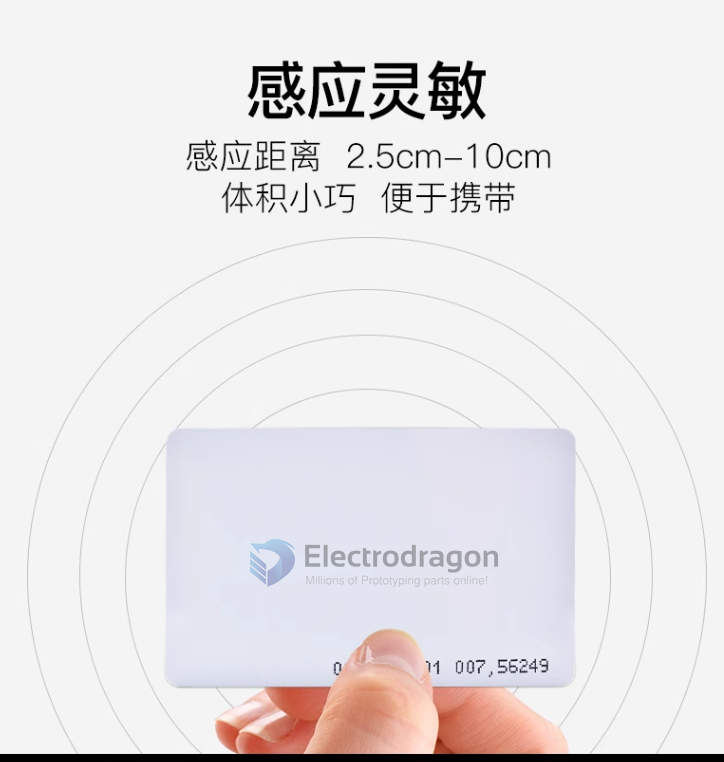
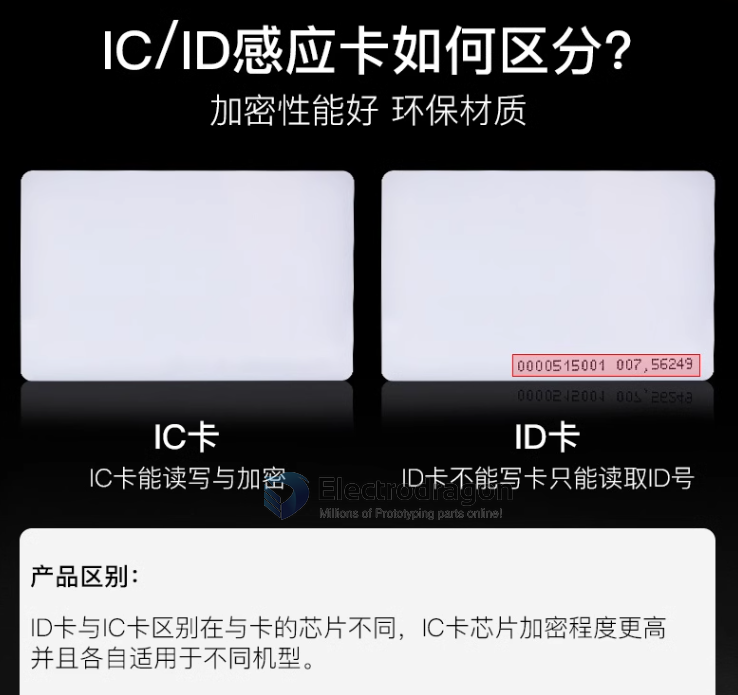

# RFID-Card-dat

- [[RFID-dat]] - [[rfid-card-dat]] - [[EDC-dat]]

[[RFID-card-dat]] 
  - key - [[NID1009-dat]] - [[EM4100-dat]] - [[125khz-dat]]
  - card - [[NID1010-dat]] - [[EM4100-dat]] - [[125khz-dat]]
  - key - [[NID1014-dat]] - [[RC522-dat]] - [[13.56mhz-dat]]
  - [[NID1022-dat]] - [[125khz-dat]] - [[NID1020-dat]] - [[NID1021-dat]]

## Types 

- IC - read and write, higher security level 
- ID - read only

* [[EM4100-dat]] - [[NID1009-dat]] - [[NID1010-dat]]

- [[NID1021-dat]] - [[NIE1022-dat]]

- [[NID1009]] - [[NID1010]]

- [[NID1021]] - [[NID1022]]

