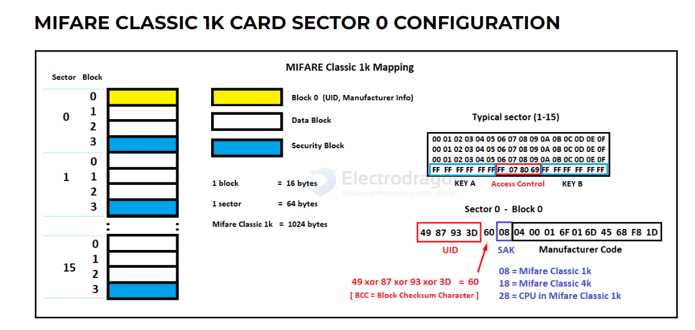

# rfid-dat

- [[RFID-dat]] - [[rfid-card-dat]] - [[EDC-dat]]

- [[EM4100-dat]] - [[125khz-dat]]

- [[13.56mhz-dat]] - [[134.2khz-dat]]

- [[wiegand-dat]] 
  
- [[NFC-dat]]

## Boards 

[[125khz-dat]] - [[NID1020-dat]] - cards and keys - [[NID1021-dat]] - [[NID1022-dat]]

[[125khz-dat]] - [[NID1005-dat]] - cards and keys - [[NID1003-dat]] - [[NID1009-dat]]

readers [[USB-dat]] based - [[NID1024-dat]]

[[NFC-dat]] - [[NID1026-dat]]

[[RFID-card-dat]] 

- [[125khz-dat]]
  - key - [[NID1009-dat]] - [[EM4100-dat]] - [[125khz-dat]]
  - card - [[NID1010-dat]] - [[EM4100-dat]] - [[125khz-dat]]
- [[13.56mhz-dat]]
  - key - [[NID1014-dat]] - [[RC522-dat]] - [[13.56mhz-dat]]
  - card - [[NID1007-dat]] - [[RC522-dat]] - [[13.56mhz-dat]]

  - [[NID1022-dat]] - [[125khz-dat]] - [[NID1020-dat]] - [[NID1021-dat]]

## interface types 

- [[EM4100]] - [[TK4100]] - [[4001]]

- [[EM4305]]

## terminlogy 

### crack 

Nested RFID refers to hierarchical tracking where tags on individual items are logically or physically associated with a parent container tag (e.g., items inside a carton on a pallet) to enable efficient, bulk, and accurate inventory tracking. This includes logistical data structures, compact chipless tag designs, and specialized antennas for metallic surfaces. 

MFOC (also known as the nested attack), first authenticates to a sector using a known key, whether that be a default key or one found from MFCUK, to then perform a nested authentication to the other sectors.  In this process, some bits of the keystream can be leaked, and eventually, the entire key can be recovered.  This is then performed for all unknown keys, and eventually to a point where all of the keys are known.  Once all keys are known the card can then be completely duplicated or cloned.

MFCUK (also known as the Darkside Attack) uses flaws in the pseudo-random number generator (PRNG) and error responses of the card to leak partial bits of the keystream, to eventually obtain one of the sector keys.  This attack is only used if not a single key is known for any given sector on the MIFARE Classic card.  While this is a rare occasion, it does happen, and this attack can take literally hours to complete.  Basically, the main goal is to find one key using MFCUK and then move on to the other attack method, MFOC.  

Sector 0 typically read-only and contains such information as the UID, access bits and manufacturer info, etc. 

To put it simply, [Mfkey32v2](https://pn532killer.com) is a tool that helps to generate a Mifare Classic Card's sector keys.

## card clone 

It’s relatively easy to clone a Mifare Classic card using the MCT Mifare Classic Tool  

https://github.com/ikarus23/MifareClassicTool  – Available for download at Google Play Store.

### rewritable magic card 

The appropriately named Chinese Magic Card allows for sector 0 writing, with re-writing capability advertised in the order of 100,000 times. 

The NFC ACR122U is a cost-friendly option for high frequency (13.56MHz) reading, writing, and cloning. Not only supported with useful open source software, but the reader/writer can also be interfaced with the NFC (near field connection) features of NFC compliant mobile phones.

## ref 

https://github.com/nfc-tools

- [[rfid]]