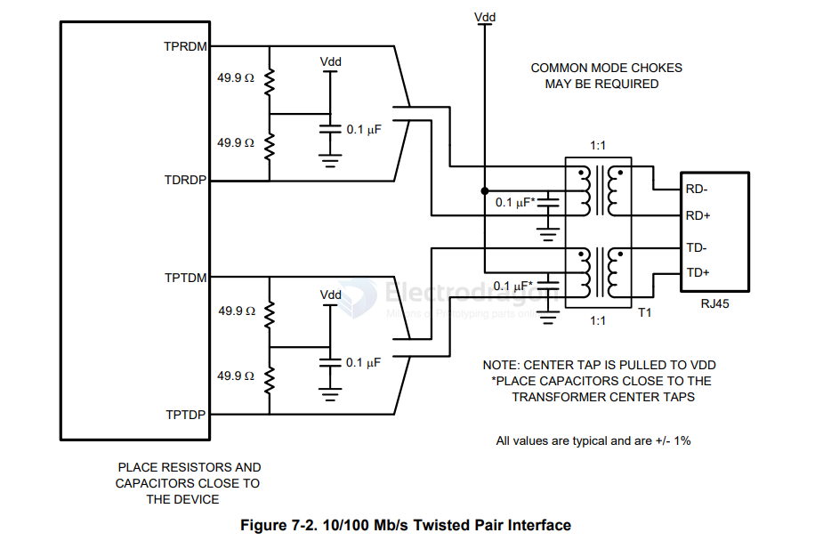

# ethernet-TPI-dat.md

https://www.ti.com/lit/ds/symlink/dp83848c.pdf

- [[network-dat]] - [[ethernet-TPI-dat]] - [[ethernet-dat]]

- [[MAC-dat]] - [[CAT-V-dat]] - [[network-dat]] - [[ti-network-dat]] - [[ethernet-dat]] - [[DP83848-dat]]

TPI Network Circuit

Figure 7-2 shows the recommended circuit for a 10/100 Mb/s twisted pair interface. To the right is a partial list of recommended transformers. 

It is important that the user realize that variations with PCB and component characteristics requires that the application be tested to ensure that the circuit meets the requirements of the intended application.

• Pulse H1102
• Pulse H2019
• Pulse J0011D21
• Pulse J0011D21B

## SCH 

## ref 

