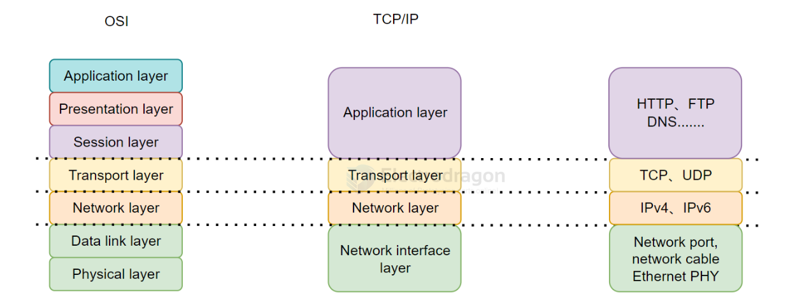
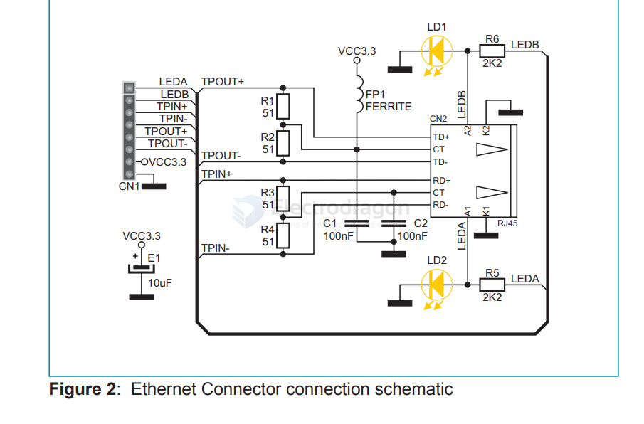
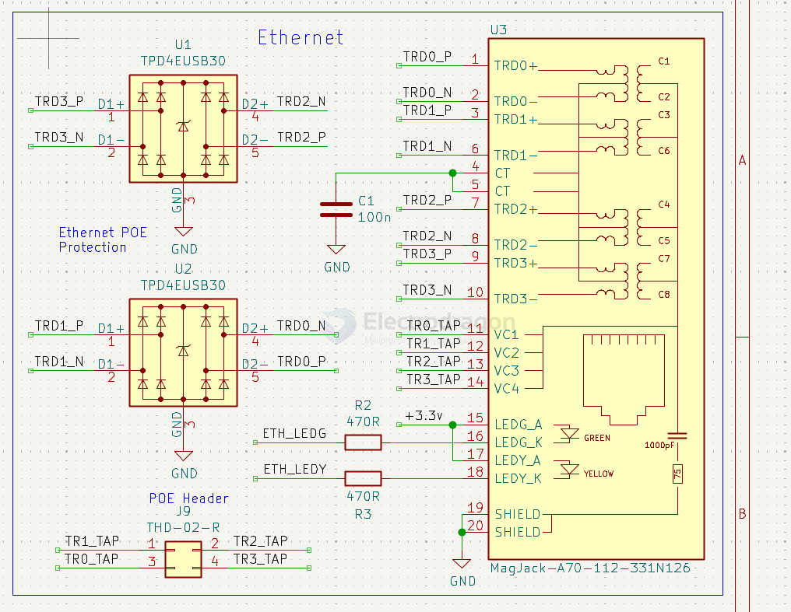
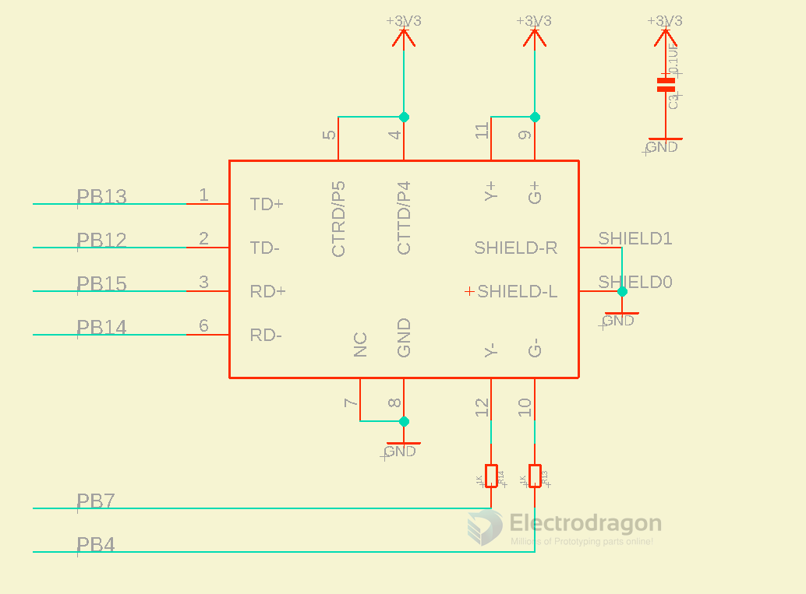
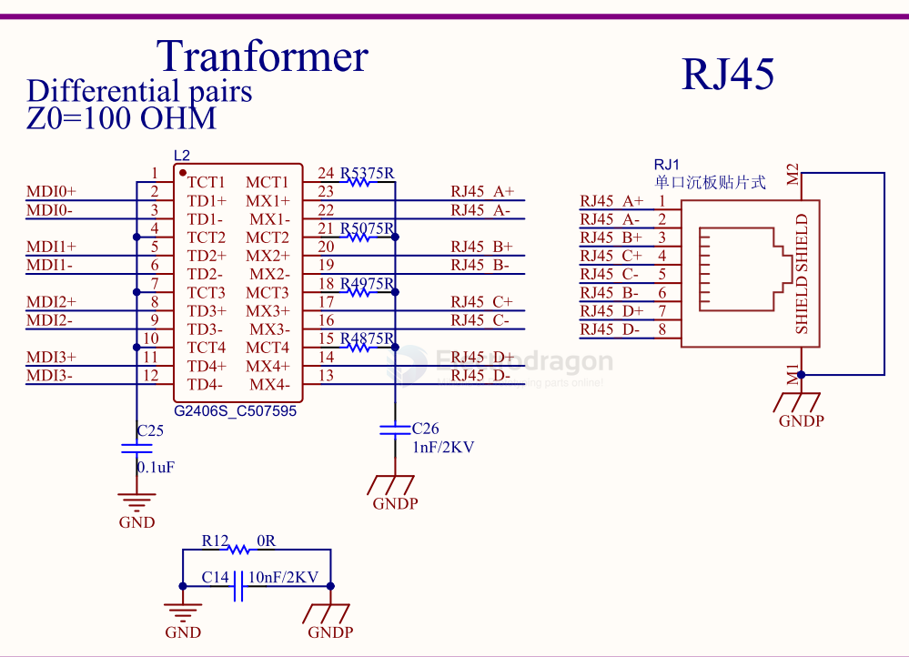
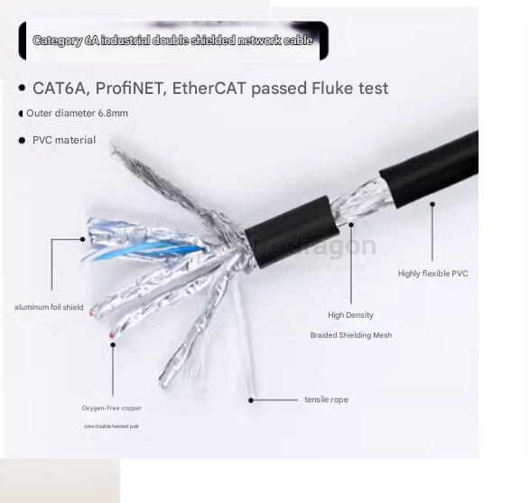

# ethernet-dat 

- [[TCPUDP-dat]]

- [[PHY-dat]]

- [[ethernet-SDK-dat]]

## info

### Basic Ethernet Concepts

Ethernet is an asynchronous, carrier-sense multiple access with collision detection (CSMA/CD) protocol/interface. While Ethernet is generally not ideal for low-power applications, it is widely used due to its broad deployment, efficient network connectivity, high data rates, and unlimited scalability. Nearly all wired communications can be achieved via Ethernet.

Ethernet is categorized by speed:
- Standard Ethernet (10 Mbit/s)
- Fast Ethernet (100 Mbit/s)
- Gigabit Ethernet (1000 Mbit/s)
- 10-Gigabit Ethernet (10 Gbit/s) and higher

Ethernet interface types include RJ45 (the most common for computers and the ESP32-P4 board), and RJ11 (telephone line interface). - [[RJ45-dat]] - [[RJ11-dat]]

The ESP32-P4 network model can be explained as follows:

- **Network Interface Layer**: ESP32-P4 connects to the IP101GRI PHY via RMII interface, and the network transformer leads to the RJ45 port. The MAC layer is integrated in the ESP32-P4 chip, handling frame encapsulation, checksums, and MAC addresses.
- **Network and Transport Layers**: Managed by ESP32-P4 driving the IP101GRI PHY.
- **Application Layer**: Once network connection is established, ESP32-P4 can perform HTTP requests, use MQTT, and other server communications.

## chip 

- [[W5500-dat]] - [[ENC28J60-dat]]

- [[LAN8720-dat]]

## RJ45 breakout board 

## SCH RPI CM4 

- [[RPI-CM4-expansion-board-dat]] - [[ESD-dat]]

## SCH 

- [[RJ45-dat]]

RJ-45

HY951180A
HY931147C
HR931130A

RJ-45 w/[[CH579-dat]]

transfomer == G2406S_C507595 and RJ45

## CAT6

## unsort 

- KSZ8041TL/FTL/MLL - 10BASE-T/100BASE-TX/100BASE-FX Physical Layer Transceiver

## ref 

- [[RGMII-dat]] - [[PHY-dat]] - [[TCPUDP-dat]] - [[TCPIP-dat]]

- [[RTL8211-dat]]

- [[ethernet]]