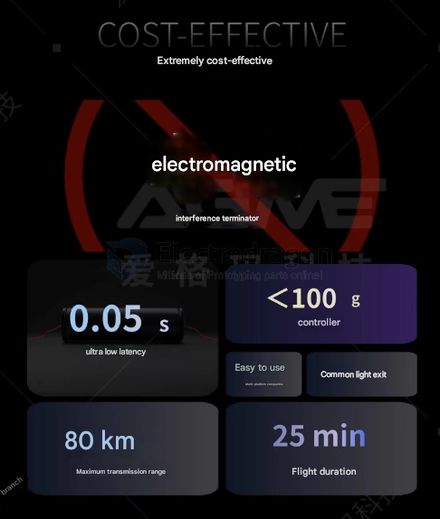
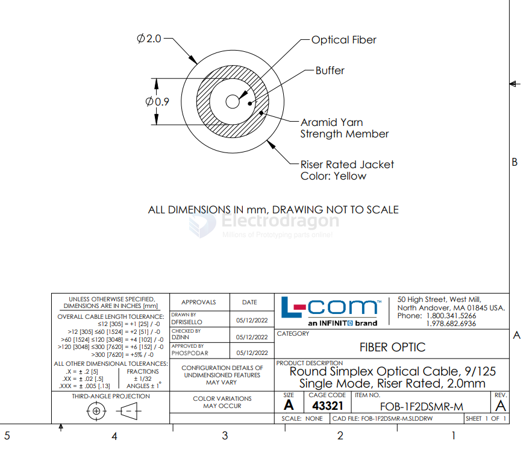

# fiber-optic-dat

info and knowledge 

- [[SFP-transceiver-dat]] - [[SFP-housing-dat]]

-  [[fiber-optic-transceiver-dat]]

- [[fiber-optic-cable-dat]] - [[POF-dat]]

- [[fiber-optic-connector-dat]] - [[LC-connector-dat]] - [[SC-connector-dat]]  - [[MTP-MPO-Connector-dat]]

already to go systems  - [[toslink-dat]] - [[photolink-dat]]

apps and solutions - [[fiber-optic-app-dat]] 
  
Signal == [[SerDes-dat]]

- [[fiber-optic-dat]] - [[cable-video-dat]]

## note 

Gigabit optical-to-electrical modules must be used with Category 5e, Category 6, and Category 6e network cables

10G optical-to-electrical modules must be used with Category 7 and Category 8 10G network cables

## advantage 

## demo 

- https://t.me/electrodragon3/342

## specs 

圆形单工光缆,9/125 单模,Riser 等级,2.0mm

## Usage 

- [[self-loop-test-dat]]

## comparison 

| Feature                  | 🔌 RS-485 (Twisted Pair)    | 🔴 Plastic Optical Fiber (POF)      | 🧪 Glass Optical Fiber               |
| ------------------------ | -------------------------- | ---------------------------------- | ----------------------------------- |
| **Max Distance**         | ~1200 m (4000 ft)          | ~50–100 m                          | >10 km (with proper transceivers)   |
| **Typical Data Rates**   | 9.6 kbps – 10 Mbps (short) | 10 kbps – 250 kbps (up to ~100m)   | 10 Mbps – 100 Gbps+                 |
| **Best Range vs Speed**  | 9.6 kbps @ 1.2 km          | 9600–38400 bps @ 100 m             | 1 Gbps @ 10+ km (SM fiber)          |
| **Signal Medium**        | Electrical (differential)  | Light (650nm LED, red)             | Light (laser or LED, 1310/1550nm)   |
| **EMI Immunity**         | Good                       | Excellent                          | Excellent                           |
| **Electrical Isolation** | Optional (via ICs)         | Yes (complete)                     | Yes (complete)                      |
| **Installation Cost**    | Low                        | Medium                             | High                                |
| **Ease of Termination**  | Simple (screw/crimp)       | Easy (cut and polish or click-fit) | Difficult (cleave, polish, splice)  |
| **Connectors**           | Screw terminal, DB9, etc.  | Snap-in (HFBR, Versatile Link)     | SC, LC, ST, FC                      |
| **Multi-node Support**   | Yes (up to 32 nodes)       | Point-to-point                     | Point-to-point (or splitter system) |
| **Use Cases**            | Industrial control, MODBUS | EMI-safe short serial links, DIY   | High-speed data, WAN/LAN, telecom   |

## fiber & copper ethernet PHY board 

[DP83869EVM - Copper & fiber industrial Ethernet PHY evaluation module](https://www.ti.com/tool/DP83869EVM)

- DP83869HM

## Applications 

[From the drones community on Reddit: Unjammable drones being flown via 12 mile long fiber optic cables.](https://www.reddit.com/r/drones/s/VfXIHkhMBL)

## ref 

- [[RJ45-DAT]] - [[RS485-dat]] - [[ethernet-dat]]

- [[fiber-optic]] - [[maker]]