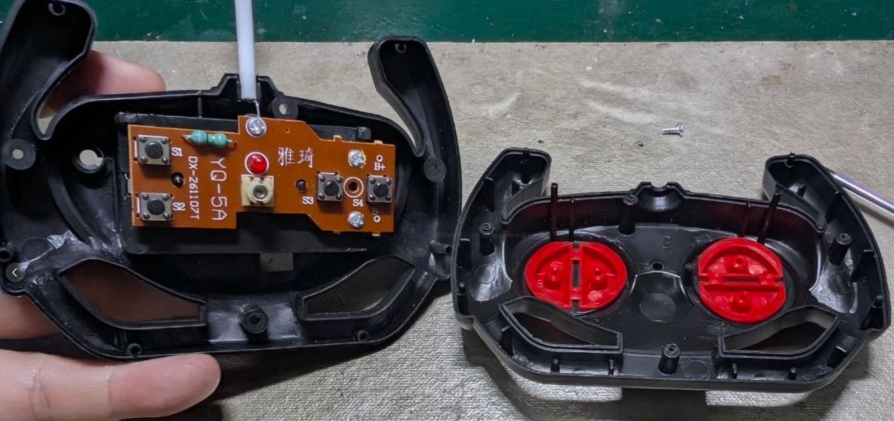
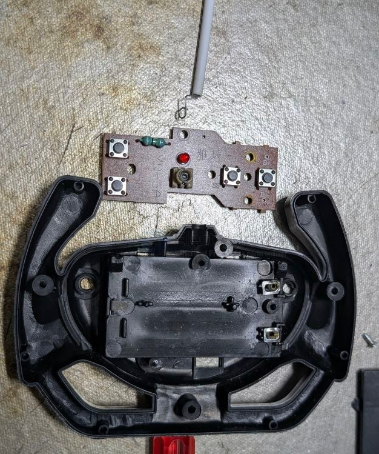
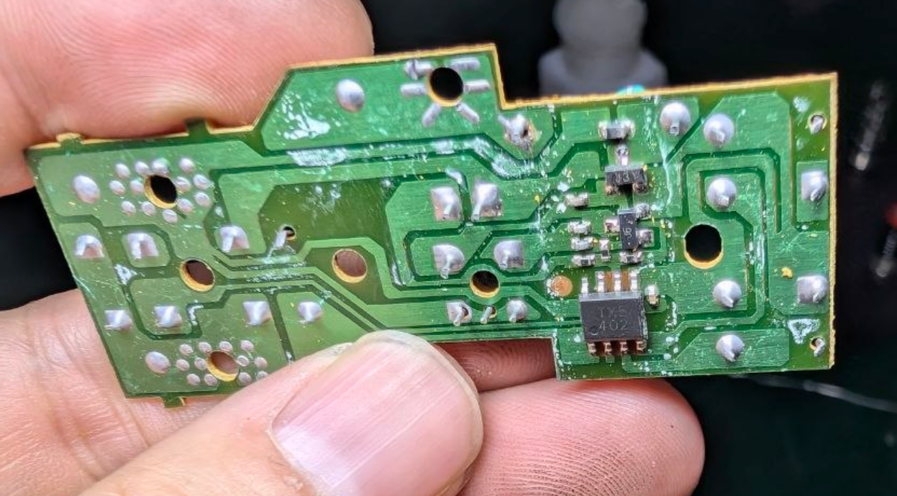
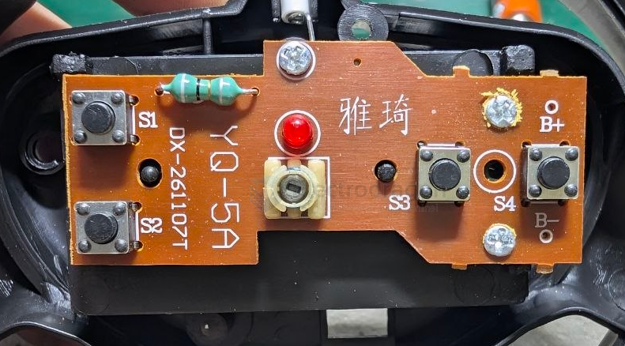

# 27mhz-dat

- [[27mhz-dat]] - [[frequency-dat]] - [[frequency-rc-dat]]

The use of the 27 MHz frequency in RC boats comes down to two main factors: **the physics of how radio waves interact with water** and **manufacturing costs**. 

While modern hobby-grade RC cars and drones have almost entirely moved to the 2.4 GHz band, water presents a unique physical barrier that makes the older, lower 27 MHz frequency highly advantageous for boats and submarines.

---

## The Physics of Water and Radio Waves

Radio waves are electromagnetic radiation, and their frequency dictates their wavelength. 
* **27 MHz** has a very long wavelength of about **11 meters**.
* **2.4 GHz** (used in modern Wi-Fi and most drones) has a very short wavelength of about **12.5 centimeters**.

Water—especially conductive water with impurities—is excellent at absorbing and reflecting high-frequency radio waves. In fact, 2.4 GHz is the exact same frequency your microwave oven uses to heat the water molecules in your food. 

Because of this, 2.4 GHz signals cannot penetrate water effectively. If a 2.4 GHz wave hits the surface of a lake, it largely bounces off or gets instantly absorbed. If an RC boat using 2.4 GHz takes on a heavy splash, flips over, or dips its receiver antenna below the water line, the signal drops to zero immediately. 

The much longer waves of 27 MHz can easily "punch through" water splashes and wave crests. More importantly, 27 MHz can actually penetrate several feet of fresh water. For RC submarines, lower frequencies (like 27 MHz, 40 MHz, or 75 MHz) are strictly mandatory, as a 2.4 GHz signal will fail if the submarine dives more than an inch below the surface.

> **Key insight:** The longer the wavelength, the better it ignores small obstacles like water droplets and wave crests. 

---

## Cost and Legacy

Beyond physics, 27 MHz is heavily used in "toy-grade" RC boats for economic reasons:

1.  **Unlicensed Band:** 27 MHz is part of the ISM (Industrial, Scientific, and Medical) and Citizen's Band (CB) spectrum. It has been free for consumer use globally for decades.
2.  **Extremely Cheap Electronics:** The basic analog AM or FM crystal components required to build a 27 MHz transmitter and receiver cost literal pennies to manufacture. 
3.  **Simplicity:** Toy manufacturers already have massive supply chains built around 27 MHz boards, making it the easiest plug-and-play solution for cheap aquatic toys.

## 27 MHz vs. 2.4 GHz in RC Boats

| Feature               | 27 MHz                                   | 2.4 GHz                            |
| :-------------------- | :--------------------------------------- | :--------------------------------- |
| **Water Penetration** | Excellent (can reach submarines)         | Non-existent (bounces or absorbs)  |
| **Splash Resistance** | Unaffected by surface splashes           | Splashes can cause signal drops    |
| **Antenna Length**    | Requires a long, external wire           | Very short (often hidden inside)   |
| **Interference**      | High (easy to cross signals with others) | Zero (digitally bound to receiver) |
| **Response Time**     | Noticeable analog lag                    | Instant digital response           |

Today, high-end hobby RC boats actually *do* use 2.4 GHz, but they require a specific design workaround: the receiver antenna must be routed through a plastic tube that sticks straight up, ensuring the tip remains strictly above the water line at all times.

### Comparison of Remote Control Frequencies for Watercraft

When operating remote-controlled (RC) boats, the choice between 27MHz and 2.4GHz involves significant trade-offs in physics and performance. Below is the technical breakdown.

---

### 1. 2.4GHz Systems (Modern Standard)
The industry standard using Spread Spectrum technology (FHSS/DSSS).

* **Optimal Range:** Typically **300 to 800 meters** in open water. High-end systems can exceed 1000 meters.
* **Water Surface Performance:** * **The "Fresnel Zone" Issue:** 2.4GHz signals have short wavelengths that reflect off the water surface. When the boat is low to the water, multipath interference can degrade the signal.
    * **The "Water Absorption" Factor:** Water is highly conductive and acts as a shield against 2.4GHz radio waves. **If your receiver antenna is submerged or trapped inside a wet hull, your range will drop to less than 10-20 meters.**

### 2. 27MHz Systems (Legacy/Traditional)
Older technology using amplitude/frequency modulation.

* **Optimal Range:** Generally **100 to 300 meters**.
* **Performance:** * **Advantages:** The longer wavelength (~11 meters) is less sensitive to surface reflections compared to 2.4GHz.
    * **Disadvantages:** Extremely susceptible to "noise" from modern electronics (like your ESP32-S3 or motor drivers) and environmental EM interference. In urban or industrial areas, reliability is significantly lower than in rural settings.

---

### Summary Comparison Table

| Feature               | 27MHz (Legacy)                 | 2.4GHz (Modern)                  |
| :-------------------- | :----------------------------- | :------------------------------- |
| **Typical Range**     | 100 - 300m                     | 300 - 800m+                      |
| **Interference**      | High (Susceptible to EM noise) | Very Low (Frequency Hopping)     |
| **Antenna Type**      | Long (Telescopic/Wire)         | Short (Monopole/PCB)             |
| **Water Sensitivity** | Moderate                       | High (Needs clear line-of-sight) |

---

### Engineering Recommendations for Your Project

1.  **Antenna Positioning:** To maximize distance, mount your 2.4GHz receiver antenna as high as possible. Ideally, use a non-conductive plastic tube to extend it vertically above the deck, ensuring it remains dry and clear of the water line.
2.  **Internal Interference:** If you are integrating microcontrollers (like the ESP32-S3 or nRF52840) inside your boat hull, they create significant radio noise. **Shield your electronics** using copper tape or a Faraday cage approach to prevent internal components from "deafening" your receiver.
3.  **Failsafe Protocol:** Always configure your receiver's Failsafe mode. If the signal is lost (e.g., due to water absorption), the boat should automatically cut the motor or center the rudder to prevent runaway incidents.
  

## Analysis of 0.5-Meter Antenna Height (2.4GHz)

For a 2.4GHz RC system, having the receiver antenna at **0.5 meters (50cm) above the water surface is considered an excellent setup.**

In practical RC boating, this height effectively solves the primary obstacle of 2.4GHz propagation over water. Here is why this height is effective and what to consider for your specific build:

#### 1. Why 0.5m is Effective
* **Breaking the "Fresnel Zone":** At 2.4GHz, the wavelength is approximately 12.5cm. Positioning the antenna at 0.5m puts it roughly 4 wavelengths above the water. This is sufficient to significantly reduce "multipath fading"—the phenomenon where reflected signals from the water surface arrive at the receiver slightly out of phase with the direct signal, causing "signal dropouts."
* **Line-of-Sight (LOS):** At this height, you are almost guaranteed a clean Fresnel zone (the elliptical area between transmitter and receiver), which is critical for maintaining maximum rated distance.

#### 2. The "Fresnel Zone" Visualization

#### 3. Factors to Monitor at 0.5m
Even with a good 0.5m height, your signal quality is still subject to:

* **Antenna Orientation (Polarization):** Ensure the antenna is **vertical**. 2.4GHz RC systems are vertically polarized. If the antenna is tilted horizontally, you lose a significant portion of the signal strength due to polarization mismatch.
* **Proximity to "Noisy" Components:** If that 0.5m mast also houses wires carrying high-current (like motor power leads or ESC wires), the interference might outweigh the benefit of the height. 
    * **Tip:** Keep the signal antenna at least 3-5cm away from any high-current power cables, and do not run the antenna wire parallel to motor wires.
* **The "Dead Zone" at Zenith:** If your transmitter is directly above the boat, the "cone of silence" at the tip of the antenna is at its strongest. 0.5m of height helps keep the antenna further away from the receiver itself, improving general coverage.

#### 4. Practical Engineering Recommendation
If your project is a medium-to-large boat, using a **plastic straw or a hollow carbon-fiber tube** (non-conductive) to support the antenna wire vertically is the industry standard. 

* **Check:** Ensure the active part of the antenna (the small, exposed metal tip at the end of the coaxial cable, usually the last 31mm) is at the very top of that 0.5m mast. The outer coaxial shielding does not need to be in the air, but the active element must be clear of all obstructions.

**Verdict:** 0.5m is more than "enough"—it is an **optimal height** that should yield near-maximum theoretical range for your 2.4GHz receiver.

## build 

board - TX5 402 - SOP8

## ref 

