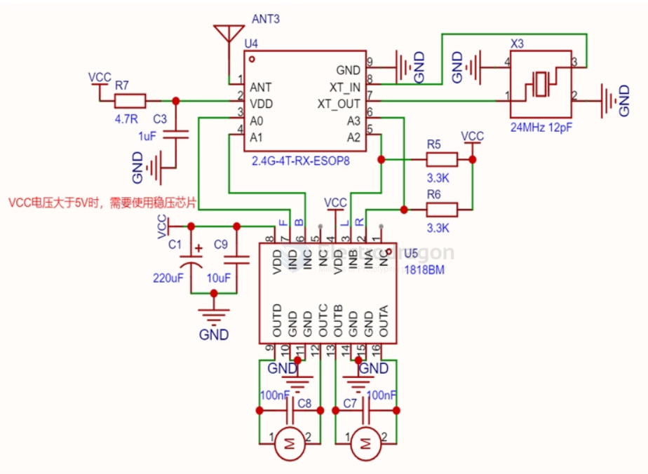
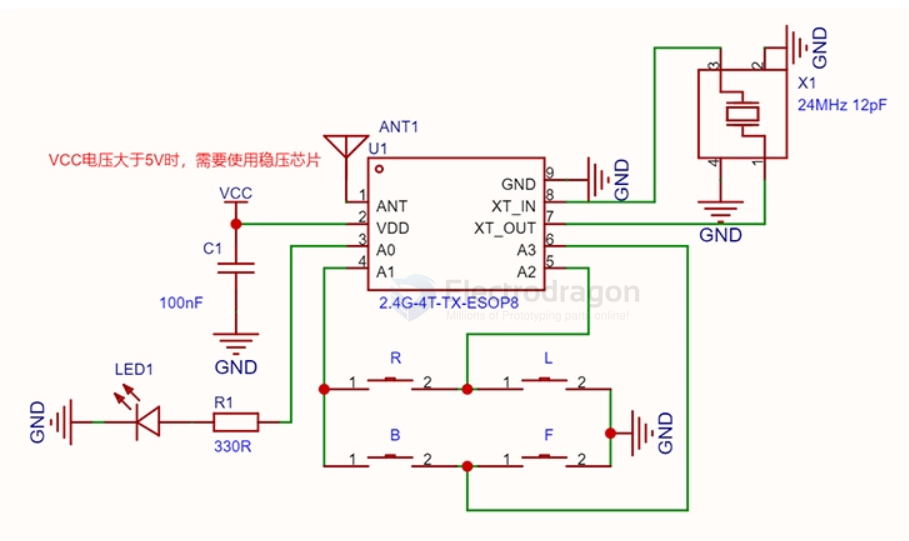
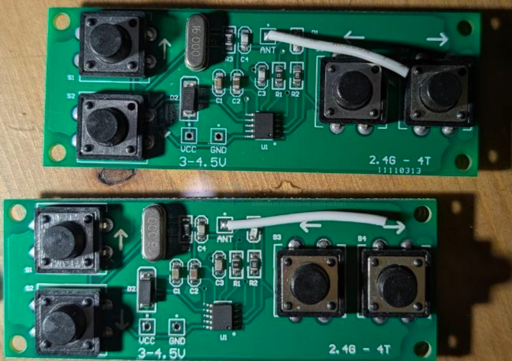
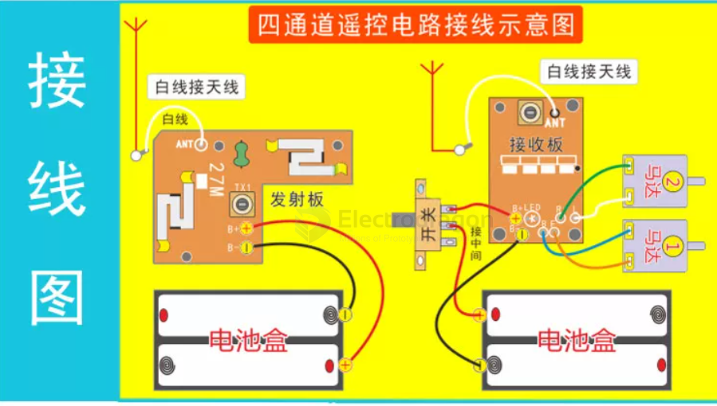
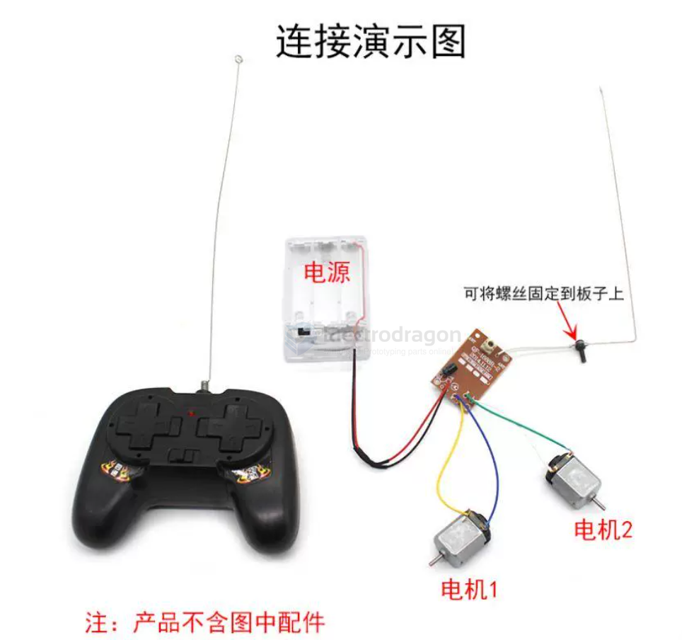
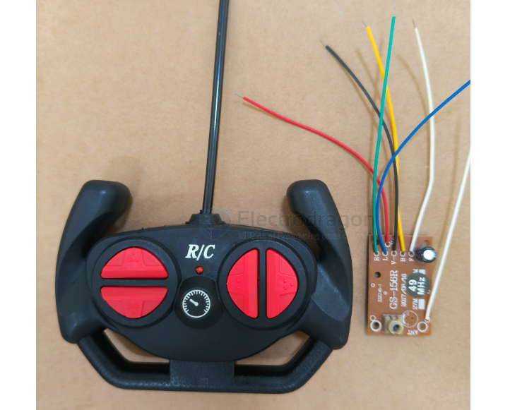
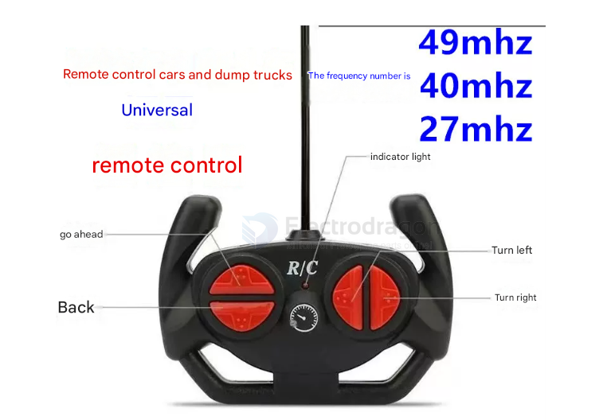

# frequency-rc-dat

- [[27mhz-dat]] - [[frequency-dat]] - [[frequency-rc-dat]] - [[RF-dat]] - [[RF-2.4Ghz-dat]] - [[RF-1Ghz-dat]]

- [[RC-dat]]

## transmitter and receiver board 

- [[27mhz-dat]] + [[40mhz-dat]] combination - [[RF-link-dat]]

- [[rf-2.4Ghz-dat]]

## customized chip TX RX

2.4G-4T-RX-ESOP8

2.4G-4T-TX-ESOP8

## transmitter 

### kit wiring 

- [[RC-controller-dat]] - [[RC-receiver-dat]]

- 27mhz 玩具车遥控器，频率一样才能用
- 40mhz 玩具车遥控器，频率一样才能用
- 49mhz 玩具车遥控器，频率一样才能用
- 27mhz ，左右反方向，不带灯
- 27mhz 遥控器 - 加车子电路板
- 40mhz 遥控器 - 加车子电路板
- 49mhz 遥控器 - 加车子电路板

带壳四通遥控器套装27mhz(含接收)，可以同时控制2个小电机转动(电机1和电机2正转与反转），可以使用它轻松自制遥控车等遥控模型。套装包含遥控器，接收板，天线，简单方便，收到即用。两种外壳颜色可选。
【遥控器电压】：3V（2节5号AA电池）
【接收板电压】：DC3-4.5V(推荐4.5V)
【参考距离】：约10米
【遥控频率】：27MHZ
【输出电压】：输出3V电压，因此适配电压是3v的电机
【接线方式】：红线+电源正极，黑线-电源负极，L与R字符处的2根线接一个电机，B和F字符处的2根线接一个电机，带圆环金属片的白线是天线（可以点击这里购买加强版天线）。L、R表示接线转向电机，B、F表示接线前后电机（输出电流大）
【外壳尺寸】：约85*45*118mm
【接收尺寸】：PCB板尺寸42*27.2mm
>>可选配件：电容（焊接后可以提遥控器灵敏度）
电池盒

## 27 MHz

The 27 MHz band is legal in most, if not all, countries for use with all types of RCs. Subject to interference from adjacent CB Operation. Note:cheap toys seem to usually use Channel 4 if there is no channel stated.

- 26.995 MHz -- Channel 1 -- Brown
- 27.045 MHz -- Channel 2 -- Red
- 27.095 MHz -- Channel 3 -- Orange
- 27.145 MHz -- Channel 4 -- Yellow
- 27.195 MHz -- Channel 5 -- Green
- 27.255 MHz -- Channel 6 -- Blue - Shared with CB Radio Service, never an "exclusive" channel

## 49 MHz

Used in some cheap toy R/C, there are at least 6 channels here too. (Need help here.) Not recommended for control of model aircraft due to limited range. Transmitter power limited to 100 Milliwatts.

- 49.830 Mhz -- Channel 1
- 49.845 Mhz -- Channel 2
- 49.860 Mhz -- Channel 3
- 49.875 Mhz -- Channel 4
- 49.890 Mhz -- Channel 5

## 50 MHz

The 50 MHz band is legal for all types of models in the US and Canada, for operators with an amateur radio license. For some reason, Channel 09 is not listed as safely usable in Canada, according to the MAAC's listings.

- 50.800 MHz -- Channel RC00
- 50.820 MHz -- Channel RC01
- 50.840 MHz -- Channel RC02
- 50.860 MHz -- Channel RC03
- 50.880 MHz -- Channel RC04
- 50.900 MHz -- Channel RC05
- 50.920 MHz -- Channel RC06
- 50.940 MHz -- Channel RC07
- 50.960 MHz -- Channel RC08
- 50.980 MHz -- Channel RC09 (not listed for use in Canada)

## 53 MHz

53 MHz is another amateur radio band for all types of models in the US and Canada. It is no longer in use for RC flying models, as high powered repeaters are now operating on this band in the United States, with very few, if any six-meter repeaters in use within Canada. Ground-based RC model operation on 53 MHz should still be relatively interference-free, however.

- 53.100 MHz -- Black-Brown
- 53.200 MHz -- Black-Red
- 53.300 MHz -- Black-Orange
- 53.400 MHz -- Black-Yellow
- 53.500 MHz -- Black-Green
- 53.600 MHz -- Black-Blue
- 53.700 MHz -- Black-Violet
- 53.800 MHz -- Black-Gray

## 72 MHz

The 72 MHz band is for aircraft use only. Country information is not currently available, other then that it is legal in the US and Canada, with various nations also using either the entire band (as Argentina is said to do) or parts of it (as France does for channels 21 through 35, and Japan with two bands using channels 17 through 21 and channels 50 through 54) as examples.

- 72.010 MHz -- Channel 11
- 72.030 MHz -- Channel 12
- 72.050 MHz -- Channel 13
- 72.070 MHz -- Channel 14
- 72.090 MHz -- Channel 15
- 72.110 MHz -- Channel 16
- 72.130 MHz -- Channel 17
- 72.150 MHz -- Channel 18
- 72.170 MHz -- Channel 19
- 72.190 MHz -- Channel 20
- 72.210 MHz -- Channel 21
- 72.230 MHz -- Channel 22
- 72.250 MHz -- Channel 23
- 72.270 MHz -- Channel 24
- 72.290 MHz -- Channel 25
- 72.310 MHz -- Channel 26
- 72.330 MHz -- Channel 27
- 72.350 MHz -- Channel 28
- 72.370 MHz -- Channel 29
- 72.390 MHz -- Channel 30
- 72.410 MHz -- Channel 31
- 72.430 MHz -- Channel 32
- 72.450 MHz -- Channel 33
- 72.470 MHz -- Channel 34
- 72.490 MHz -- Channel 35
- 72.510 MHz -- Channel 36
- 72.530 MHz -- Channel 37
- 72.550 MHz -- Channel 38
- 72.570 MHz -- Channel 39
- 72.590 MHz -- Channel 40
- 72.610 MHz -- Channel 41
- 72.630 MHz -- Channel 42
- 72.650 MHz -- Channel 43
- 72.670 MHz -- Channel 44
- 72.690 MHz -- Channel 45
- 72.710 MHz -- Channel 46
- 72.730 MHz -- Channel 47
- 72.750 MHz -- Channel 48
- 72.770 MHz -- Channel 49
- 72.790 MHz -- Channel 50
- 72.810 MHz -- Channel 51
- 72.830 MHz -- Channel 52
- 72.850 MHz -- Channel 53
- 72.870 MHz -- Channel 54
- 72.890 MHz -- Channel 55
- 72.910 MHz -- Channel 56
- 72.930 MHz -- Channel 57
- 72.950 MHz -- Channel 58
- 72.970 MHz -- Channel 59
- 72.990 MHz -- Channel 60

## 75 MHz

75 MHz is a surface model band in the US.

- 75.410 MHz --- Channel 61
- 75.430 MHz --- Channel 62
- 75.450 MHz --- Channel 63
- 75.470 MHz --- Channel 64
- 75.490 MHz --- Channel 65
- 75.510 MHz --- Channel 66
- 75.530 MHz --- Channel 67
- 75.550 MHz --- Channel 68
- 75.570 MHz --- Channel 69
- 75.590 MHz --- Channel 70
- 75.610 MHz --- Channel 71
- 75.630 MHz --- Channel 72
- 75.650 MHz --- Channel 73
- 75.670 MHz --- Channel 74
- 75.690 MHz --- Channel 75
- 75.710 MHz --- Channel 76
- 75.730 MHz --- Channel 77
- 75.750 MHz --- Channel 78
- 75.770 MHz --- Channel 79
- 75.790 MHz --- Channel 80
- 75.810 MHz --- Channel 81
- 75.830 MHz --- Channel 82
- 75.850 MHz --- Channel 83
- 75.870 MHz --- Channel 84
- 75.890 MHz --- Channel 85
- 75.910 MHz --- Channel 86
- 75.930 MHz --- Channel 87
- 75.950 MHz --- Channel 88
- 75.970 MHz --- Channel 89
- 75.990 MHz --- Channel 90

## ref 

