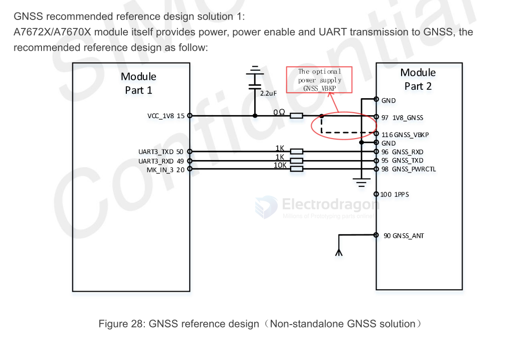

# GNSS-dat 

- [[location-dat]] - [[GNSS-dat]] - [[GPS-dat]] - [[nema-dat]]

## info 

- [[simcom-at-sscom-location-dat]]

- [[beidou-dat]] - [[GPS-dat]] - [[GLONASS-dat]]

- gnss protocol - [[quectel_l76-lbl26-lblc86l_gnss_protocol_specification_v2-2.pdf]]

- GSV - GNSS Satellites in View. 

- GSA - GNSS  DOP  and  Active  Satellites.  GNSS  receiver  operating  mode,  satellites  used  in  the  navigation solution reported by the GGA sentence, and DOP values. 

- GLL - Geographic Position – Latitude/Longitude. 

- GGA - Global Positioning System Fix Data. Time, position, and fix-related data for a GNSS receiver.

- VTG - Course Over Ground & Ground Speed. 

- RMC - Recommended Minimum Specific GNSS Data. Time, date, position, course, and speed data provided by a GNSS receiver.

## tech 

### What is a POT GNSS Module?

A **POT GNSS module** refers to a GNSS (Global Navigation Satellite System) module that uses a **Patch On Top (POT)** antenna design.

- **POT** stands for **Patch On Top**.
- The module integrates a ceramic patch antenna directly on top of the GNSS receiver.
- This design makes the module compact, easy to integrate, and suitable for space-constrained applications.
- POT GNSS modules are commonly used for GPS, GLONASS, Galileo, and BeiDou navigation systems.

**Summary:**  
A POT GNSS module is a navigation module with a built-in patch antenna mounted on top, providing a simple and compact solution for satellite positioning.

## GNSS Start 

COLD start GNSS:
- When first used;
- Loss of ephemeris information due to battery depletion;
- Move the receiver more than 200 km under shutdown. 

HOT start GNSS:
- Boot less than two hours from the last location

WARM start GNSS:
- Boot more than two hours from the last location

## GNSS bands 
| Type    | Frequecy          |
| ------- | ----------------- |
| GPS     | 1575.42±1.023MHz  |
| GLONASS | 1597.5~1605.8MHz  |
| BeiDou  | 1561.098±2.046MHz |

## GNSS Antenna Requirements

| Antenna Specification      | Specification Requirement          |
| :------------------------- | :--------------------------------- |
| Operating Frequency Band   | L1: 1559~1609MHz                   |
| Directionality             | Hemisphere, face to sky            |
| Impedance                  | 50 Ω                               |
| Maximum Input Power        | 50W                                |
| VSWR                       | < 2                                |
| Polarization Type          | RHCP or Linear                     |
| Passive Antenna Gain       | 0dBi                               |
| Active Antenna Gain        | -2dBi                              |
| Active Antenna Noise Figure| < 1.5                              |
| Built-in Antenna LNA Gain  | 20dB(Typ.)                         |
| Total Antenna Gain         | < 18 dB                            |
| Coaxial Cable Insertion Loss | <1.5dB                             |

## Schematic 

- [[A7670-dat]]

## board 

- [[NGS1078-dat]] - [[NGS1052-dat]]

- [[MPC1056-dat]]

- [[antenna-dat]]

## chip 

- [[GPS-dat]] - [[location-dat]] 

- [[NEO-6-dat]] - [[NEO-7-dat]] - [[NEO-8-dat]] - [[u-blox-dat]]

- [[location-dat]] - [[GNSS-dat]]

- [[ZHONGKEWEI-dat]] - [[ATGM336H-dat]] - [[NGS1078-dat]]

## commands examples 

    Search GPS + GLONASS: 
    $PMTK353,1,1,0,0,0*2B

    Enable GPS, Glonass, Galileo:
    $PMTK353,1,1,1,0,0*2A

Sets  the  speed  threshold  for  static  navigation.  

    $PMTK386,0.4*39 
    $PMTK001,386,3*3D

Gets whether the GPS/GLONASS/BDS/Galileo satellite seraching is enabled or not.

    $PMTK355*31 
    $PMTK001,355,3,1,1,0,0*33
    
PMTK838 PMTK_TEST_ANTI_SPOOFING - Enables or disables jamming detection function.

    $PMTK838,1*2C 
    $PMTK001,838,3,1*2E 

PMTK605 PMTK_Q_RELEASE - Queries the firmware release information. See PMTK_DT_RELEASE for the query result.

    $PMTK605*31
    $PMTK705,MT3333_AXN5.1.9_MODULE_STD_F1_P1,0007,Quectel-L76L,1.0*08
    $PMTK705,AXN_5.1.6_3333_19010218,0007,Quectel-L76L,1.0*53

## GNSS Log 

    $GBGSV,2,1,06,03,65,189,40,07,41,202,27,16,27,165,34,27,79,266,39,0*75
    $GBGSV,2,2,06,28,46,154,39,32,50,281,47,0*7F
    $GNRMC,081456.00,A,2234.27498,N,11353.24761,E,0.000,,010625,,,A,V*1E
    $GNGGA,081456.00,2234.27498,N,11353.24761,E,1,13,1.36,28.7,M,,M,,*6D
    $GNGSA,A,3,05,11,15,29,18,24,13,,,,,,2.04,1.36,1.53,1*03
    $GNGSA,A,3,27,28,32,03,07,16,,,,,,,2.04,1.36,1.53,4*0C
    $GPGSV,3,1,09,05,44,017,30,15,66,258,46,18,13,320,31,29,47,278,44,0*6A
    $GPGSV,3,2,09,11,32,114,29,13,68,041,26,24,19,179,26,194,,,27,0*62
    $GPGSV,3,3,09,199,,,26,0*59

### GNSS Data Summary (June 1, 2025, 08:14:56 UTC)

| Parameter             | Value                                 |
|-----------------------|----------------------------------------|
| **Date/Time (UTC)**   | 2025-06-01 08:14:56                    |
| **Fix Status**        | 3D Fix (Valid)                         |
| **Latitude**          | 22° 34.27498′ N                        |
| **Longitude**         | 113° 53.24761′ E                       |
| **Altitude**          | 28.7 m above mean sea level            |
| **Speed (Ground)**    | 0.000 knots (stationary)               |
| **Satellites Used**   | 13 (GPS + BeiDou)                      |
| **Satellites in View**| 15 (9 GPS, 6 BeiDou)                   |
| **HDOP**              | 1.36 (Good)                            |
| **VDOP**              | 1.53 (Good)                            |
| **PDOP**              | 2.04                                   |
| **GPS Satellites**    | 05, 11, 13, 15, 18, 24, 29, (194?), (199?) |
| **BeiDou Satellites** | 03, 07, 16, 27, 28, 32                 |

## ref 

- [[GPS-dat]] - [[quectel-GPS-dat]]

- [[SIMCOM-dat]] - [[simcom-at-sscom-location-dat]]