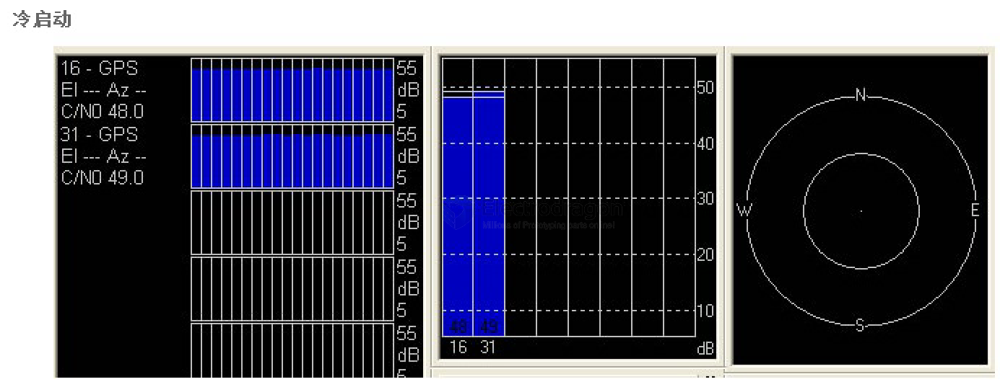
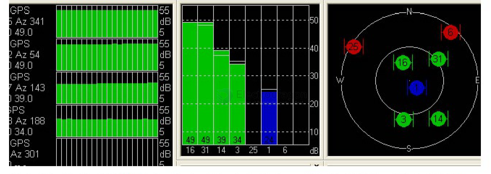
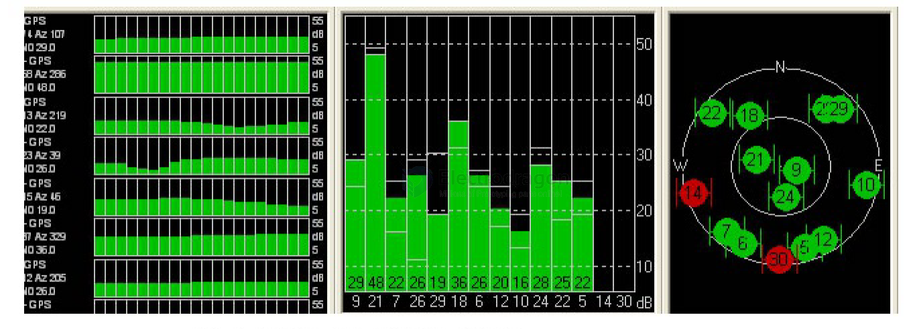

# GPS-dat 

- legacy wiki page - https://w.electrodragon.com/w/Category:Location#GNSS

- [[location-dat]] - [[GNSS-dat]] - [[GPS-dat]] - [[nema-dat]]

- [[serial-CMD-dat]]

## Functions 

- [[GNSS-dat]]
- ATGM
- [[GPS-dat]]
- Galileo
- sbas
- dgps
- beidou
- glonass
- gzss
- [[AGPS-dat]]

## boards 

- [[NGS1052-dat]] - [[NGS1089-dat]] - [[NGS1078-dat]] - [[quectel-gps-dat]]

## chip manufactures 

- [[quectel-gps-dat]] - [[ZHONGKEWEI-dat]] - [[SIMCOM-dat]]

- [[u-blox-dat]]

## software 

- https://igs.bkg.bund.de/ntrip/download

## Tesing 

[[NGS1089-dat]]

    AT+CPIN?
    +CPIN: READY

    AT+CGNSPWR=?
    +CGNSPWR: (0-1)

    OK
    AT+CGNSPWR?
    +CGNSPWR: 0

    OK
    AT+CGNSPWR=1
    OK

    AT+CGNSINF
    +CGNSINF: 1,0,19800109075159.000,,,,0.00,0.0,0,,,,,,3,0,2,,44,,

    OK
    AT+CGNSINF
    +CGNSINF: 1,0,20240626075200.000,,,,0.00,0.0,0,,,,,,3,0,2,,44,,

    AT+CGNSINF
    +CGNSINF: 1,1,20240626074838.000,22.570777,113.887168,155.727,0.00,65.8,1,,2.8,3.0,1.0,,7,4,5,,47,,

- 2.1  AT+CGNSPWR      GNSS power control ...................................................................... 8 
- 2.2  AT+CGNSSEQ   Define the last NMEA sentence that parsed ..................................... 9 
- 2.3  AT+CGNSINF    GNSS navigation information parsed from NMEA sentences ......... 11 
- 2.4  AT+CGNSURC   GNSS navigation, GEO-fences and speed alarm URC report ....... 12 
- 2.5  AT+CGNSCMD    Send command to GNSS ............................................................... 13 
- 2.6  AT+CGNSTST    Send data received from UART2 to UART1 ................................... 14 
- 2.7  AT+CGNSCHK    Check EPO file property ................................................................ 14 
- 2.8  AT+CGNSDEL    Delete EPO file ............................................................................... 15 
- 2.9  AT+CGNSIPR   Configure UART2 baud rate ............................................................ 16 
- 2.10  AT+CGNSAID    Send EPO file to GNSS engine ....................................................... 16 
- 2.11  AT+CRFLOC   Give reference location to GNSS engine ........................................... 17 
- 2.12  AT+CGNSVER  Query GNSS version....................................................................... 17 

## Note 

### Why you really need good GPS signal, compare to your smart phone? 

- your smart phone use 4G network to assist the location, but GPS module use [[GPS-dat]] signal location only
- read more at [[AGPS-net]]

## interface 

- [[serial-dat]]

- [[NGS1078]]

- [[quectel-gps-dat]] - [[quectel-gnss-dat]]

## cold, warm and hot start 

> GPS modules are outdoor positioning systems, so the antenna must be placed **outdoors** to get a fix. The first time you power on the module it performs a **cold start** and needs to download satellite data. This usually takes about **1–10 minutes**, so please be patient.

### Cold Start (冷启动)

A **cold start** means the module has **no stored ephemeris or almanac data** internally. This is the very first startup, or any startup where all such data has been lost.

- Since there is no satellite orbit information available, the module must begin receiving signals and **search the entire sky** within the antenna’s view to find satellites and download ephemeris.
- During this first operation, the **power consumption is high** and the **internal computation is complex**, because it has to keep downloading the current effective ephemeris of the visible satellites.
- **Cold-start sensitivity is lower**. Without any prior ephemeris, the module cannot estimate its approximate position. It’s like arriving in a completely unfamiliar desert: you have no reference points, so you must scan the entire environment for landmarks to figure out where you are.

In other words, during a cold start, the GPS module has to do **a lot of “wasted work”**:

- It scans **every corner of the sky** like sifting signals through a filter.
- This process consumes a **lot of power**.
- Once it finds a satellite, it starts downloading ephemeris. If the signal condition changes (for example, you’re in a moving car and position changes constantly), the module may fail to download complete data and has to retry, which **extends the cold-start time**.
- In weak-signal environments, downloading ephemeris takes even longer.

You can compare this to downloading a file from the internet:

- If the connection is good, the file downloads quickly.
- If the connection is unstable, it may disconnect and need to re-establish the link, restarting or slowing the download.
- Users of **CDMA / GPRS** connections, especially on a train, know that the link can be intermittent and significantly worse than being near a base station.

Once the GPS module has continuously tracked **three or more satellites**, the situation improves:

- Like sketching a rough map in the field, you can at least estimate your **approximate 2D position**.
- At **three satellites**, 2D (horizontal) positioning becomes possible.
- At **four satellites**, you get **3D positioning** (including altitude).

After the module has been running for a while and has finished downloading enough current information:

- It enters a relatively **stable signal reception state**.
- Small movements or moderate signal changes no longer affect it as much, because it has **stored the current ephemeris data**.
- Even with brief signal loss, it can rely on **memory and internal calculations** to quickly restore its position, just like someone who has become familiar with a new environment and can quickly find their way back.

Once stabilized:

- The ephemeris data continues to **refresh periodically**.
- After stabilization, the **power consumption naturally decreases**.

An analogy:

- The first time you visit a large amusement park (or zoo), you see elephants, monkeys, tigers, artificial hills, dense woods, etc. It’s dazzling and disorienting; you easily lose sense of direction.
- After wandering around all day, you become familiar with the terrain and realize the whole place isn’t that big.
- If someone then briefly covers your eyes and releases you, you can quickly figure out east/west/north/south.

Similarly, once the GPS module is in this familiar state:

- Even if you move into a weak-signal area from time to time, it can **quickly readjust**.
- Thanks to the stored ephemeris and internal calculations, the positioning performance is **much better than during a fresh cold start in the same place**.

You might wish that the module **never** had to go through cold start. In practice, we can **shorten cold-start time** by using **network-assisted data**, but some limitations remain:

- Through the internet, you can download **almanac/ephemeris-like data** (e.g. from u‑blox servers).
- However, **ephemeris (星历)** and **almanac (历书)** are different:
  - Almanac is generated by u‑blox using data from **about 182 ground receivers worldwide**, then computing satellite orbits with software.
  - Almanac files can cover **1 day, 7 days, 2 weeks**, or even longer. In theory, with good almanac you can avoid a full cold start for **long periods**.
- In reality, satellite orbits are **constantly corrected**:
  - Satellites’ actual paths change.
  - Ground stations periodically adjust and correct the trajectory.
  - So a “perfectly” computed almanac still has limited accuracy for precise positioning.
- Nonetheless, having good almanac/assistance **significantly shortens cold-start time**. Technologies like **u‑blox A‑GPS** or **AssistNow** are classic examples, but they **require network connectivity**, which is sometimes limited in real applications.

### Hot Start (热启动)

If a cold start is the difficult process of adapting to a completely new environment, then a **hot start** is like living in a **familiar** place:

- You watch familiar TV, listen to familiar music, sleep in a familiar bed, and enjoy a pleasant, sunny day.
- We also hope that the module can “stay in a good mood”, i.e. **remain familiar with its environment**.

Practical meaning:

- Sometimes we need to **briefly power off** the GPS or the whole device.
- To allow the module to **quickly return** to its previous state when powered on again, we must **save the current ephemeris and related data**.
- This is done with a **backup battery** (后备电池), which can maintain the module’s data for **about 8–12 hours**.

If the main power is removed but the backup battery is present:

- And we **reapply power within about 2 hours**, the module can perform a **hot start**.
- In this case, it can reach a normal fixed position in about **3 seconds**.
- The reason is that the satellite configuration overhead has **not changed much**:
  - The satellites above your head have only moved slightly.
  - It’s like walking near your home; the landmarks barely change, so you can quickly find your way back.

That **small backup battery or backup supply** can save you **a lot of waiting time**.

### Warm Start (温启动)

Warm start is the case **between cold and hot start**:

- In practice, we don’t always restart within 2 hours.
- Suppose the main power to the module has been off for **more than 2 hours**, but the **backup battery still has power**.
- If we restart within **8 hours** (approximate range) of power-off, the module will perform a **warm start**.

Characteristics:

- Startup speed is **slower than hot start**, but **faster than cold start**.
- Signal environment requirements are **less strict than cold start**, but stricter than hot start.
- The actual time needed to fix a position varies:
  - The closer the **time and satellite configuration** is to the moment when data was last saved, the **shorter** the time to get a fix.
  - The longer the power-off duration, or the bigger the change in satellite geometry, the **longer** it takes.

Analogy:

- The shorter the time you are away from home, the **faster** you re-familiarize yourself with your surroundings when you return—assuming your memory is fine.
- If you have been away **too long**, things change and your memory becomes less useful.

If enough time passes:

- For example, after **20 hours**, the satellite configuration has changed significantly.
- The stored ephemeris is no longer very useful.
- In this case, the module effectively has to perform a **cold start again**.

### Summary

- A computer is a machine that executes programs designed by humans; its “thinking” cannot exceed human logic.
- Many artificial intelligence products such as GPS systems are implementations of **human-designed strategies** based on **natural rules**.
- By understanding how our own thinking and memory work, we can design **better and more efficient GPS behavior**, especially around cold, warm and hot starts.

## ref 

- [[location-dat]]