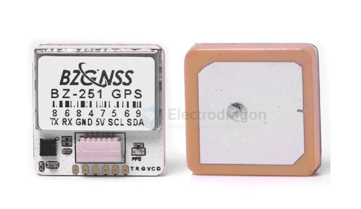
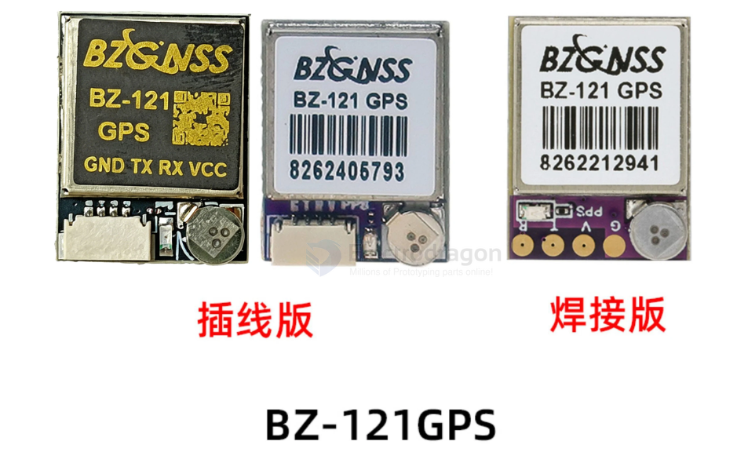
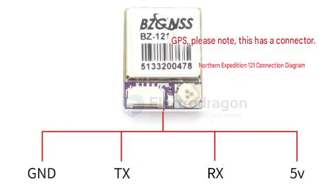

# location-FPV-dat


- [[FPV-build-dat]] - [[location-FPV-dat]] - [[location-dat]]

[[location-FPV-dat]] == [[GNSS-dat]] + [[3-Axis-Magnetic-dat]] - [[sensor-dat]]


[[3-Axis-Magnetic-dat]] == [[QMC5883-dat]] == compass sensor == magnetometer


## GNSS info 




### BZ M10 specs 

- [[GPS-dat]] - [[GLONASS-dat]] - [[BDS-dat]] - [[GALILEO-dat]] - [[SBAS-dat]] - [[QZSS-dat]] - [[NNMA-dat]] - [[UBLOX-dat]]

Product specifications:

- **Chip**: M10 (10th-generation chip)
- **Modes**: GPS, GLONASS, BDS, GALILEO, SBAS, QZSS (default: GPS + GLONASS + BDS joint positioning)
- **Antenna**: Ceramic antenna (spray-oil process to prevent scratching/oxidation)
- **Receive channels**: 72 search channels
- **Dimensions**: 12mm × 16mm × 4.5mm
- **Weight**: 2.4g
- **Power**: 5V
- **Baud rate**: 115200 bps
- **Output protocol**: NMEA / UBLOX (dual protocol)
- **Output frequency**: 1Hz–10Hz (default 10Hz)
- **Speed accuracy**: 0.05 m/s
- **Horizontal positioning accuracy**: 2D ACC 1.5m (open sky)
- **Receive sensitivity**: Tracking –162 dBm; Acquisition –160 dBm


### pin definitions 



RTVG  



GTRV 


### GNSS setup 

GPS设置方法：

1. 比如（例1图片）GPS接在TX3/RX3也就是飞控的UART3串口。（注：一定要接空余的串口或GPS专用串口）
2. 首先打开BetaflightConfigurator软件.进入端口界面。找到UART3在传感器输入打开GPS并选择波特率115200。
3. 然后再打开配置界面启用GPS。协议选择UBLOX。
4. 设置完成后.检查GPS是否已通信。
5. 如果GPS图标亮起说明GPS已正常通信。6.如果GPS指示灯不亮的请为飞控插上电池供电个别飞控需要插电池GPS才正常工作。
7. 如果GPS图标不显示或GPS指示灯不亮(已供电）请检查接线方式是否正确。供电电压是否正常。


### GNSS size and antenna size 

3个GPS有什么不同：
- 外观尺寸：和天线大小不一样，251大-181-121小
- 功能区别：251带罗盘，一般用在INAV固件，BF也是可以用的，不接罗盘(蓝绿线不要)就可以，181和121不带罗盘体积也小，BF固件优先推荐。
- 信号方面：251天线和181天线大相对121搜星要快那么一点点。
- 注意：因GPS芯片是新10代芯片，飞控需要刷固件4.29及以上，


## magnetometer

The **QMC5883L** is a 3-axis magnetometer (electronic compass) that acts as the "north-finder" in a positioning system. Here's how it works:

- [[QMC5883-dat]]

### Its Core Role in Positioning: Providing Orientation (Heading / Yaw)

```
Positioning = Position (X/Y/Z)  +  Orientation (Yaw / Heading)
                  ↑                          ↑
            GPS / Vision provides     Compass provides
```

**GPS only tells you "where you are", not "which way you're facing".** The compass fills that gap.

---

### Specific Use Cases

| Purpose | What it does |
| ------- | ------------ |
| **Heading reference** | Knows which direction the nose points while hovering / flying |
| **Coordinate alignment** | GPS waypoint flight needs "fly north / fly east" — without a compass you can't tell which way is north |
| **Return to Home (RTH)** | One-key RTH must first turn toward home; the compass calculates that angle |
| **Attitude estimation support** | Fuses with the gyroscope to cancel its yaw drift (gyro slowly "walks off"; compass periodically corrects it) |

---

### Fusion Principle (Kalman Filter)

| Sensor | Characteristics |
| ------ | --------------- |
| **Gyroscope** | Yaw changes fast but accumulates drift (1000 Hz) |
| **Compass** | Yaw is stable but updates slowly and is noisy (10–100 Hz) |

```
             ↓ fusion
Stable, drift-free heading
```

**Without a compass:** the gyroscope's yaw drifts over time — the flight controller slowly "thinks it's turning" when it isn't. Within a few minutes the heading is completely wrong.

---

### QMC5883L in Real-World FPV / Drone Use

- Integrated into many GPS modules: **BN-880, GY-271, Matek M8Q**, etc. (used in your iNAV setup)
- In **iNAV / ArduPilot**, a compass is a must-have for "position hold + RTH"
- Racing drones (**Betaflight**) usually skip the compass — pure manual flying doesn't need it

---

### Usage Warnings (The QMC5883L Pitfalls)

| Pitfall | Explanation |
| ------- | ----------- |
| **Magnetic interference** | Motor currents, power wires, and metal parts all interfere → must be mounted away from power lines |
| **Calibration** | A figure-8 calibration is mandatory before use, otherwise heading error can reach tens of degrees |
| **Ferromagnetic environments** | Near rebar or iron tables the readings become distorted |

---

### One-Sentence Summary

> The compass is the positioning system's "steering wheel": GPS tells the drone *where* it is, the compass tells it *which way it's facing*. Position hold, waypoint flight, and automatic RTH all fail without it.


## ref 

