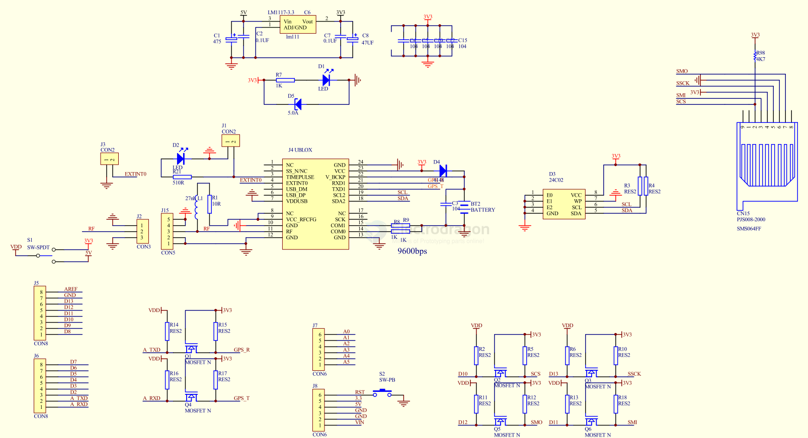
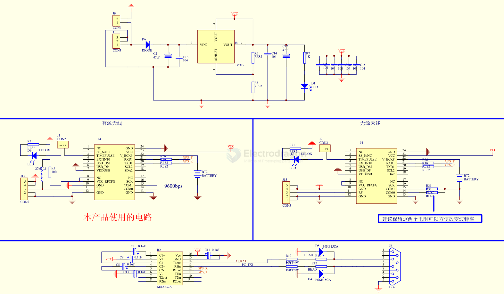

# location-dat

[all location boards here. ](https://www.electrodragon.com/product-category/network/tracker/)

## tech 

- [[GNSS-dat]] - [[GPS-dat]] - [[AGPS-dat]] - [[NEMA-dat]]

- [[amplifier-dat]]

- [[antenna-location-dat]]

## companies 

- [[u-blox-dat]] - [[NEO-7-dat]] - [[NEO-6-dat]]

- [[quectel-dat]] - [[quectel-gps-dat]] - [[quectel-GNSS-AT-dat]] - [[L86-dat]] - [[L76-dat]] - [[ED20-dat]] - [[EC20-dat]] - [[BC20-dat]]

- [[simcom-dat]] - [[A7670-dat]] - [[SIM7080-dat]] - [[SIM7000-dat]] - [[SIM868-dat]] - [[SIM808-dat]]

- [[ATGM336H-dat]]

## Common Locating Issues 

**Network Dependency**

A-GPS (Assisted GPS) - [[AGPS-dat]] relies on Wi-Fi or mobile data to speed up location locking. If no internet is available, it may take much longer.

Poor mobile signal or no Wi-Fi can delay GPS start.

**Cold Start vs Warm Start**

If you haven't used GPS in a while or have moved a long distance since last use, your GPS might need a "cold start," which takes longer.

## location by [[A7670-dat]]

turn on GPS functions 

    AT+CGNSSPWR=1
    
turn on GPS power by GPIO pin 4: 

    AT+CGDRT=4,1
    AT+CGSETV=4,1

wait until GPS feedback READY!

    +CGNSSPWR: READY!

foward signal to GPS NEMA serial port 

    AT+CGNSSTST=1
    OK

## GPS NEMA output Port 

    SimTech HS-USB NMEA 9011 (COM346)
    设备类型：端口(COM和LPT)
    制造商：SimTechIncorporated
    位置：0000.001d.0000.001.002.002.000.000.000

## test tools NEMA 

- [[NMEA GPS Demo V2.10.zip]]

- [[GNSSToolKit_Lite.exe]]

- u-center_v8.22.exe === search online 

## SCH 

arduino shield with [[neo-6-dat]] + [[SD-dat]]

- [[Logic-level-shifter-dat]]

[[NEO-6-dat]] to [[RS232-dat]]

## ref 

- [[STM32-dat]]

- [[location]] - [[network]]

