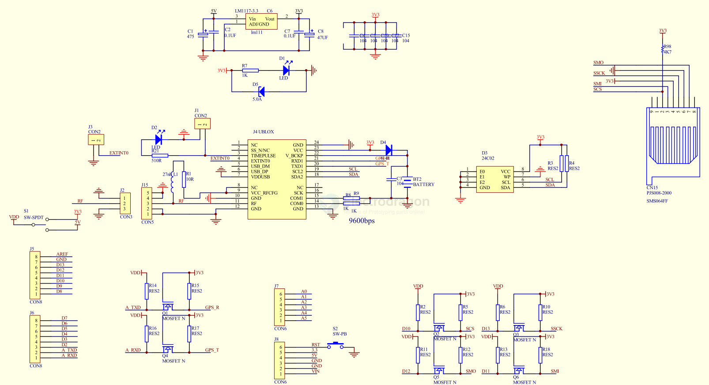
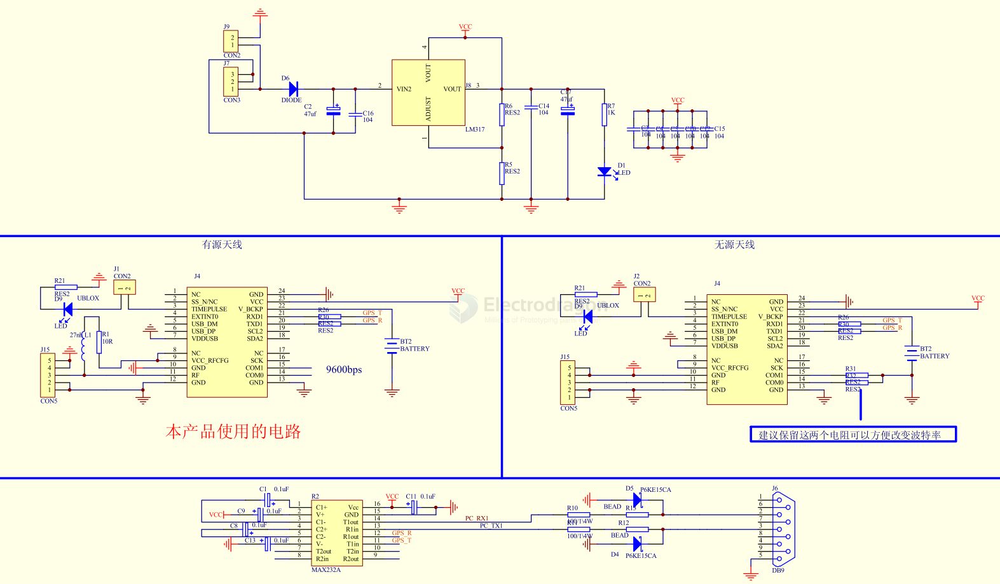
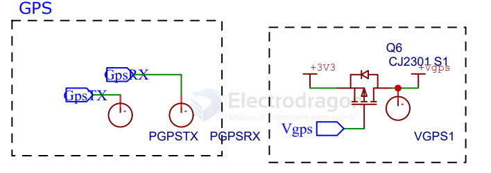

# location-dat

[all location boards here. ](https://www.electrodragon.com/product-category/network/tracker/)

## tech 

- [[GNSS-dat]] - [[GPS-dat]] - [[AGPS-dat]] - [[NEMA-dat]]

- [[GPS-dat]] - [[GLONASS-dat]] - [[BDS-dat]] - [[GALILEO-dat]] - [[SBAS-dat]] - [[QZSS-dat]] 

- [[NNMA-dat]] - [[UBLOX-dat]]

- [[GPS-L1-dat]]

- [[amplifier-dat]]

- [[antenna-location-dat]]

- [[interface-dat]] - [[serial-dat]] - [[XH2.54-dat]]

- [[Geofencing-dat]] - [[location-dat]]

## boards 

- [[quectel-dat]] - [[quectel-gps-dat]] - [[quectel-GNSS-AT-dat]] - [[L86-dat]] - [[L76-dat]] - [[ED20-dat]] - [[BC20-dat]] - [[NGS1100-dat]] - [[NGS1101-dat]] - [[NGS1102-dat]] - [[NGS1103-dat]] 

- [[ATGM336H-dat]]

- [[u-blox-dat]] - [[NEO-7-dat]] - [[NEO-6-dat]] - [[NGS1052-dat]]

- [[NGS1089-dat]] - [[SIM868-dat]] - [[SIMCOM-dat]] - [[location-dat]]

| model           | type                                        | standalone serial port |
| --------------- | ------------------------------------------- | ---------------------- |
| [[NEO-6-dat]]   | GPS                                         | default                |
| [[SIM7080-dat]] | [[CAT-M-dat]]/[[CAT-NB-dat]] + [[GNSS-dat]] | UART3                  |
| [[A7670-dat]]   | [[CAT-1-dat]] + [[GNSS-dat]]                | GNSS_TXD / GNSS_RXD    |

### composite function board 

- [[simcom-dat]] - [[A7670-dat]] - [[SIM7080-dat]] - [[SIM7000-dat]] - [[SIM868-dat]] - [[SIM808-dat]] - [[SIM7600-dat]]

- [[NGS1063-dat]] - [[EC20-dat]] 

## Common Locating Issues 

**Network Dependency**

A-GPS (Assisted GPS) - [[AGPS-dat]] relies on Wi-Fi or mobile data to speed up location locking. If no internet is available, it may take much longer.

Poor mobile signal or no Wi-Fi can delay GPS start.

**Cold Start vs Warm Start**

If you haven't used GPS in a while or have moved a long distance since last use, your GPS might need a "cold start," which takes longer.

## location by [[A7670-dat]]

turn on GPS functions 

    AT+CGNSSPWR=1
    
turn on GPS power by GPIO pin 4: 

    AT+CGDRT=4,1
    AT+CGSETV=4,1

wait until GPS feedback READY!

    +CGNSSPWR: READY!

foward signal to GPS NEMA serial port 

    AT+CGNSSTST=1
    OK

## GPS NEMA output Port 

    SimTech HS-USB NMEA 9011 (COM346)
    设备类型：端口(COM和LPT)
    制造商：SimTechIncorporated
    位置：0000.001d.0000.001.002.002.000.000.000

## test tools NEMA 

- [[NMEA GPS Demo V2.10.zip]]

- [[GNSSToolKit_Lite.exe]]

- u-center_v8.22.exe === search online 

## SCH 

arduino shield with [[neo-6-dat]] + [[SD-dat]]

- [[Logic-level-shifter-dat]]

[[NEO-6-dat]] to [[RS232-dat]]

## build 

socket interface - [[protection-power-dat]] - [[location-dat]]

## apps 

- [[location-FPV-dat]]

## chip 

- AT6558R - [[zhongkewei-dat]] - [[location-dat]] - [[AT6558-dat]] 

- [[L76K-dat]] - [[L76-K-dat]] - [[quectel-dat]] - [[L76-dat]]

- [[ATGM332D-dat]] == - [[AT6558-dat]]  - [[zhongkewei-dat]]

- M8030-KT ? 

- M10

- [[location]]

## tech 

### advance features 

Here is a brief overview of each of these satellite navigation features:

#### 1. Multi-System Combined Positioning (多系统联合定位)
* **What it is**: Simultaneously receiving and processing signals from multiple global navigation satellite systems (GNSS) like GPS, BeiDou, GLONASS, and Galileo.
* **Main Benefit**: Dramatically increases the total number of visible satellites in view. This improves positioning availability, reliability, and accuracy, especially in difficult environments like urban canyons, heavy tree cover, or indoors near windows.

#### 2. Dual-Frequency Signal Reception (L1/L5 or L1/L2) (双频信号接收L1/L5或L1L2)
* **What it is**: Receiving satellite signals from two different frequency bands simultaneously for the same constellation (e.g., GPS L1 and L5).
* **Main Benefit**: Different frequencies experience different delays when passing through the Earth's ionosphere. By comparing the two frequencies, the receiver can mathematically calculate and virtually eliminate ionospheric delay errors, significantly boosting accuracy and resistance to multipath interference.

#### 3. 20Hz Positioning Refresh Rate (20Hz定位刷新率)
* **What it is**: The frequency at which the receiver updates its position coordinates, meaning it outputs a new position update **20 times per second** (every 0.05 seconds).
* **Main Benefit**: Provides ultra-smooth, real-time tracking with minimal latency. It is essential for high-speed motion scenarios such as racing drones, fast-moving vehicles, robotics, and precise motion logging.

#### 4. Meter-Level High-Precision Positioning (米级高精度定位)
* **What it is**: A positioning accuracy level where location errors are constrained within **1 to 3 meters** (and sometimes sub-meter), outperforming standard consumer-grade GPS (which often drifts around 5 to 10 meters).
* **Main Benefit**: Achieved through advanced multi-system filtering, signal enhancement, or basic SBAS (Satellite-Based Augmentation Systems), making it reliable for lane-level car navigation, outdoor hiking, and general asset tracking.

#
### Single-Frequency Multi-Mode Satellite Positioning

**Single-Frequency Multi-Mode Satellite Positioning** is a technical term in the field of satellite navigation. To understand what it means, we can break it down into its two core components: "Single-Frequency" and "Multi-Mode."

GPS L1, GLONASS L1, BDS B1, GALILEO E1, SBAS L1, QZSS L1

#### I. Core Concept Breakdown

1. **Single-Frequency**
   * **Definition**: The receiver only receives and processes navigation signals from satellites on a **single, specific frequency band**.
   * **Example (GPS)**: The most common example is receiving only the `GPS L1 frequency band (approximately 1575.42 MHz)`.
   * **Characteristics**: The hardware structure is relatively simple, cost-effective, and power-efficient. However, its main drawback is that it cannot effectively eliminate errors caused by ionospheric delay, and its resistance to multipath effects (signal reflection interference) is weaker.

2. **Multi-Mode (Multi-Constellation)**
   * **Definition**: The receiver is capable of simultaneously receiving and processing signals from **multiple distinct global satellite navigation systems**.
   * **The Four Global Satellite Systems**:
     * **GPS** (United States)
     * **BDS / BeiDou** (China)
     * **GLONASS** (Russia)
     * **Galileo** (European Union)
   * **Characteristics**: Because the total number of visible satellites in the sky increases dramatically (instead of seeing only a few GPS satellites, the device can see dozens from BeiDou, GPS, GLONASS, and Galileo combined), the **availability, reliability, and Dilution of Precision (DOP)** of the positioning improve significantly, especially in harsh environments like urban canyons or dense tree cover.

---

#### II. Overall Performance: Pros and Cons

* **Advantages**:
  * **High Cost-Performance Ratio**: Compared to "Dual-Frequency Multi-Mode" setups (which receive dual bands like L1 + L5), single-frequency hardware costs less, generates less heat, and consumes less power. This makes it ideal for smartphones, vehicle navigation systems, dashcams, and various mid-to-low-tier IoT tracking devices.
  * **Fast Time-To-First-Fix (TTFF) & Good Cold Start**: By scanning multiple satellite systems simultaneously, the device can quickly capture enough satellites to lock a position faster.

* **Limitations**:
  * **Precision Limits**: Because it is single-frequency, it cannot use dual-frequency algorithms to cancel out ionospheric errors. Its absolute positioning accuracy typically stays at the meter level (standard consumer grade) and cannot achieve centimeter-level or millimeter-level high-precision surveying (which generally requires RTK differential corrections or dual-frequency tech).

---

#### III. Typical Application Scenarios

* **Consumer Smartphones and Wearables**: The vast majority of everyday smartphones and smartwatches use single-frequency multi-mode configurations (e.g., supporting single L1 band across GPS + BeiDou + GLONASS) to balance power consumption, physical size, and manufacturing cost.
* **Basic Vehicle Tracking & Shared Bicycles**: Perfectly adequate for general route tracking and everyday navigation requirements.

---

In short, "Single-Frequency Multi-Mode" is a cost-effective positioning approach that **"uses only one frequency band, but harnesses all major global satellite navigation systems (BeiDou, GPS, GLONASS, Galileo) simultaneously."**

## ref 

- [[amplifier-GNSS-dat]] - [[amplifier-dat]]

- [[STM32-dat]]

- [[location]] - [[network]]

