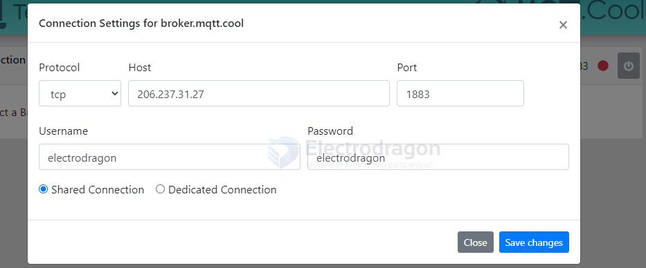
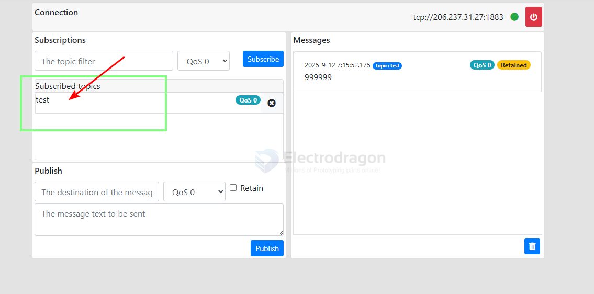
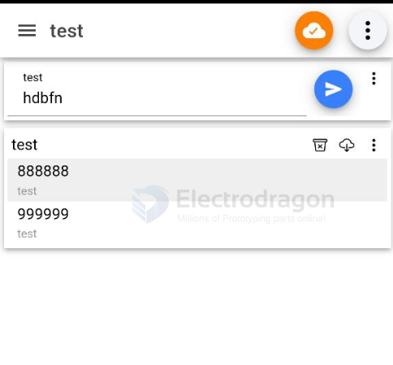

# MQTT-APP-dat

## web test 

- https://testclient-cloud.mqtt.cool/

may not working SSL not enabled

- https://www.hivemq.com/demos/websocket-client/
- https://www.emqx.io/mqtt/mqtt-websocket-toolkit

## android software 

- IOT MQTT Panel

setup guide for out free MQTT broker

1. connection part - connection info 

notice in addtional options add user name and password to be electrodragon and electrodragon

2. dashboard part 

3. panel part 

4. output 

receiving info 

## ref 

- [[MQTT-dat]]