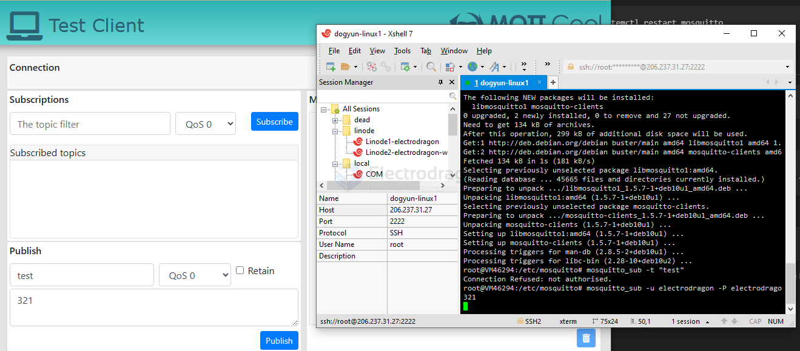

# mqtt dat 

- [[simcom-at-mqtt-dat]]

## 🔹 Will Message
- A special message defined by the client when it connects.
- Published **by the broker** if the client disconnects unexpectedly (without sending a proper `DISCONNECT`).
- Example: `"Device123 offline"`

## 🔹 Will Topic
- The MQTT topic where the broker will publish the **will message**.
- Other clients subscribed to this topic will receive the notification.

## MQTT QoS (Quality of Service)

In MQTT, **QoS (Quality of Service)** defines the **guarantee level of message delivery** between a publisher and a subscriber.  
There are **3 levels**:

---

### 🔹 QoS 0 — "At most once"
- **Meaning**: The message is delivered **at most once**, best effort, no acknowledgment.
- If the client or broker goes offline during transmission, the message may be lost.
- **Use case**: Non-critical data, such as sensor readings that update frequently.

---

### 🔹 QoS 1 — "At least once"
- **Meaning**: The message is delivered **at least once**.  
- Broker requires acknowledgment (`PUBACK`).
- Duplicates may occur (subscriber could get the same message more than once).
- **Use case**: Important data that must arrive, but duplicates are acceptable (e.g., logging, notifications).

---

### 🔹 QoS 2 — "Exactly once"
- **Meaning**: The message is delivered **exactly once**.  
- Uses a 4-step handshake (`PUBREC`, `PUBREL`, `PUBCOMP`).
- No duplicates, no missing messages.  
- Highest reliability but more overhead (slower and heavier).
- **Use case**: Billing systems, financial transactions, or critical commands.

## AT MQTT workflow

- [[simcom-at-mqtt-dat]]

pub 

| purpose                            | AT command                                              | note                                                                                   |
| ---------------------------------- | ------------------------------------------------------- | -------------------------------------------------------------------------------------- |
| Start MQTT service                 | `AT+CMQTTSTART`                                         | returns `+CMQTTSTART: 0` on success                                                    |
| Acquire a client                   | `AT+CMQTTACCQ=0,"a12mmmm",0`                            | 0 is the client_index, "a12mmmm" is the client ID, 0 == TCP                            |
| Set Will Topic                     | `AT+CMQTTWILLTOPIC=0,10`                                | 0 is the client_index, 10 is the length of the topic string                            |
| Set Will Message                   | `AT+CMQTTWILLMSG=0,6,1`                                 | 0 is the client_index, 6 is the length of the message string, 1 is the QoS level       |
| Connect to Broker                  | `AT+CMQTTCONNECT=0,"tcp://broker.hivemq.com:1883",60,1` | 0 is the client_index, 60 is the keep-alive time in seconds, 1 indicates clean session |
| Input the topic of publish message | `AT+CMQTTTOPIC=0,9`                                     |                                                                                        | 0 is the client_index, 9 is the length of the topic string |
| Input the publish message          | `AT+CMQTTPAYLOAD=0,4`                                   | 0 is the client_index, 4 is the length of the message string                           |
| Publish the message                | `AT+CMQTTPUB=0,1,60`                                    | 0 is the client_index, 1 is the QoS level, 60 means pub_timeout                        |

sub
| purpose                              | AT command          | note                                                              |
| ------------------------------------ | ------------------- | ----------------------------------------------------------------- |
| Input the topic of subscribe message | `AT+CMQTTTOPIC=0,4` | /* subscribe one or more topics which input by AT+CMQTTSUBTOPIC*/ |
| Subscribe a message to server        | `AT+CMQTTSUB=0,4,0` | /* subcribe one topic*/                                           |

## arduino library 

- async-mqtt-client-master 

- PubSubClient
    - https://github.com/knolleary/pubsubclient
    - examples/mqtt_esp8266.ino

- radiolib

## MQTT broker on ubuntu 

install service and check status 

    sudo apt install -y mosquitto

    sudo systemctl status mosquitto

more systemctl check 

- Stop the mosquitto service:
    - $ sudo systemctl stop mosquitto
- Start the mosquitto service:
    - $ sudo systemctl start mosquitto
- Restart the mosquitto service:
    - $ sudo systemctl restart mosquitto

Log file 

    cat /var/log/mosquitto/mosquitto.log

## Conf Setup list

Secure the Mosquitto Server

Create a default.conf under the directory.

    nano /etc/mosquitto/conf.d/default.conf

    allow_anonymous false  // not allow anonymous
    password_file /etc/mosquitto/passwd // set password

optionally 

    listener 1883  // set port 1883 public, or listener 1883 localhost for localhost only
    listener 1884 // set 1884 for wss protocol websockets

set users 

    nano /etc/mosquitto/passwd

    electrodragon:electrodragon

Restart the mosquitto service to load the new changes.

    sudo systemctl restart mosquitto

## MQTT client 

    sudo apt install -y mosquitto-clients

sub:

    mosquitto_sub -t "test"
    mosquitto_sub -u electrodragon -P electrodragon -t "test"

pub:

    mosquitto_pub -m "ON" -t "test"

A number of my IoT students make use of (the FREE plan with) BeeBotte for their remote MQTT broker.

https://beebotte.com/

It's very easy to set up and works really well with Nod-RED.

## execute 

From this point forward, you should execute any pub/sub command using the syntax below. Remember to replace electrodragon and EXAMPLE_PASSWORD with the credentials that you defined in the password file.

    mosquitto_sub -u electrodragon -P electrodragon -t "home/lights/sitting_room"
    mosquitto_pub -u electrodragon -P electrodragon -t "home/lights/sitting_room" -m "ON"

## free electrodragon MQTT broker

- 206.237.31.27
- user == electrodragon
- password == electrodragon
- SSL not enabled

## ref 

- https://mosquitto.org/man/mosquitto-conf-5.html

- [[android-dat]]