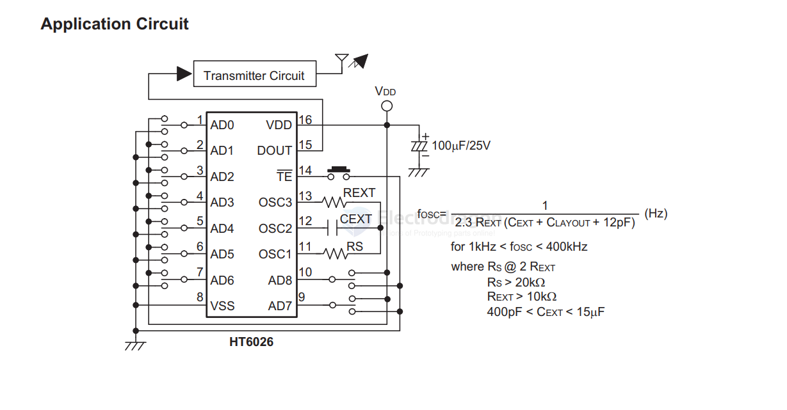

# remote-control-dat

- [[network-dat]] - [[remote-control-dat]] - [[infrared-dat]]

remote control encoder 

`HT6026` - The HT6026 is a CMOS LSI encoder designed for use in remote control system. - [[holtek-dat]]

It is capable of encoding 9 bits of information which consists of N address bits and 9–N data bits. 

Each address/data input is externally trinary programmable by external switches. 

The programmable address/data is transmitted along with the header bits via an RF or an infrared transmission medium upon receipt of a trigger signal (TE). The HT6026 is pin compatible with the MC145026.

Applications
- Burglar alarm system
- Smoke and fire alarm system
- Garage door controllers
- Car alarm system

HT12A/HT12E - 2^12 Series of Encoders

The 2^12 encoders are a series of CMOS LSIs for remote control system applications. They are capable of encoding information which consists of N address bits and 12-N data bits. 

Each address/data input can be set to one of the two logic states. 

The programmed addresses/data are transmitted together with the header bits via an RF or an infrared transmission medium upon receipt of a trigger signal. 

The capability to select a TE trigger on the HT12E or a DATA trigger on the HT12A further enhances the application flexibility of the 212 series of encoders. The HT12A additionally provides a 38kHz carrier for infrared systems. - [[infrared-dat]]

## ref 

