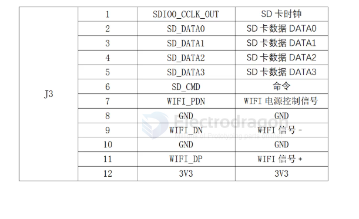
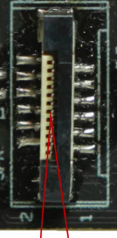

# Wifi-SDIO-dat

- [[wifi-USB-dat]] - [[Wifi-SDIO-dat]] - [[wifi-dat]]

## module 

- [[Realtek-dat]] - [[RTL8812-dat]] - [[RTL8822-dat]]

- [[SKY85601-dat]] - [[skyworks-dat]] - [[amplifier-low-noise-dat]] - [[amplifier-dat]]

## example 

J3 USB Pin Definition

To tap into the native USB 2.0 interface on this board, solder your data lines directly to the following points on the J3 connector area:

- Pin 9: USB_D- (Data Minus)
- Pin 11: USB_D+ (Data Plus)

ref == [[GK7205V300-dat]]

- SDIOO_CCLK_OUT
- SD_DATAO
- SD_DATA1
- SD_DATA2
- SD_DATA3
- SD_CMD
- WIFI_PDN
- GND
- WIFI_DN
- GND
- WIFI_DP
- 3V3

- [[CONN-FPC-dat]] - [[Wifi-SDIO-dat]]

## 1. Pin Analysis of J3

- **SDIOO_CCLK_OUT, SD_DATA0~3, SD_CMD** — These are the standard SDIO bus lines. They are designed to interface directly with an SDIO-based Wi-Fi module (such as certain Realtek chips like RTL8188 or similar native modules used in standard security cameras).
- **WIFI_PDN** — Power Down / Enable pin for the Wi-Fi module, controlled by the processor.
- **3V3 & GND** — Power and Ground rails (supplying 3.3V).
- **WIFI_DP / WIFI_DN** — Despite having names containing "DP/DN", on this specific SDIO-focused J3 header, these are typically part of the multi-function pin mappings or secondary interfaces routed near the module slot, not a standard USB 2.0 host differential pair (USB_DP / USB_DM).

## 2. Can You Connect Your FPV Wi-Fi Hardware Here?

### For Standard USB Wi-Fi Dongles (RTL8812AU / RTL8812EU for OpenHD / Ruby FPV)

No. High-power USB Wi-Fi cards require a true USB 2.0 interface (5V power, D+, D-, GND) and draw too much current for a 3.3V SDIO slot. Plugging an RTL8812AU card here will not work because the protocol and voltage ($3.3\text{V}$ vs $5\text{V}$, SDIO vs USB) do not match.

### For Native SDIO Wi-Fi Modules

If you are trying to hook up a compatible matching SDIO Wi-Fi card meant specifically for that board's factory firmware, these pins are correct. However, for digital FPV use (Ruby FPV / OpenHD), systems rely heavily on external high-power USB cards managed via Linux USB drivers.

## ref

