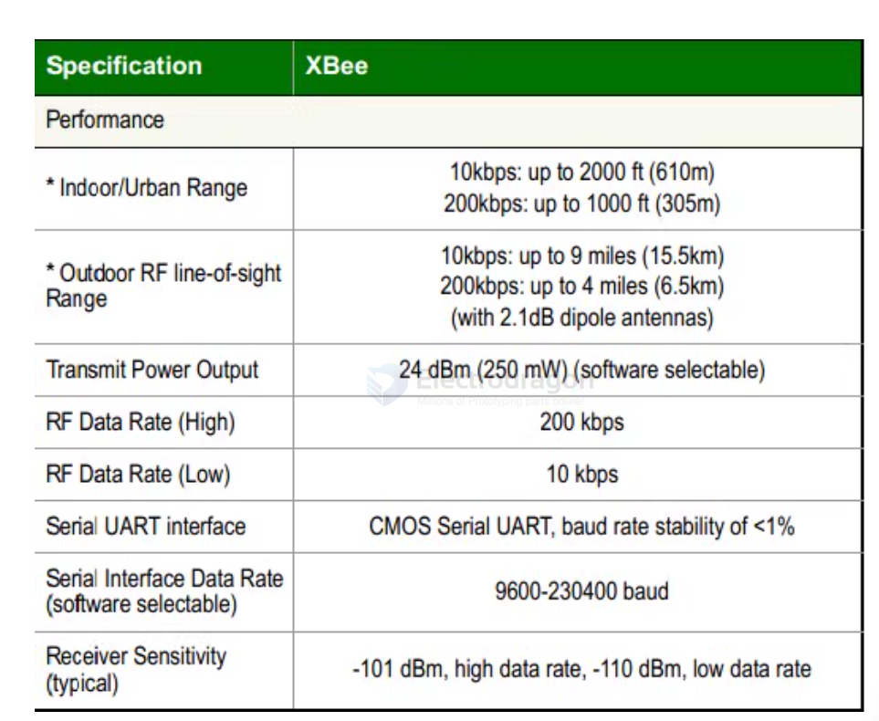
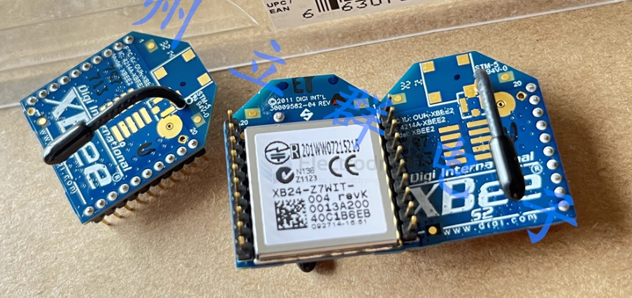
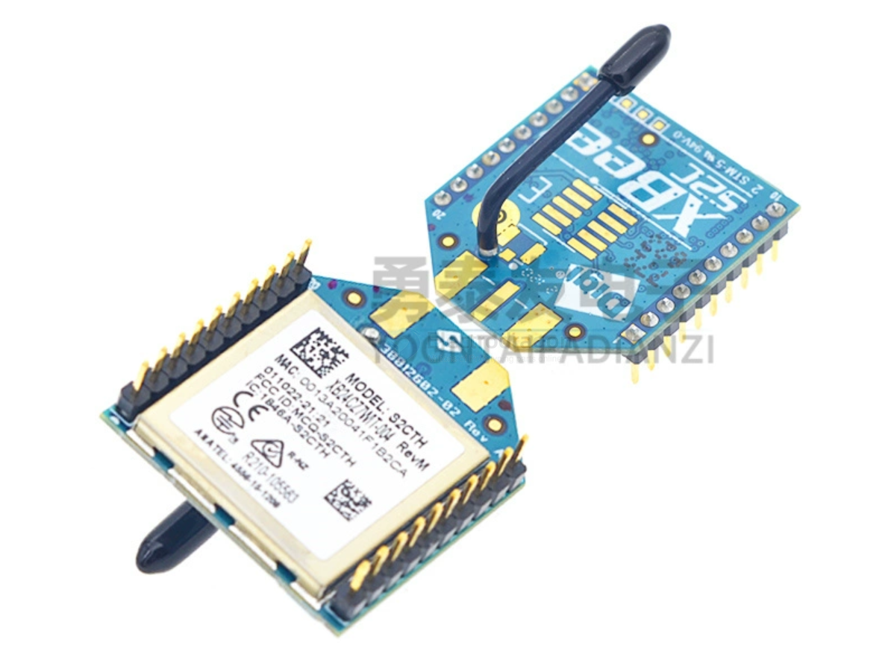
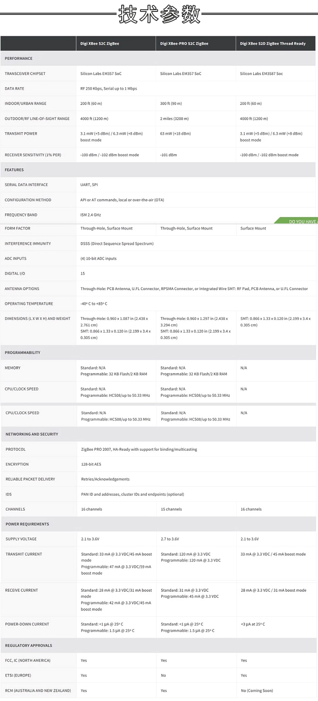
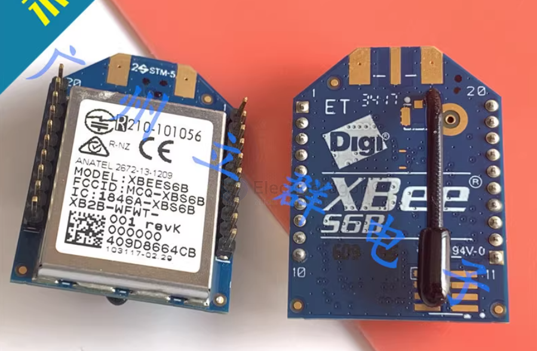

# xbee-dat

## board 

- [[DAS1016-dat]]

## info 

xbee is a brand of radio modules from Digi International that are based on the IEEE 802.15.4 standard for wireless communication. 

XBee modules are commonly used in applications such as home automation, industrial control, and remote sensing due to their ease of use and versatility.

XBee modules support various communication protocols, including Zigbee, 802.15.4, and DigiMesh, allowing for flexible network configurations.

## XBee Module Types

1. **XBee Series 1**: Basic point-to-point and point-to-multipoint communication.
2. **XBee Series 2**: Supports mesh networking with Zigbee protocol.
3. **XBee 868/900**: Operates in the 868 MHz and 900 MHz bands for long-range communication.
4. **XBee Cellular**: Provides cellular connectivity for IoT applications.
5. **XBee Wi-Fi**: Enables Wi-Fi connectivity for devices.

## Key Features

- Easy to use with simple serial interface (UART).
- Supports various network topologies (point-to-point, star, mesh).
- Low power consumption, suitable for battery-operated devices.
- Configurable via AT commands or API mode.
- Wide range of accessories and development kits available.

## Xbee XB24 

- Packaging Tray: ②
- Part Status: Discontinued
- DigiKey Programmable: Not Verified
- RF Series/Standard: 802.15.4
- Protocol: Zigbee
- Modulation: DSSS
- Frequency: 2.4GHz
- Data Rate: 250kbps
- Output Power: 1dBm
- Sensitivity: -96dBm
- Serial Interface: UART
- Antenna Type: Integrated, Wire Antenna
- IC/Component Used: EM250
- Storage Capacity: (Not specified)
- Supply Voltage: 2.1V ~ 3.6V
- Receive Current: 38mA ~ 40mA
- Transmit Current: 35mA ~ 45mA
- Mounting Type: Through Hole
- Operating Temperature: -40°C ~ 85°C

## Xbee Pro S2C

specs 

## XBee S6B 

## XBee PRO 900HP (XBeePROS3B) Wireless Module Guide

The XBee PRO 900HP (also known as XBeePROS3B) is a long-range wireless data transmission module operating in the 900–928 MHz band, using FHSS (Frequency Hopping Spread Spectrum) technology. It is ideal for applications requiring robust, long-distance communication.

### Key Features

- Maximum transmit power: up to 250mW
- FHSS technology for interference resistance
- Supports multiple firmware protocols (XBP9B-DM, XBP9B-DP)
- Flexible network topologies: star, mesh (Digimesh), point-to-point

For environments with high background noise (e.g., many base stations), consider the higher-power XBeePROSX module for extended range.

---

## Getting Started with XCTU

1. **Download and install the latest XCTU tool.**
2. **Connect your XBee modules to your computer using Digi’s development kit and USB cables.**
3. **Open XCTU and use the search button to detect connected XBee modules. Add them to the left panel.**

---

## Module Configuration

- By default, XCTU opens in configuration mode.
- Select a module to view and edit its parameters.
- It’s recommended to restore factory defaults before testing to avoid unexpected results.
- Use the “Default” button to load default parameters, then “Write” to save them to the module.

---

## Transparent Mode Communication

To form a network:
- Ensure all modules have the same Network ID and HP (hopping pattern).
- CM (channel mask) should cover the same frequency points.
- Modules communicate using 64-bit addresses:
  - SH, SL: module’s own MAC address
  - DH, DL: target address (DH=0, DL=FFFF for broadcast)

**Broadcast Communication:**
- With default parameters, modules can communicate via broadcast.
- In XCTU, open the terminal for each module and use “Split View” to see both terminals.
- Typing in one terminal will send data to the other.

**Unicast Communication:**
- Set each module’s DH, DL to the other’s SH, SL for direct communication.
- Test in the terminal to confirm unicast data transfer.

---

## AT Command Mode

- Enter command mode by typing “+++” in the terminal; module responds with “OK”.
- Example: Set the NI (Node Identifier) parameter:
  - `ATNI NODE1` (sets name to NODE1)
  - `ATNI` (reads current name)
  - `ATWR` (writes changes to flash)
  - `ATCN` (exits command mode)

- If you don’t exit command mode, the module will automatically return to transparent mode after ~6 seconds of inactivity.

---

## API Mode Communication

**Advantages of API Mode:**
- Direct, targeted communication with any module
- Send AT commands without switching modes
- Identify data sources and receive feedback packets
- Remotely configure other modules

**How to Enable:**
- Set the AP parameter to 1 or 2 in configuration mode.

**Sending Data:**
- In terminal mode, the window changes to a frame-based interface.
- Use the wizard to create an API frame (e.g., FrameType 0x10 for sending data).
- Enter the target module’s MAC address and data (e.g., “1234”).
- Send the frame; the target module receives the data.

- Data sent from a transparent mode module will appear as a 0x90 receive frame in API mode.

---

## Digimesh vs. Point-to-Multipoint

- **Digimesh (XBP9B-DM firmware):** Supports mesh networking; any node can route data for others.
- **XBP9B-DP firmware:** No mesh; lower RF rate (10Kbps) for longer range, suitable for star networks with distant nodes.

---

## UAVs and High-Speed Industrial Communication

For point-to-multipoint setups (not mesh), optimize for bandwidth and real-time performance:
- `TO=40`: Enables point-to-multipoint mode
- `CE=2`: Node does not route data, saving CPU and bandwidth
- `NH=1`: Limits network hops to 1, increasing bandwidth

---

## Summary

The XBee PRO 900HP module is versatile for various wireless networking scenarios. Use Digimesh for self-organizing mesh networks, or configure for point-to-multipoint for high-speed, real-time applications. API mode offers advanced control and flexibility, while transparent mode is simple for basic data transmission.

## ref 

- [[network-dat]] - [[IEEE-dat]]

