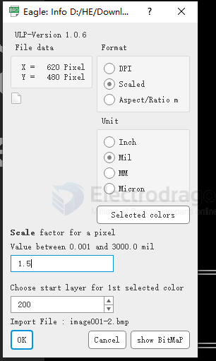
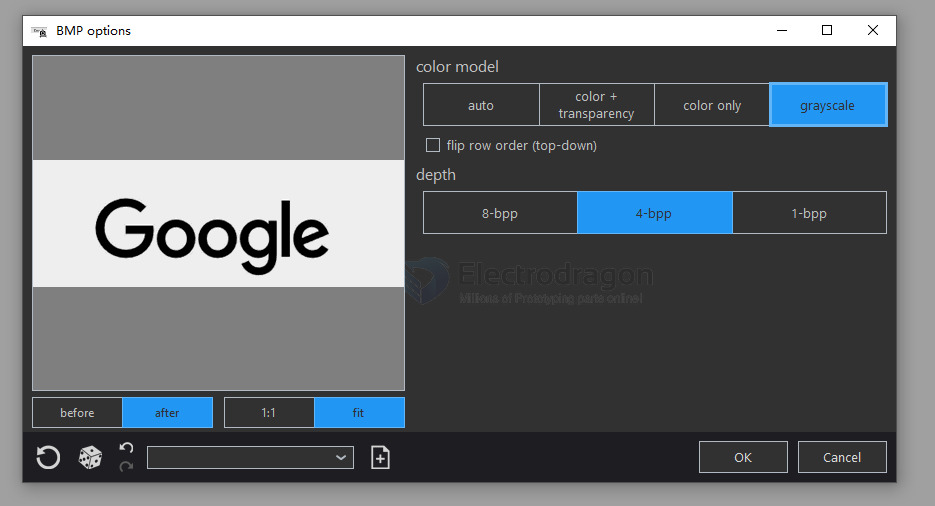
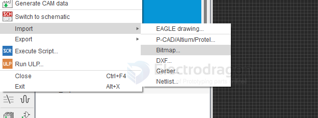
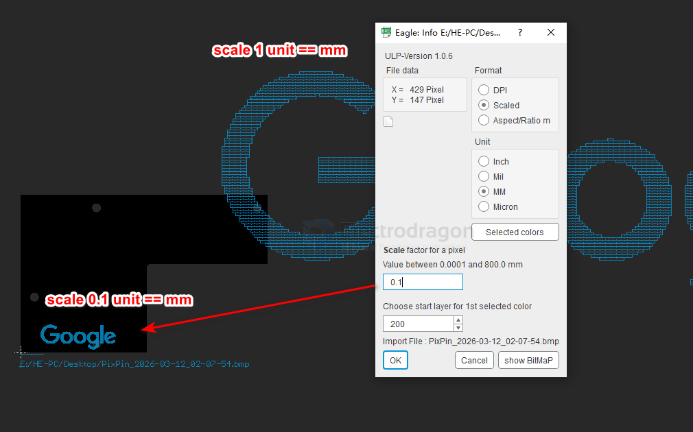

# eaglecad-artwork-dat

- [[eaglecad-artwork-dat]] - [[eaglecad-dat]]

## artwork 

default settings scaled // mil // scale == 1.0

some more notes: 

- if print on the back side of the PCB, image must be mirrored, otherwise the image will be reversed after printing.

size definitions 

- define the pixels, for example your raw bitmap image size is 620 x 480 px 
- define the import scale, for exmample 1.0 

1. invert the color, only left black to use, white to left out, saved as BMP, tools is opensource photodemon  

saved file size is 430 x 150 px 

2. import in eagleCAD brd, 

PCB size rougly 90 x 60 mm  

import only color black to use 

scale 1 will be too big for this PCB size, size scale 0.1 looks good 

finally copy paste to layer 21 tplace 

## ref 

