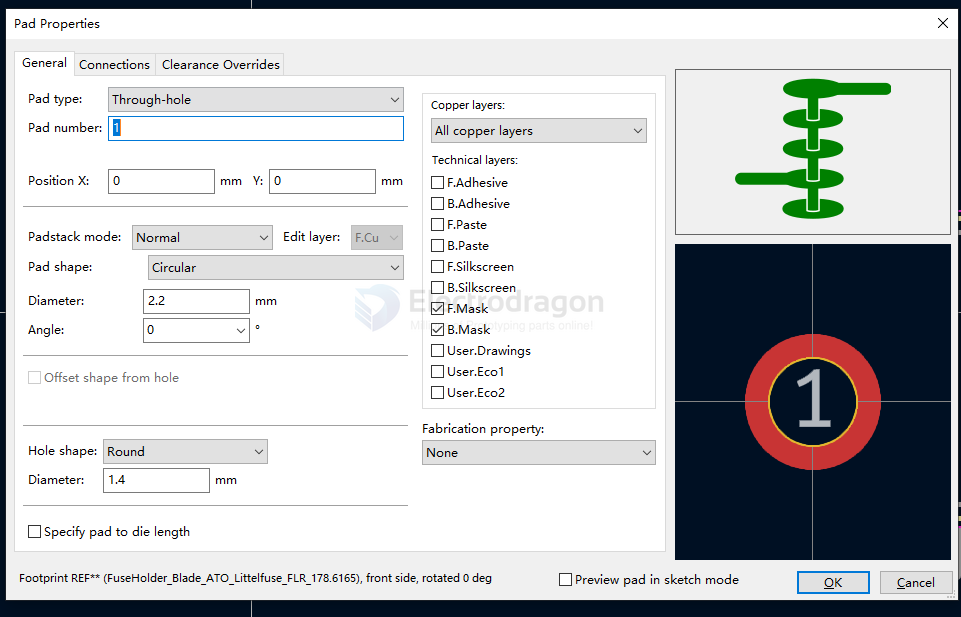

# kicad-footprint-dat.md

- [[kicad-symbol-dat]] - [[kicad-pcb-dat]]

## custom build footprint guide 

## common used global library 

- Connector_pinheader 
- Connector_Wire
    - SolderingWirePad_1x01_SMD_1x2mm
- Connector_USB
    - USB_C_Receptacle_G-Switch_GT-USB-7010ASV
    - USB_A_CNCTech_1001-011-01101_Horizontal == [[USB-A-dat]]
- MountingHole 
    - MountingHole_3.2mm_M3  
- Package_SO
    - SOIC-8_5.3x5.3mm_P1.27mm
    - SOIC-16_10.3x7.5mm_P1.27mm
    - SOP-8_3.9x4.9mm_P1.27mm
    - SOP-8_3.76x4.96mm_P1.27mm

## ref 

- [[kicad-symbol-dat]]