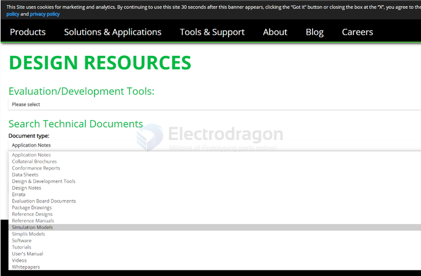
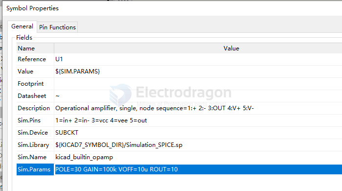
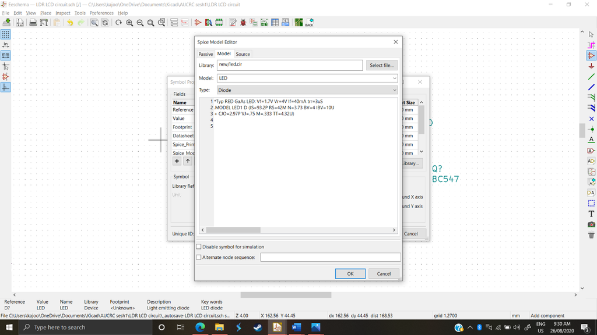
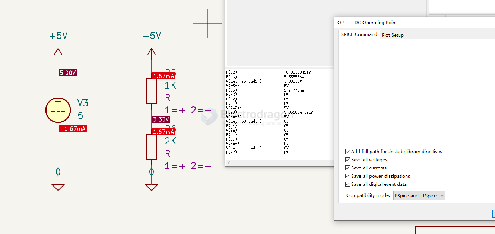
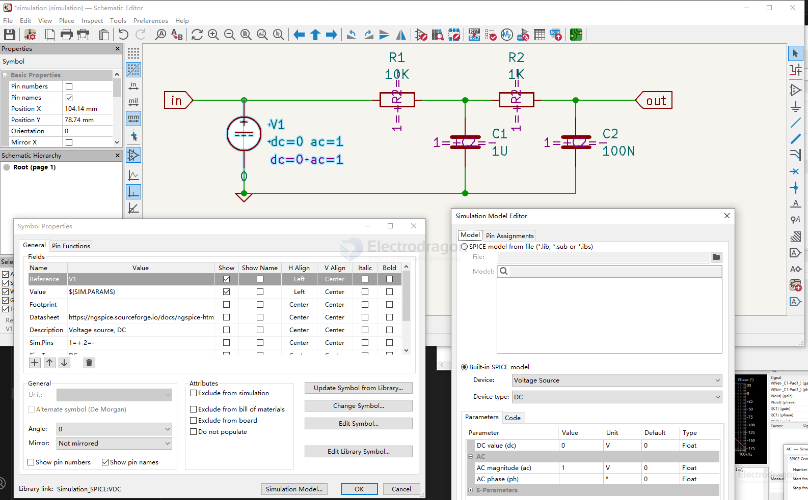
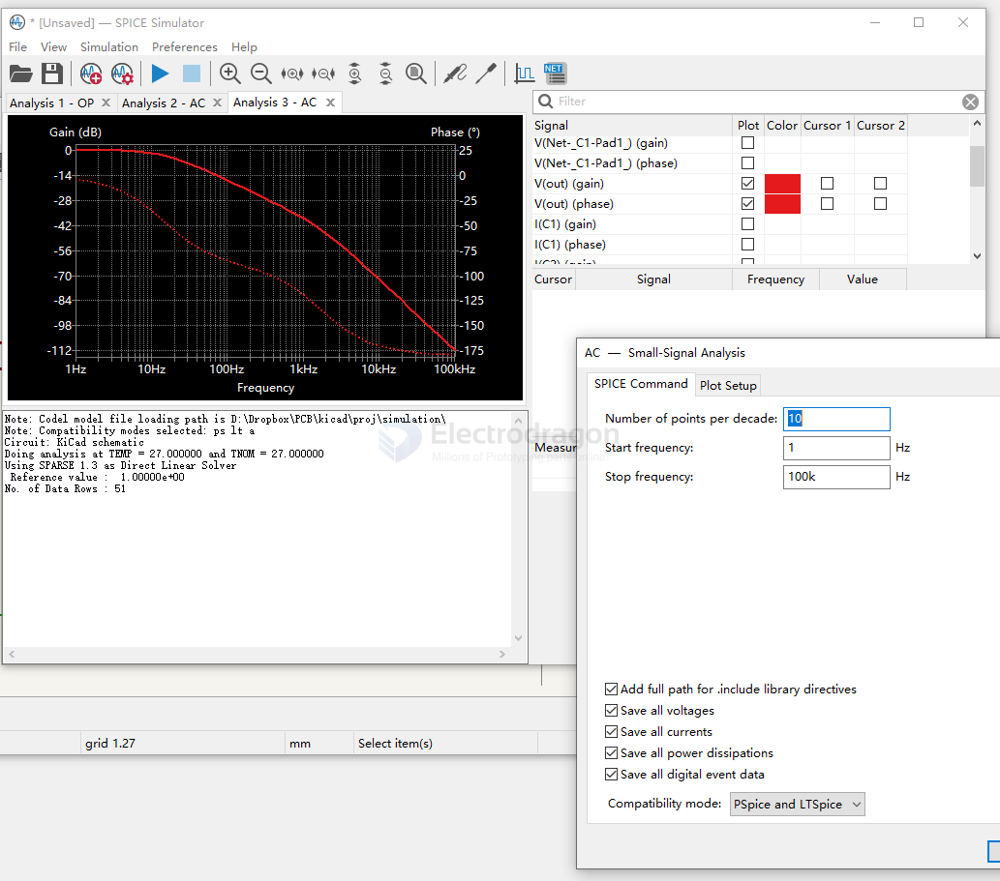

# kicad-simulation-dat

- [[LM358-dat]]

- [[EDA-simulation-dat]]

## Import SPICE model 

SPICE model from file (*.lib, *.sub or *ibs)

## custom build 

LED 

I opened their “Tools and support” tab, underneath I, found a design resources tab. (figure 1)

Underneath design resources they asked for the type of document, I chose “Simulation Models” (figure 2)

I searched for the part by name: “BC547”. We want the library, so we choose “BC547 Lib Model” and downloaded it. (figure 3)

OP-Amp 

## setup 

[VDC](https://ngspice.sourceforge.io/docs/ngspice-html-manual/manual.xhtml#sec_Independent_Sources_for) 

### LED 

LEDs are a bit trickier in the fact that modeling them requires some knowledge about their parameters and curve-fitting. So, to model them I just looked up “LED ngspice”. 

I found multiple people posting their “LED models” and I decided to go with this 

“ *Typ RED GaAs LED: Vf=1.7V Vr=4V If=40mA trr=3uS .MODEL LED1 D (IS=93.2P RS=42M N=3.73 BV=4 IBV=10U + CJO=2.97P VJ=.75 M=.333 TT=4.32U)?”

## download 

[Simulation examples for KiCad8/KiCad9/Eeschema/ngspice](https://forum.kicad.info/t/simulation-examples-for-kicad8-kicad9-eeschema-ngspice/45546)

- Generic symbols with generic models, see intro4
- Another 555 circuit example

[github collections](https://github.com/labtroll/KiCad-Simulations)

[simulation-examples-for-kicad-eeschema-ngspice](https://forum.kicad.info/t/simulation-examples-for-kicad-eeschema-ngspice/34443/4)

## tuto kicad 9 

[ref tutorial](https://ngspice.sourceforge.io/ngspice-eeschema.html#OpAmp)

### simple - voltage ladder 

### AC Since - RC Ladder

Schematic Setup 

SPICE Simulator 

### Inverting Amplifier - Transient Analysis

https://www.youtube.com/watch?v=6YvECTfwVOw

## tuto 

https://www.instructables.com/Simulating-a-KiCad-Circuit/

3Y ago 
https://www.youtube.com/watch?v=pCQ4MUyQjx0

https://www.kicad.org/discover/spice/

simple transistor build and simulate
https://www.woolseyworkshop.com/2019/07/01/performing-a-circuit-simulation-in-kicad/

## OPA1641 

- need to fix the pin assignment 
- [great tuto here](https://www.youtube.com/watch?v=Wg7uSs4J_0U)

## ref 

- [[kicad-dat]] - [[voltage-divider-dat]]