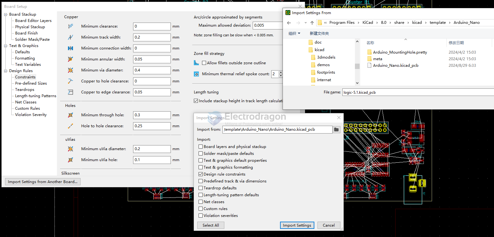
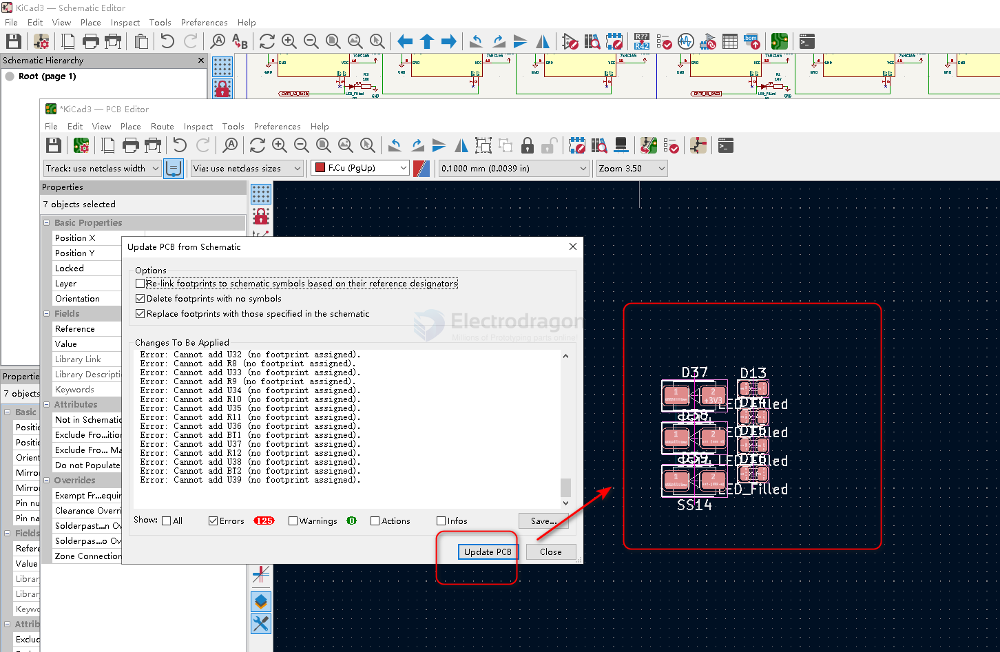
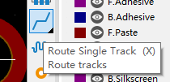
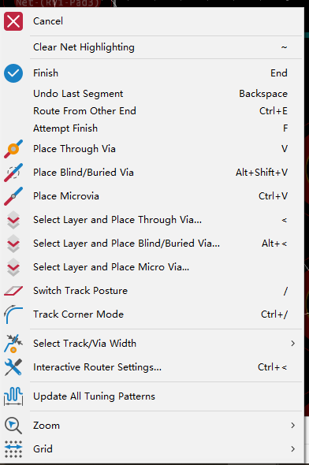
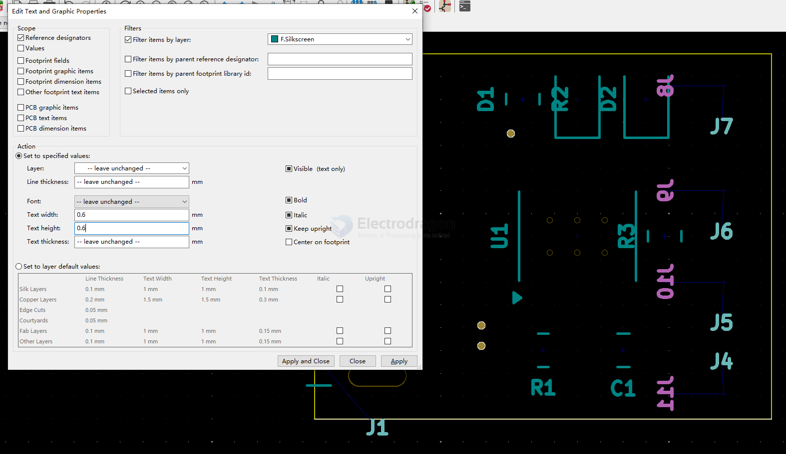

# kicad-pcb-dat

## import from other template projects 

pre-defined file: D:\Program Files\KiCad\8.0\share\kicad\template\Arduino_Nano

- DRC rules = design rules constrains 
- teardrop defaults 

### update into PCB

- switch to PCB
- update from PCB
- fix errors 
- update PCB
- layout it

## PCB layout 

- autoroute - by [[kicad-plugin-dat]]

## PCB Info 

commom layers 

| layers         | explain            | CN     |
| -------------- | ------------------ | ------ |
| edge.cuts      | board edge layer   | 边框层 |
| F/B Silkscreen | Silkscreen layer   | 丝印层 |
| F/B Mask       | Mask layer         | 阻焊层 |
| F/B Paste      | solder Paste layer | 锡膏层 |
| F/B Cu         | copper layer       | 铜箔层 |

* F for front and B for back 

## PCB init setup 

- 网络线宽
- 钻孔尺寸
- 网格 1.0 mm 
- 缩放 

## Layout setup 

Simply Only use Trace x.CU, Silkscreen layer x.Silkscreen, and Edge.Cuts 

## routing PCB

## Modify PCB 

## Filled Zones (ground pour)

Edit - Fill All Zones (B or Ctrl+B)

### Optimized the Text 

Optimize the text size of the desginators

## export gerber 

output folder 

    for the current folder == ./
    for the sub folder "gerber" in current folder == ./gerber