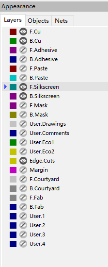

# kicad-pcb-dat

- [[kicad-footprint-dat]] 

- [[footprint-dat]] - [[DRC-dat]] - [[PCB-design-dat]]

## shortkey 

- V == place through via 

- page UP/DM == change layers 
- W (by default) to cycle through track width 

| Action                              | Hotkey      |
| ----------------------------------- | ----------- |
| Rotate Counterclockwise             | R           |
| Custom Track/Via Size               | Q           |
| Switch to Component (F.Cu) layer    | PgUp        |
| Switch to Copper (B.Cu) Layer       | PgDn        |
| Pack and Move Footprints            | P           |
| Select All Unconnected Footprints   | O           |
| Move                                | M           |
| Toggle Lock                         | L           |
| Sketch Tracks                       | K           |
| Create Corner                       | Ins         |
| Drag Free Angle                     | G           |
| Change Side / Flip                  | F           |
| Attempt Finish                      | F           |
| Properties                          | E           |
| Drag 45 Degree Mode                 | D           |
| Clear Net Highlighting              | ~           |
| Increase Layer Opacity              | {           |
| Decrease Layer Opacity              | }           |
| Highlight Net                       | `           |
| Decrease Via Size                   | \           |
| Route Single Track                  | X           |
| Switch Track Width to Next          | W           |
| Place Through Via                   | V           |
| Toggle Layer                        | V           |
| Select/Expand Connection            | U           |
| Skip                                | Tab         |
| Get and Move Footprint              | T           |
| Route Selected                      | Shift+X     |
| Switch Track Width to Previous      | Shift+W     |
| Cycle Layer Pair Presets            | Shift+V     |
| Constrain to H, V, 45               | Shift+Space |
| Rotate Clockwise                    | Shift+R     |
| Position Relative To                | Shift+P     |
| Grab Nearest Unconnected Footprints | Shift+O     |
| Move Exactly                        | Shift+M     |
| Attempt Finish Selected (Autoroute) | Shift+F     |
| Route Selected From Other End       | Shift+E     |
| Delete Full Track                   | Shift+Del   |
| Add a Zone Cutout                   | Shift+C     |

Move without grid (free placement)

Hold Ctrl while dragging → ignores grid snap (lets you place anywhere).

Useful when aligning visually or placing text/graphics

## text 

## stop mask - trace 

- turn on - soldermask 

## stop mask - filled zone and polygon 

- duplicate the filled zone into polygon, and move to **Mask layer** to stop it being filled

details 

- click corner to create chamber

## import from other template projects 

pre-defined file: D:\Program Files\KiCad\8.0\share\kicad\template\Arduino_Nano

- DRC rules = design rules constrains 
- teardrop defaults 

### update into PCB

- switch to PCB
- update from PCB
- fix errors 
- update PCB
- layout it

## PCB layout 

- autoroute - by [[kicad-plugin-dat]]

## PCB Info 

commom layers 

| layers         | explain            | CN     |
| -------------- | ------------------ | ------ |
| edge.cuts      | board edge layer   | 边框层 |
| F/B Silkscreen | Silkscreen layer   | 丝印层 |
| F/B Mask       | Mask layer         | 阻焊层 |
| F/B Paste      | solder Paste layer | 锡膏层 |
| F/B Cu         | copper layer       | 铜箔层 |

* F for front and B for back 

## PCB init setup 

- 网络线宽
- 钻孔尺寸
- 网格 1.0 mm 
- 缩放 

## layers 

### Layout setup 

Simply Only use Trace x.CU, Silkscreen layer x.Silkscreen, and Edge.Cuts 

### layer display options 

- normal / dim 

## routing PCB

## Modify PCB 

## Filled Zones (ground pour)

Edit - Fill All Zones (B or Ctrl+B)

### Optimized the Text 

Optimize the text size of the desginators

text width and height 0.6 mm 

## export gerber 

output folder 

    for the current folder == ./
    for the sub folder "gerber" in current folder == ./gerber

## export info 

layer 
- x.Mask 
- x.Fab
- Edge.Cuts

## mimic to eagleCAD

- [[eagleCAD-dat]]

Custom shortcut (KiCad 6/7/8)

Go to Preferences → Preferences → Hotkeys → Edit Hotkeys.

Search for Add Via or Place Via.

You can bind it to a keyboard key (e.g. Space, Tab, Q).

Unfortunately, KiCad doesn’t allow binding mouse buttons directly in hotkeys.

## kicad drawing print 

paste / edge / fab 

## ref 

- [[kicad-dat]]