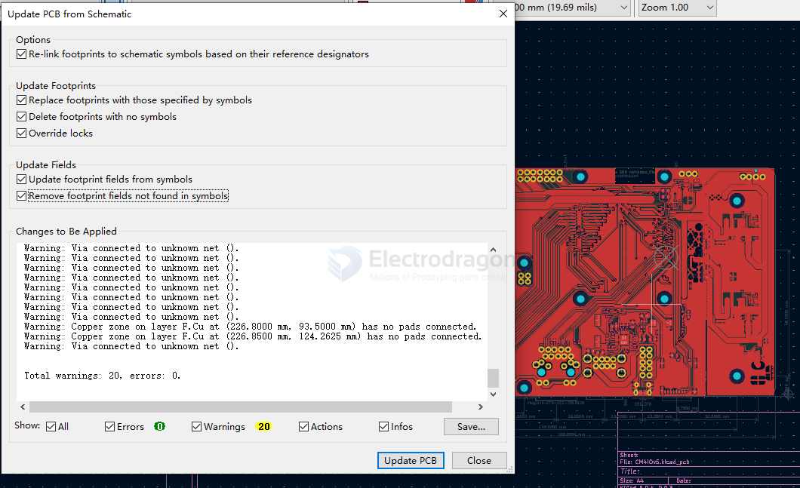

# kicad-workflow-dat

- prerequisite shortcuts - https://docs.kicad.org/7.0/en/kicad/kicad.html

- [[kicad-sch-dat]] -> [[kicad-pcb-dat]]

- create root 
- Draw Hierarchical Sheets
- add sub circuits to sheets 

## label 

- Hierarchical lable
- Global label

- Net label
- Directive label 

## kicad PCB modify 

example [[RPI-CM4-expansion-board-dat]], we are going to make a new PCB based on the scheamtic 

- unlock all the components
- delete unneccssary user drawings 
- delete inner layers 
- delete all zones 
- delete all tracks
- delete all vias 
- delete all unneccsary silkprints
- delete all mounting holes 
- update all the data from scheamtic to PCB 

## ref 

- [[PCB-fab-dat]]

- [[kicad-workflow]] - [[kicad]]

- [[RPI-CM4-expansion-board-dat]] - [[RPI-CM4-expansion-board]]