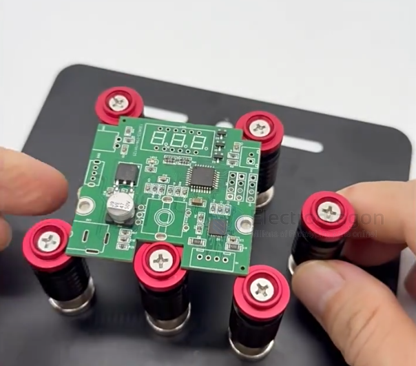
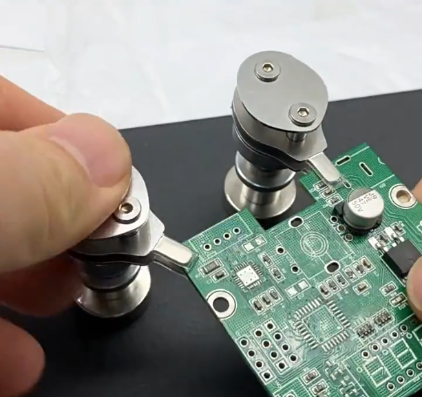
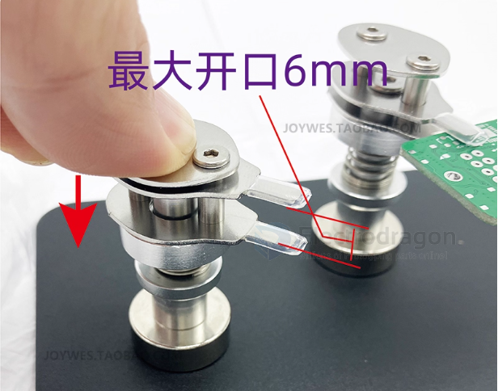

# PCB-accesories-dat

- [[heatsink-dat]] 

- [[magnetic-screw-dat]]

- PCB stand == [[PMP1036-dat]] - [[PMP1037-dat]]

- hexgon spacer == [[PMP1033-dat]] == https://www.electrodragon.com/product/common-used-m3-hexgon-spacing-bar-screw-kit/

- [[PMP1016-dat]] - [[PMP1019-dat]] - [[PMP1021-dat]] == https://www.electrodragon.com/product/m3-brazz-bolt-different-length-available/

- PCB electric isolation 

- 三防漆 == Conformal Coating

- [[PCB-installation-dat]]

PCB holder 

magnetic plate 

## ref 

- [[PCB-dat]] - [[rover-dat]]