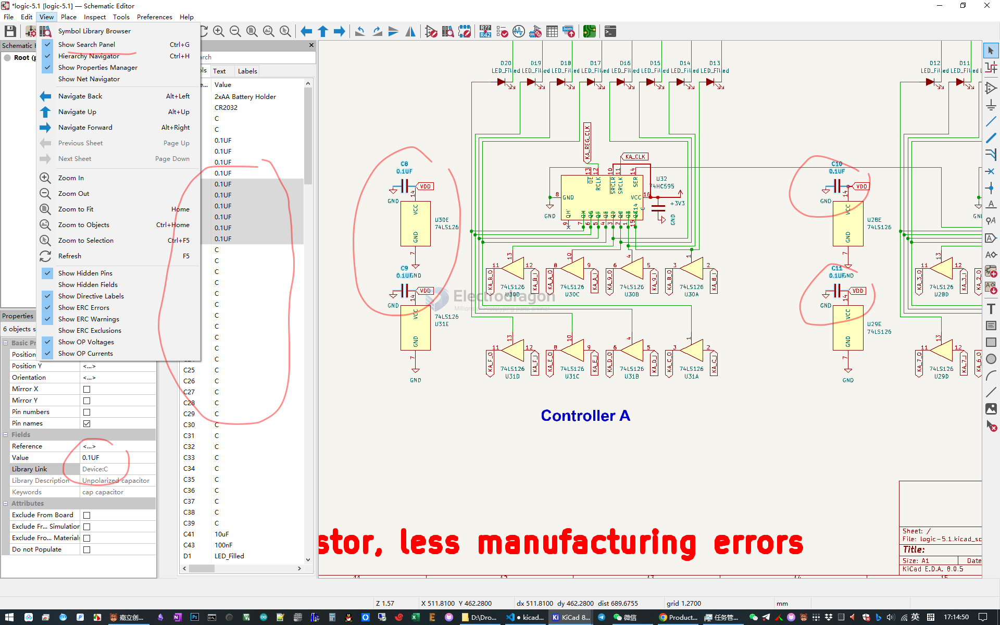
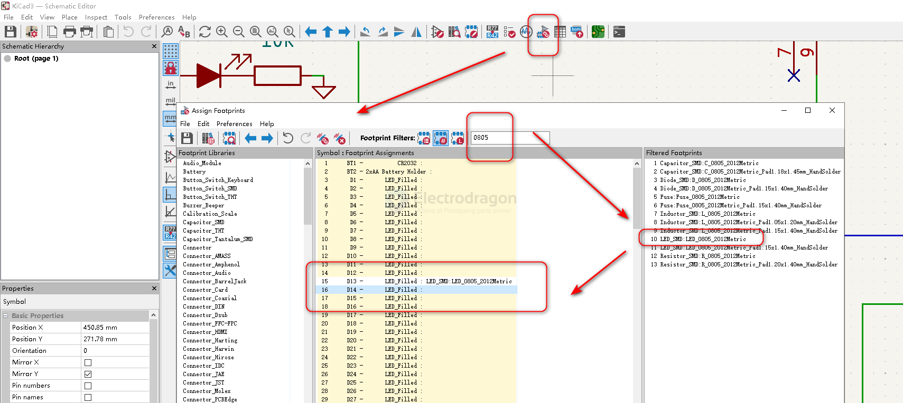

# kicad-sch-dat

- [[kicad-symbol-dat]]

## shortcut 

- D == datasheet 
- G == drag 
- M == move
- R == rotate
- ctrl+D == duplicate 

## add new hierarchy sheet

- click tool icon - draw hierarchy sheets 

### add symbol 

- search based on components type and footprint

- ctrl+D duplicate the symbol

- [[kicad-symbol-dat]]

### mutiple assign the value

### sort network classes network 

- schematic setup -> net classes

### assign the footprints

- add symbols and assign footprint 
  - enter "E" for properties, and assign the footprint 

## ref 

- [[kicad-dat]]

