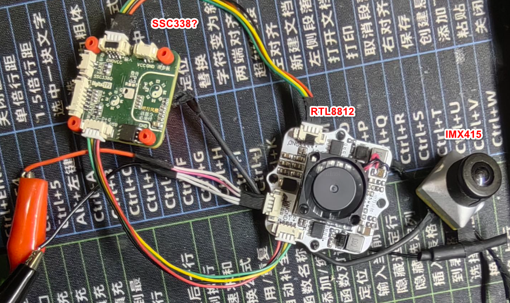

# PCB-design-complex-dat

- [[fab-dat]]

- [[PCB-design-dat]] - [[PCB-design-basic-dat]] - [[PCB-design-complex-dat]]

- [[PCB-stack-dat]] - [[PCB-form-dat]] - [[PCB-penalization-design-dat]]

## difficulties 

- [[PCB-design-complex-dat]] - [[DDR-dat]] - [[MIPI-dat]]

## cases 

- [[CONN-BTB-dat]] - [[CONN-data-dat]] 

- [[IMX415-dat]] - [[SSC338-dat]] - [[RTL8812-dat]] - [[PCB-design-complex-dat]]

- [[HI3516-dat]] - [[PCB-design-complex-dat]] - [[IMX307-dat]]

## ref 

