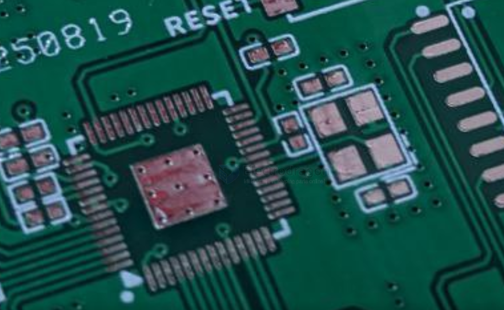

# PCB-design-dat

## design 

- [[footprint-dat]] - [[thermal-disppation-dat]] - [[heatsink-dat]] - [[PCB-installation-dat]]

- [[EDA-dat]] - [[EDA-simulation-dat]]

- [[test-point-dat]]

## special  

- [[flex-PCB-dat]]

## basic 

### PCB layers 

| design layers | funcs                            |
| ------------- | -------------------------------- |
| tStop         | solder mask stop on top layer    |
| bStop         | solder mask stop on bottom layer |

- [[EDA-dat]] - [[fab-pcb-dat]] - [[fab-pcba-dat]]

## ERC Rules 

| mil | mm     |
| --- | ------ |
| 6   | 0.1524 |
| 8   | 0.2032 |
| 10  | 0.254  |
| 12  | 0.3048 |
| 16  | 0.4064 |

## experiences 

ground protected crystals for [[RP2040-dat]] - [[RPI-dat]]

## ref 

- [[PCB-dat]]