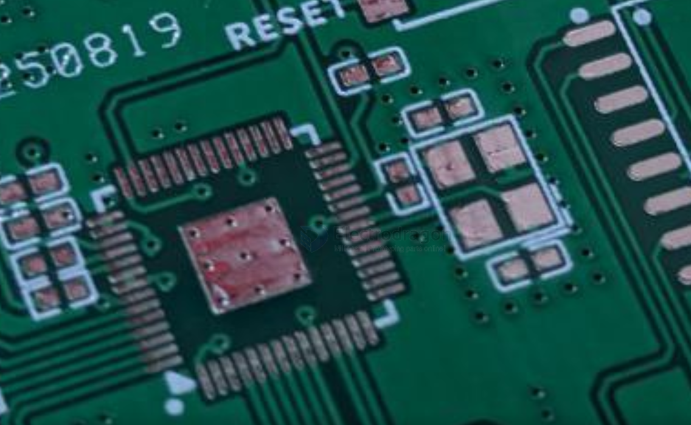

# PCB-design-dat

- [[kicad-dat]] - [[eagleCAD-dat]] - [[kicad-PCB-dat]]

- [[thermal-relief-dat]]

- [[circuits-dat]] - [[PCB-design-dat]] - [[resistor-dat]] - [[capacitor-dat]] - [[RCL-dat]]

- [[PCB-aluminium-dat]] - [[PCB-design-dat]] - [[led-panel-dat]]

- [[PCB-design]] - [[PCB]] - [[PCB-form-dat]]

- [[PCB-design-basic-dat]] - [[PCB-design-stack-dat]] - [[peripherals-dat]] - [[dev-board-dat]]

- [[reverse-engineering-dat]] - [[PCB-design-dat]]

- [[PCB-customized-dat]] - [[PCB-design-dat]] - [[PCB-dat]]

  
- [[footprint-dat]] - [[thermal-disppation-dat]] - [[heatsink-dat]] - [[PCB-installation-dat]]

- [[PCB-layout-dat]] - [[PCB-trace-dat]]

- [[EDA-dat]] - [[EDA-simulation-dat]]

- [[test-point-dat]]

- [[peripherals-dat]]

- [[4-layer-dat]] - [[0402-dat]] - [[double-side-PCB-dat]]

- [[CONN-BTB-dat]] - [[PCB-Castellated-Holes-dat]] - [[PCB-gold-fingers-dat]]

- [[test-point-dat]]

- [[bom-dat]]

- [[PCB-ground-dat]]

- [[PCB-design-dat]] - [[power-dat]] 

## special  

- [[PCB-flex-dat]]

## basic 

### PCB layers 

| design layers | funcs                            |
| ------------- | -------------------------------- |
| tStop         | solder mask stop on top layer    |
| bStop         | solder mask stop on bottom layer |

- [[EDA-dat]] - [[fab-pcb-dat]] - [[fab-pcba-dat]]

## ERC Rules 

| mil | mm     |
| --- | ------ |
| 6   | 0.1524 |
| 8   | 0.2032 |
| 10  | 0.254  |
| 12  | 0.3048 |
| 16  | 0.4064 |

## experiences 

ground protected crystals for [[RP2040-dat]] - [[RPI-dat]]

### Current Capacity Table (1 oz Copper)

| Trace Width | Layer Location | Current Cap @ $10^\circ\text{C}$ Rise | Current Cap @ $20^\circ\text{C}$ Rise |
| :--- | :--- | :--- | :--- |
| **0.5 mm** (~20 mils) | **External** (Surface) | **~1.1 A** | **~1.6 A** |
| | **Internal** (Inner) | ~0.6 A | ~0.9 A |
| **1.0 mm** (~40 mils) | **External** (Surface) | **~1.8 A** | **~2.6 A** |
| | **Internal** (Inner) | ~1.1 A | ~1.5 A |
| **2.0 mm** (~80 mils) | **External** (Surface) | **~3.0 A** | **~4.2 A** |
| | **Internal** (Inner) | ~1.7 A | ~2.4 A |

### 10A peak current handle 

Transient **peak current** (pulses, spikes, or brief bursts), a **2.0 mm wide, 1 oz copper trace can absolutely handle 10A**. 

However, if "peak" means a sustained heavy load that lasts for more than a few seconds, it will struggle. Here is how it breaks down based on the duration of that 10A current:

### 1. Short Pulses / Transient Peaks (Safe)
If the 10A current consists of short pulses (e.g., motor startup spikes, switching transients, or RC ESC/inrush currents) lasting from **a few milliseconds up to 1–2 seconds**, the trace will handle it easily. 
* **Why:** Copper has thermal mass. It takes time for the energy from a brief pulse to heat up the trace. As long as the pulse ends before the copper reaches its maximum temperature, it won't damage the board.

### 2. Continuous or Long Peaks (Not Safe)
If the 10A load is sustained for **longer than 5 to 10 seconds** at a time, a standard 2.0 mm 1 oz external trace will overheat. 
* **The Math:** To safely carry 10A *continuously* on 1 oz copper without exceeding a standard $20^\circ\text{C}$ temperature rise, you would typically need an external trace width of around **5.0 mm to 6.0 mm**. 
* Running 10A continuously through a 2.0 mm trace would cause a massive temperature rise—likely exceeding **$80^\circ\text{C}$ to $100^\circ\text{C}$ above ambient**. This risks damaging the FR4 substrate, lifting the trace off the board, or causing system instability.

---

### How to Make a 2.0 mm Trace Handle 10A Safely

If your layout forces you to stick to a 2.0 mm trace width, but you need to support long or frequent 10A peaks, use these hardware workarounds:

* **Increase Copper Weight to 2 oz ($70\ \mu\text{m}$):** Bumping your PCB fabrication settings to 2 oz copper immediately doubles the cross-sectional area. A 2.0 mm trace on 2 oz copper handles continuous currents much closer to 5–6A, making 10A peaks significantly safer.
* **Expose the Trace and Add Solder:** Design the PCB with the solder mask window removed over that specific 2.0 mm track. During assembly, a thick layer of solder can be flowed over the exposed copper, drastically increasing its thickness and lowering resistance.
* **Route on Both Top and Bottom Layers:** Duplicate the 2.0 mm trace on both the top and bottom layers in parallel, stitching them together with multiple via holes to split the current evenly (5A per layer).

## ref 

- [[PCB-dat]]

- [[circuits-dat]]