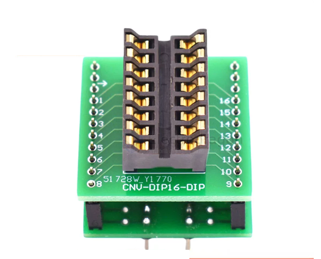

# DIP8-dat

- [[DIP8-dat]] - [[DIP16-dat]] - [[DIP28-dat]] - [[PCB-footprint-dat]]

## chip socket 

## programmer 

- [[DPR1093-dat]] - [[CH341-dat]] - [[programmer-dat]]

programmer design 

## pin table template 

- [[STC-SOP8-dat]]

| pin | func | note                | app |
| --- | ---- | ------------------- | --- |
| 2   | VCC  | power               |     |
| 4   | GND  | power               |     |
| 1   | I/O1 | general purpose I/O |     |
| 3   | I/O2 | general purpose I/O |     |
| 5   | I/O3 | general purpose I/O |     |
| 6   | I/O4 | general purpose I/O |     |
| 7   | I/O5 | general purpose I/O |     |
| 8   | I/O6 | general purpose I/O |     |

## ref 

- [[PCB-footprint-dat]]