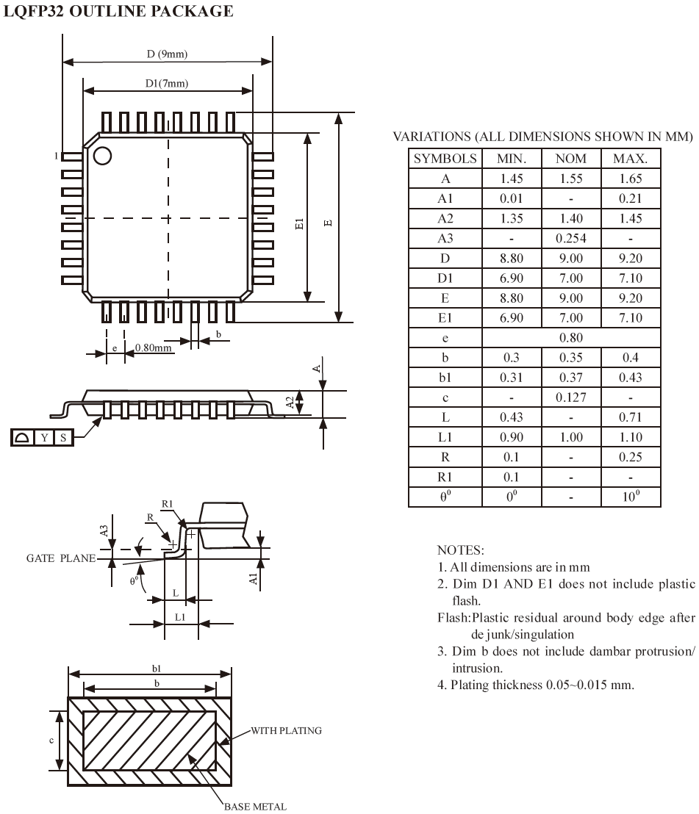
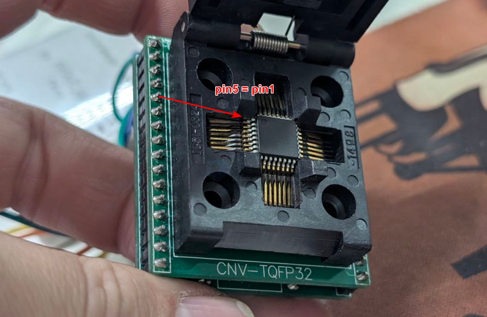
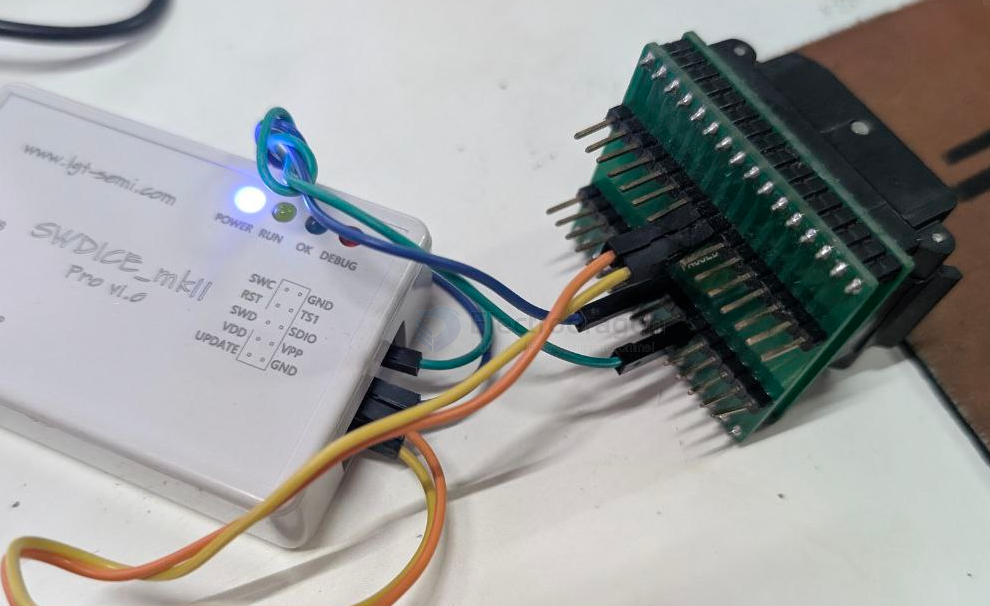

# TQFP-dat

## TQFP32 package 

- [[atmega328-dat]]

## CNV-TQFP32

    pin 5 = pin 1 
    pin 6 = pin 2 
    pin 7 = pin 3
    pin 8 = pin 4
    pin 9 = pin 5

    pin 22 = pin 18 
    pin 23 = pin 19
    pin 24 = pin 20
    pin 25 = pin 21

## ref 

- [[footprint-dat]]

